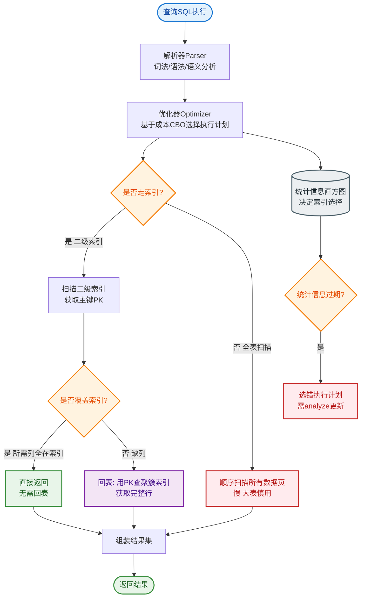

# 数据库引擎InnoDB与MyISAM的区别和适用场景？

### InnoDB 与 MyISAM 的区别与适用场景

**1. 核心架构差异对比表**

| 特性 | InnoDB | MyISAM |
| :--- | :--- | :--- |
| **事务支持** | ✅ 支持 (ACID) | ❌ 不支持 |
| **锁粒度** | 行级锁 (支持并发写) | 表级锁 (写整表锁) |
| **外键** | ✅ 支持 | ❌ 不支持 |
| **崩溃恢复** | ✅ 依赖 Redo Log/Undo Log | ❌ 容易损坏，需扫描修复 |
| **存储方式** | 共享表空间 / 独立表空间 (.ibd) | 独立表空间 (.MYD 数据, .MYI 索引) |
| **索引结构** | 聚簇索引 (数据文件即主键索引文件) | 非聚簇索引 (索引和数据分离) |
| **全文索引** | 5.6+ 支持 | ✅ 支持 (早期性能更优) |
| **计数器** | 不存储表行数，需全表扫描 | 存储表行数 (COUNT 快) |
| **MVCC** | ✅ 支持，读写不冲突 | ❌ 不支持 |

**2. 关键原理细节**

#### (1) 索引与存储结构
- **InnoDB (聚簇索引)**：
  主键索引的叶子节点直接存储**整行数据**。辅助索引的叶子节点存储**主键值**，查数据时需要“回表”（先查辅助索引拿到主键，再查主键索引）。
  ```text
  InnoDB 主键索引 (B+ Tree)
          ┌───┐
          │ 10│ ──> [Row Data(ID=10, Name=A...)]
          └───┘
  ```
- **MyISAM (非聚簇索引)**：
  索引文件 (.MYI) 和数据文件 (.MYD) 分离。主键索引和辅助索引的叶子节点都存储的是**数据文件的物理地址指针**。
  ```text
  MyISAM 索引 -> 数据文件映射
  Index (ID=10) ──> Pointer(0x01) ──> .MYD File offset 0x01
  ```

#### (2) 锁机制
- **InnoDB**：
  默认使用 **MVCC** 解决读读冲突，使用 **Next-Key Lock** (Record Lock + Gap Lock) 解决幻读问题，支持高并发。
- **MyISAM**：
  即使操作不同行，写操作也会锁定整表，导致并发读写性能极低。

**3. 适用场景总结**
- **InnoDB**：
  - 绝大多数 OLTP 业务（订单、支付、用户信息）。
  - 需要事务、行锁、外键约束的场景。
- **MyISAM**：
  - 只读或极少写的场景（如日志归档、配置表）。
  - 需要频繁进行 `COUNT(*)` 统计且不涉及 `WHERE` 条件的表。
  - 全文检索场景（在旧版本 MySQL 中）。

## 常见考点
1. **为什么 MyISAM 的 COUNT(*) 快？**
   - *原因*：MyISAM 内部维护了一个计数器变量，存储了表的总行数，`COUNT(*)` 直接读取该变量，O(1) 复杂度。而 InnoDB 由于支持 MVCC，不同事务看到的行数可能不同，必须逐行扫描统计。
2. **InnoDB 为什么不存储总行数？**
   - *原因*：多版本并发控制下，每个事务可能看到不同版本的数据，无法维护一个全局统一的计数器。
3. **InnoDB 的主键设计建议？**
   - *建议*：尽量使用单调递增的长整型作为主键。这能减少聚簇索引页分裂，提高写入性能。如果使用 UUID（无序），会导致频繁的随机 IO 和页分裂。
4. **什么情况 MyISAM 会比 InnoDB 快？**
   - *场景*：纯读操作、大量 `COUNT(*)`、没有事务需求。


## 核心流程图


## 记忆要点

- InnoDB支持事务行锁与MVCC，而MyISAM仅支持表锁无事务
- InnoDB是聚簇索引，辅助索引需回表；而MyISAM是非聚簇分离存储
- MyISAM存了总行数COUNT快，而InnoDB因MVCC只存历史版本需扫表统计
- 适用场景：InnoDB适合绝大多数OLTP业务，MyISAM适合只读或单纯COUNT统计

## 结构化回答

**30 秒电梯演讲：** 事务与并发能力的权衡。打个比方，像带锁的保险柜 vs 公共阅报栏。

**展开框架：**
1. **InnoDB支持事务行锁与MVCC** — 而MyISAM仅支持表锁无事务
2. **InnoDB是聚簇索引** — 辅助索引需回表；而MyISAM是非聚簇分离存储
3. **MyISAM存了总行数COUNT快** — 而InnoDB因MVCC只存历史版本需扫表统计

**收尾：** 这三点都能配合实战聊。您想深入聊原理、对比还是避坑？

## 视频脚本

> 预计时长：3 分钟 | 由浅入深

| 时间 | 画面/字幕 | 口播台词 | 讲解要点 |
|------|----------|----------|----------|
| 0:00 | 标题卡：数据库引擎InnoDB与MyISAM… | "数据库引擎InnoDB与MyISAM的区别和适用场景？一句话——像带锁的保险柜 vs 公共阅报栏。" | 开场钩子 |
| 0:45 | 概念动画/示意图 | "事务与并发能力的权衡——像带锁的保险柜 vs 公共阅报栏" | 核心定义 |
| 1:30 | 要点1图解示意 | "而MyISAM仅支持表锁无事务" | 要点1 |
| 2:15 | InnoDB是聚簇索引示意 | "辅助索引需回表；而MyISAM是非聚簇分离存储" | 要点2 |
| 3:00 | 总结卡 | "记住这几条，面试不慌。下期讲进阶追问。" | 收尾 |

### 视频流程图


