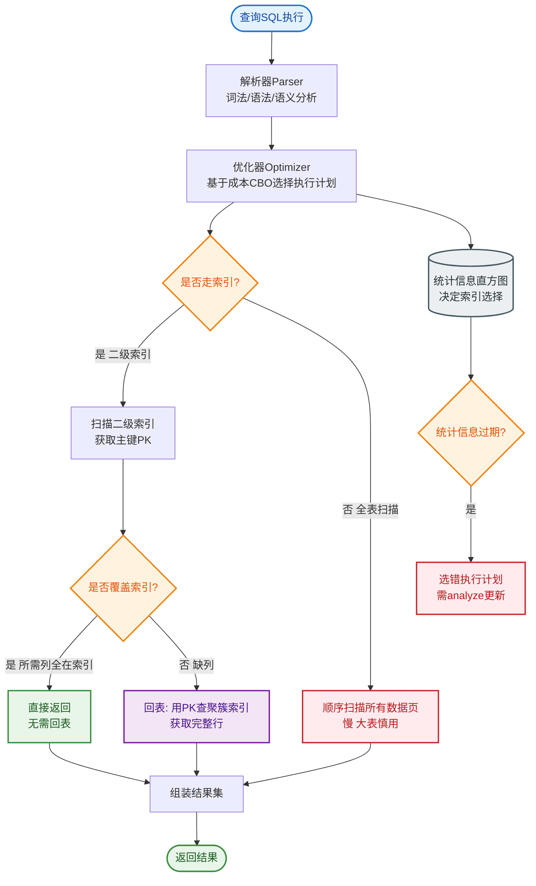

# MySQL索引为什么用B+树而不是B树或红黑树？

B+树优势：
1. **非叶子节点不存数据只存索引**：B+树非叶子节点只存储Key和指针，不存储实际数据。这意味着同样的物理页大小（默认16KB）可以容纳更多的索引项。这使得B+树更加“矮胖”，在数据量相同的情况下，树的高度更低，从而减少磁盘IO次数。
2. **天然支持范围查询**：B+树所有叶子节点使用双向链表（InnoDB实现）连接。在进行范围查询（如 `BETWEEN`, `>`, `<`）时，只需找到起始节点，然后遍历链表即可，无需反复从根节点查找。
3. **查询性能稳定**：B+树的所有数据都存储在叶子节点，无论查询哪条数据，路径长度都是树的高度。而B树的数据可能存在于非叶子节点，查询时间不固定。

**补充原理与数据计算**：
- InnoDB页大小默认16KB。假设主键为BIGINT（8字节），指针大小为6字节（InnoDB源码默认）。
- 一个非叶子节点可存储索引项数 ≈ 16KB / (8B + 6B) ≈ 1170。
- 3层B+树结构：根节点(1170) -> 第二层(1170 * 1170) -> 第三层叶子节点。
- 第三层叶子节点存储实际数据，假设一行数据1KB，一个叶子节点存16行。
- 总存储量 ≈ 1170 * 1170 * 16 ≈ 2000万行。这解释了为什么千万级表查询通常只需要3次IO。

**不用红黑树的原因**：
红黑树是二叉平衡树，树高近似为 log₂N。对于1000万数据，树高约24。红黑树节点在逻辑上相邻但在物理上可能不连续，无法利用局部性原理，且逻辑高度远高于B+树的3层，意味着大量的随机IO。

**不用B树的原因**：
B树的非叶子节点也存储数据，这会占用大量空间，导致单页能存储的索引项变少，树不得不“长高”，增加IO次数。且B树范围查询需要在中序遍历中反复上下层穿梭，效率不如B+树的链表顺序扫描。

```text
       B+树结构示意图 (简化)
       ┌───────┐
       │  Root │ (非叶子节点: 仅存索引)
       └───┬───┘
           │
     ┌─────┼─────┐
     ▼     ▼     ▼
  ┌─────┐ ┌─────┐ ┌─────┐
  │ Node│ │ Node│ │ Node│ (非叶子节点: 仅存索引)
  └──┬──┘ └──┬──┘ └──┬──┘
     │      │      │
     └──┬───┴──────┘
        ▼
  ┌─────────────────────┐
  │ Leaf Page 1 <──────>│ Leaf Page 2 (链表连接)
  │ [Key|Data][Key|Data]│ ...
  └─────────────────────┘
  (叶子节点: 存储所有数据行)
```

## 常见考点
1. **Hash索引与B+树索引的区别**：Hash索引仅支持等值查询，不支持范围查询，且存在Hash冲突问题。
2. **主键自增的设计考量**：主键最好是自增的（如Snowflake ID或自增ID），若使用随机UUID（无序），会导致叶子节点频繁页分裂，产生大量碎片，降低插入性能。
3. **聚簇索引的页分裂**：当插入数据导致页满时，B+树会进行页分裂，这会消耗资源并降低性能。


## 核心流程图


## 记忆要点

- 对比B树：B+树非叶子节点不存数据，单页能装更多索引，树更矮，IO更少。
- 对比红黑树：红黑树二叉树高极高，B+树因为矮胖，千万级数据通常只需3次IO。
- 范围查询：B+树所有叶子节点用双向链表串联，范围遍历极快，B树需回溯。
- 查询性能：数据全在叶子节点，路径长度固定，查询性能极其稳定。
- 关键数字：InnoDB默认页大小16KB，3层B+树可存储约2000万行数据。

## 结构化回答

**30 秒电梯演讲：** 减少磁盘IO次数，优化范围查询。打个比方，像查字典，先查目录（索引）再翻页，而不是翻遍每一页。

**展开框架：**
1. **对比B树** — B+树非叶子节点不存数据，单页能装更多索引，树更矮，IO更少。
2. **对比红黑树** — 红黑树二叉树高极高，B+树因为矮胖，千万级数据通常只需3次IO。
3. **范围查询** — B+树所有叶子节点用双向链表串联，范围遍历极快，B树需回溯。

**收尾：** 这三点都能配合实战聊。您想深入聊原理、对比还是避坑？

## 视频脚本

> 预计时长：2 分钟 | 由浅入深

| 时间 | 画面/字幕 | 口播台词 | 讲解要点 |
|------|----------|----------|----------|
| 0:00 | 标题卡：MySQL索引为什么用B+树而不是B… | "MySQL索引为什么用B+树而不是B树或红黑树？一句话——像查字典，先查目录（索引）再翻页，而不是翻遍每一页。" | 开场钩子 |
| 0:40 | 概念动画/示意图 | "减少磁盘IO次数，优化范围查询——像查字典，先查目录（索引）再翻页，而不是翻遍每一页" | 核心定义 |
| 1:20 | 对比B树示意 | "B+树非叶子节点不存数据，单页能装更多索引，树更矮，IO更少。" | 要点1 |
| 2:00 | 总结卡 | "记住这几条，面试不慌。下期讲进阶追问。" | 收尾 |
