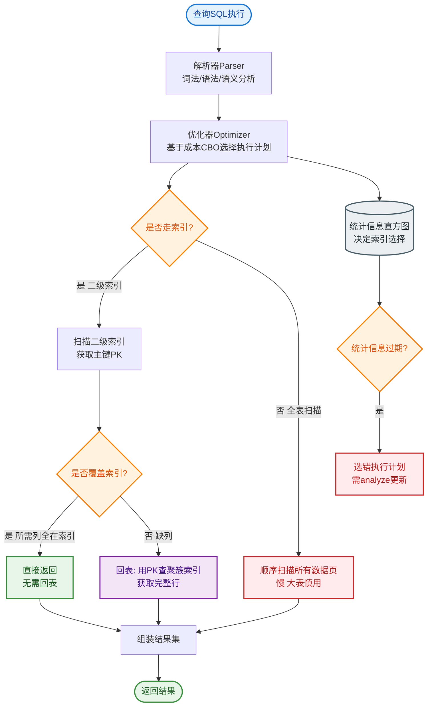

# 什么是回表？什么是索引覆盖？

回表：
- **定义**：当查询所需的列不完全包含在当前使用的索引（二级索引）中时，MySQL引擎会先通过二级索引查到主键ID，然后再拿着主键ID去聚簇索引（主键索引）中查找完整的行数据。
- **成本**：回表相当于多执行了一次树的遍历，属于随机IO，在高并发下会对性能产生影响。

索引覆盖：
- **定义**：如果SELECT的列和WHERE条件的列全部包含在某个索引中，查询执行时只需要扫描索引树即可获取所有数据，无需回表。
- **示例**：`SELECT id, name FROM users WHERE name = 'Tom'`。如果存在联合索引 `(name, id)`（InnoDB会自动在二级索引包含主键），或者索引 `name` 包含了id（InnoDB二级索引叶子节点必有PK），则可以直接从索引叶子节点拿到 `name` 和 `id`。

优化建议：
1. **利用覆盖索引**：将高频查询的字段建立联合索引。例如 `SELECT name, age FROM user WHERE email = 'xx'`，可以建立 `(email, name, age)` 联合索引。
2. **避免 SELECT ***：`SELECT *` 几乎永远不会触发索引覆盖（除非是聚簇索引全表扫描），且会增加网络传输和IO开销。
3. **建立联合索引**：遵循最左前缀原则，尽量将常用查询字段放入索引。

**EXPLAIN 判断**：
- `Using index`：表示使用了覆盖索引，这是性能极佳的表现。
- `Using index condition`：表示使用了索引下推（ICP），但可能仍需回表（视SELECT列而定）。

```text
回表 vs 索引覆盖流程

场景: SELECT id, name FROM user WHERE age = 20;
假设索引: idx_age (age)

回表流程 (未覆盖):          索引覆盖流程 (假设索引 idx_age_name_id):
                            (索引包含了 age, name, id)
┌─────────────┐            ┌─────────────┐
│ 扫描二级索引  │            │ 扫描二级索引  │
│ idx_age      │            │ idx_age...  │
│ 得到: age,PK │            │ 得到: age,name,PK
└──────┬──────┘            └──────┬──────┘
       │                          │
       ▼                          ▼
┌─────────────┐            ┌─────────────┐
│ 去聚簇索引   │            │ 直接返回结果  │
│ 查找完整行   │            │ (无需再查树) │
│ 得到: id,...│            │             │
└──────┬──────┘            └─────────────┘
       │
       ▼
┌─────────────┐
│ 提取id, name │
└─────────────┘
```

## 常见考点
1. **索引下推（ICP）与索引覆盖的区别**：索引覆盖是完全不走聚簇索引；索引下推是存储引擎层在遍历索引时，先过滤掉不符合条件的记录，再回表，减少回表次数，但最终还是需要回表（如果SELECT列不在索引中）。
2. **哪些场景适合建立联合索引来实现覆盖**：例如统计查询 `COUNT(*)`、分页查询只查ID等场景。
3. **主键查询是否算回表**：不算，主键查询直接走聚簇索引，本身就是查数据。


## 核心流程图


## 记忆要点

- 回表定义：二级索引查出主键后，必须再去聚簇索引查整行数据，引发随机IO。
- 索引覆盖：查询列全被包含在二级索引中，直接返回结果，免去回表步骤。
- 性能判断：EXPLAIN中Extra显示 Using index 即代表命中索引覆盖，性能极佳。
- 优化手段：高频查询避免SELECT *，尽量建立联合索引实现覆盖。
- 对比ICP：索引覆盖是彻底不回表，索引下推(ICP)是先过滤再回表，减少回表次数。

## 结构化回答

**30 秒电梯演讲：** 利用索引避免回表查数据。打个比方，在目录上直接能看到页码和摘要，就不需要翻到正文页。

**展开框架：**
1. **回表定义** — 二级索引查出主键后，必须再去聚簇索引查整行数据，引发随机IO。
2. **索引覆盖** — 查询列全被包含在二级索引中，直接返回结果，免去回表步骤。
3. **性能判断** — EXPLAIN中Extra显示 Using index 即代表命中索引覆盖，性能极佳。

**收尾：** 这三点都能配合实战聊。您想深入聊原理、对比还是避坑？

## 视频脚本

> 预计时长：2 分钟 | 由浅入深

| 时间 | 画面/字幕 | 口播台词 | 讲解要点 |
|------|----------|----------|----------|
| 0:00 | 标题卡：什么是回表？什么是索引覆盖 | "什么是回表？什么是索引覆盖？一句话——在目录上直接能看到页码和摘要，就不需要翻到正文页。" | 开场钩子 |
| 0:40 | 概念动画/示意图 | "利用索引避免回表查数据——在目录上直接能看到页码和摘要，就不需要翻到正文页" | 核心定义 |
| 1:20 | 回表定义示意 | "二级索引查出主键后，必须再去聚簇索引查整行数据，引发随机IO。" | 要点1 |
| 2:00 | 总结卡 | "记住这几条，面试不慌。下期讲进阶追问。" | 收尾 |
