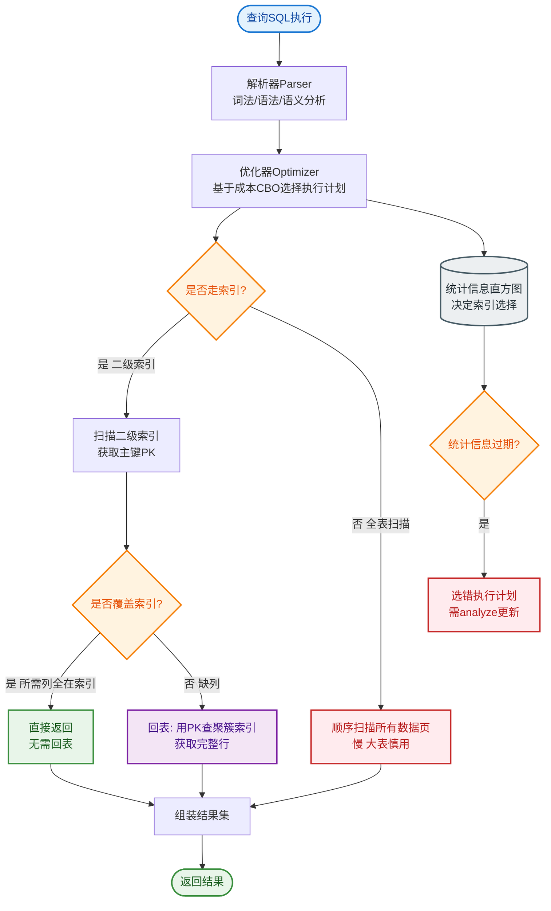

# 深度分页如何优化？

### 问题本质

`SELECT * FROM table ORDER BY create_time LIMIT 1000000, 10`

MySQL 的 `LIMIT offset, N` 语义是：**先读取 offset + N 行，然后丢弃前 offset 行，返回剩余 N 行**。当 offset 极大时，MySQL 需要扫描大量无效数据（回表查询），导致 I/O 和 CPU 消耗巨大。

---

### 优化方案详解

#### 1. 延迟关联 - 推荐

**原理**：利用覆盖索引，先在二级索引上查出主键 ID，再根据主键 ID 回表查询完整数据。这避免了回表扫描 `offset` 行的数据。

```sql
-- 优化前：扫描 1000010 行数据，回表 1000010 次
SELECT * FROM `order` ORDER BY create_time LIMIT 1000000, 10;

-- 优化后：先在索引树上找到 1000010 个 ID（仅扫描索引树，不回表）
-- 然后只用这最后 10 个 ID 去回表查询
SELECT t1.* 
FROM `order` t1 
INNER JOIN (
    SELECT id FROM `order` ORDER BY create_time LIMIT 1000000, 10
) t2 ON t1.id = t2.id;
```

#### 2. 游标分页 / 标签记录法

**原理**：记录上一页最后一条数据的排序值（或 ID），下一页查询时直接过滤掉已看过的数据。本质是将“绝对位置偏移”转化为“条件过滤”。

```sql
-- 假设上一页最后一条数据的 create_time = '2023-01-01 10:00:00' 且 id = 10000
-- 即使数据有重复时间，结合 ID 可以保证严格顺序
SELECT * FROM `order` 
WHERE (create_time, id) > ('2023-01-01 10:00:00', 10000)
ORDER BY create_time, id 
LIMIT 10;
```

**缺点**：不支持随机跳转（无法直接跳到第 50 页），只适用于“下一页”加载模式。

#### 3. 子查询优化

```sql
-- 仅适用于 ID 是连续自增的情况
SELECT * FROM `order` WHERE id > 1000000 LIMIT 10;
```

#### 4. 其他方案
*   **搜索引擎**：将数据同步到 ES，利用 ES 的 `search_after` 或 `scroll` API 进行深分页。
*   **产品限制**：百度/Google 搜索也只有前几十页。产品层面限制页码深度（如限制 100 页）。

---

### 执行流程对比 ASCII 图

**原始 Limit 方式：**
```text
[二级索引树 B+ Tree]
   │
   ├── 扫描第 1 行 (丢弃) ──→ [回表查聚簇索引] ──→ 取出数据(丢弃)
   ├── 扫描第 2 行 (丢弃) ──→ [回表查聚簇索引] ──→ 取出数据(丢弃)
   │ ...
   ├── 扫描第 1000000 行 (丢弃) ─→ [回表查聚簇索引] ──→ 取出数据(丢弃)
   ├── 扫描第 1000001 行 (保留) ─→ [回表查聚簇索引] ──→ 取出数据
   │ ...
   └── 扫描第 1000010 行 (保留) ─→ [回表查聚簇索引] ──→ 取出数据

代价：1000010 次随机 I/O (回表)
```

**延迟关联 方式：**
```text
Step 1: 子查询 (覆盖索引)
[二级索引树 B+ Tree]
   │
   ├── 扫描第 1 行 (只读 ID) (丢弃)
   │ ...
   ├── 扫描第 1000001 行 (只读 ID) (保留) 
   │ ...
   └── 扫描第 1000010 行 (只读 ID) (保留)
   └─→ 得到 10 个 ID

Step 2: 关联查询
[聚簇索引 B+ Tree]
   │
   ├── 根据 ID_1 定位并取出数据 (主键查找，极快)
   ├── ...
   └── 根据 ID_10 定位并取出数据

代价：1000010 次顺序 I/O (读索引) + 10 次随机 I/O (回表)
```

### 实战案例
某日志系统后台在查询百万页数据时频繁超时。我们评估后发现业务允许“只允许往后翻，不准跳页”，于是抛弃传统的 `LIMIT offset`，改用 `WHERE id > last_max_id` 的游标分页方式。查询速度从 3s+ 降低为稳定 20ms，彻底解决了深度分页的性能瓶颈。

### 代码示例
```sql
-- 优化前：传统分页
SELECT * FROM huge_table ORDER BY id LIMIT 100000, 10;

-- 优化后：游标分页（传入上一页最后一条ID）
SELECT * FROM huge_table WHERE id > 100000 ORDER BY id LIMIT 10;
```


## 核心流程图


## 记忆要点

- 性能元凶：LIMIT offset,N 会先扫描并回表前 offset 行数据再丢弃，产生海量无效IO。
- 延迟关联：先查二级索引获取目标页的主键ID，再用ID去聚簇索引关联拿完整数据。
- 游标分页：记住上一页最大ID，下一页用 WHERE id > max_id 极速查询，但不支持跳页。
- 百度的做法：若非必须，产品层面直接限制最大浏览页数（如仅允许看前100页）。
- 第三方方案：海量数据深分页可将其同步至ES，利用search_after机制解决。

## 结构化回答

**30 秒电梯演讲：** 避免扫描大量无用数据。打个比方，看书时直接翻到第1000页，而不是从第一页翻到第1000页。

**展开框架：**
1. **性能元凶** — LIMIT offset,N 会先扫描并回表前 offset 行数据再丢弃，产生海量无效IO。
2. **延迟关联** — 先查二级索引获取目标页的主键ID，再用ID去聚簇索引关联拿完整数据。
3. **游标分页** — 记住上一页最大ID，下一页用 WHERE id > max_id 极速查询，但不支持跳页。

**收尾：** 我在项目里踩过坑——某日志系统后台在查询百万页数据时频繁超时。您想深入聊哪一段：原理、避坑还是对比选型？

## 视频脚本

> 预计时长：3 分钟 | 由浅入深

| 时间 | 画面/字幕 | 口播台词 | 讲解要点 |
|------|----------|----------|----------|
| 0:00 | 标题卡：深度分页如何优化 | "深度分页如何优化？一句话——看书时直接翻到第1000页，而不是从第一页翻到第1000页。" | 开场钩子 |
| 0:45 | 概念动画/示意图 | "避免扫描大量无用数据——看书时直接翻到第1000页，而不是从第一页翻到第1000页" | 核心定义 |
| 1:30 | 性能元凶示意 | "LIMIT offset,N 会先扫描并回表前 offset 行数据再丢弃，产生海量无效IO。" | 要点1 |
| 2:15 | 延迟关联示意 | "先查二级索引获取目标页的主键ID，再用ID去聚簇索引关联拿完整数据。" | 要点2 |
| 3:00 | 总结卡 | "记住这几条，面试不慌。下期讲进阶追问。" | 收尾 |
