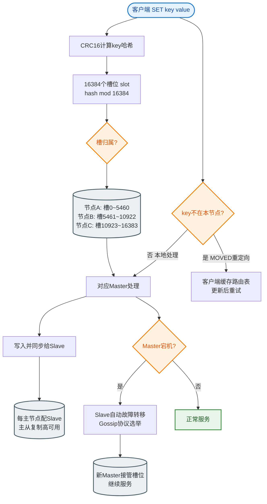

# Redis 6.0为什么引入多线程？

### 背景分析

在 Redis 6.0 之前，Redis 被称为“单线程”模型（实际上还有后台线程处理刷盘、AOF 重写等，但网络请求处理和命令执行是单线程的）。

**性能瓶颈转移**：
*   单线程下，CPU 并不是瓶颈。因为大部分命令是 O(1) 或 O(logN)，内存操作极快（10万+ QPS）。
*   随着 QPS 提升（例如大 key 传输、高并发连接），瓶颈在于**网络 I/O 的读写**（数据在内核态与用户态之间拷贝、协议解析）。

---

### Redis 6.0 多线程模型

Redis 6.0 引入了**多线程 I/O**，但**保持了命令执行的单线程模型**。

1.  **主要改动**：
    *   **网络 I/O 多线程**：将 socket 读取、数据解析、命令回写等耗时操作放入多线程处理。
    *   **命令执行单线程**：依然由主线程串行执行命令。

2.  **核心优势**：
    *   **提升并发吞吐量**：充分利用多核 CPU 的并行计算能力处理网络包。
    *   **无需开发负担**：保持命令执行的原子性，用户无需担心并发安全问题，无需修改代码。
    *   **可插拔**：默认关闭，按需开启。

3.  **开启配置**：
    ```conf
    # 开启 IO 多线程
    io-threads-do-reads yes
    # 设置线程数，建议不超过 CPU 核数，官方建议 4 线程对于 4 核机器提升明显
    io-threads 4
    ```

---

### 处理流程架构图

```text
客户端请求          Worker Thread Group (IO Threads)         Main Thread
   │                       ┌──────────────────────┐             │
   ├── 请求 Socket 1 ─────>│ 读取 Socket 数据      │             │
   │                      │ 解析 Redis 协议      │             │
   │                      └───────────┬──────────┘             │
   │                                  │                       │
   │               队列分配 (每个线程负责部分 Socket)           │
   │                                  │                       │
   │                                  ▼                       │
   │                      ┌──────────────────────┐             │
   │                      │  将解析好的命令      │────────────>│ 命令执行
   │                      │  推入全局任务队列    │             │ (内存读写)
   │                      └──────────────────────┘             │
   │                                                           │
   │                      ┌──────────────────────┐             │
   │                      │  从队列获取结果      │<────────────│ 返回结果
   │                      │  写回 Socket         │             │
   │<─────────────────────│ 构造响应报文        │             │
   │                       └──────────────────────┘             │
   │                                                           │
``` 
*注：主线程负责 IO 线程的调度和命令执行，IO 线程只负责读写和解析。*

### 实战案例
在将 Redis 迁移到物理机（8核）后，由于涉及大数据量的 `List` 和 `Hash` 操作，带宽吃紧导致 QPS 卡在 5万 左右。开启 Redis 6.0 的多线程 I/O（配置为 6 线程）后，QPS 瞬间提升至 12万，CPU 使用率从单核 100% 变为多核 60% 左右，成功解决了网络瓶颈。

### 代码示例
```conf
# redis.conf
# 启用多线程，设置为 yes
io-threads-do-reads yes

# 设置 IO 线程数，一般设置为 CPU 核数
# 注意：如果是 4 核 CPU，官方建议设置为 2 或 3，保留 1-2 核给主线程和系统
io-threads 4
```


## 核心流程图


## 记忆要点

- 瓶颈转移：Redis命令执行在内存极快，旧版单线程的真正瓶颈在于网络IO读写。
- 核心改动：引入多线程仅处理网络IO（读写socket/解析协议），命令执行依然单线程。
- 保留单线程原因：极大提升网络吞吐，同时保留了无锁串行执行的安全性，无需加锁。
- 开启方式：配置 io-threads-do-reads yes，线程数建议不超过CPU核数。

## 结构化回答

**30 秒电梯演讲：** 多线程IO处理，单线程命令执行。打个比方，大厨（单线程）负责炒菜，帮厨（多线程）负责洗菜端菜。

**展开框架：**
1. **瓶颈转移** — Redis命令执行在内存极快，旧版单线程的真正瓶颈在于网络IO读写。
2. **核心改动** — 引入多线程仅处理网络IO（读写socket/解析协议），命令执行依然单线程。
3. **保留单线程原因** — 极大提升网络吞吐，同时保留了无锁串行执行的安全性，无需加锁。

**收尾：** 我在项目里踩过坑——在将 Redis 迁移到物理机（8核）后，由于涉及大数据量的 `List` 和 `Hash` 操作，带宽吃紧导致 QPS 卡在 5万 左右。您想深入聊哪一段：原理、避坑还是对比选型？

## 视频脚本

> 预计时长：3 分钟 | 由浅入深

| 时间 | 画面/字幕 | 口播台词 | 讲解要点 |
|------|----------|----------|----------|
| 0:00 | 标题卡：Redis 6.0为什么引入多线程 | "Redis 6.0为什么引入多线程？一句话——大厨（单线程）负责炒菜，帮厨（多线程）负责洗菜端菜。" | 开场钩子 |
| 0:45 | 概念动画/示意图 | "多线程IO处理，单线程命令执行——大厨（单线程）负责炒菜，帮厨（多线程）负责洗菜端菜" | 核心定义 |
| 1:30 | 瓶颈转移示意 | "Redis命令执行在内存极快，旧版单线程的真正瓶颈在于网络IO读写。" | 要点1 |
| 2:15 | 核心改动示意 | "引入多线程仅处理网络IO（读写socket/解析协议），命令执行依然单线程。" | 要点2 |
| 3:00 | 总结卡 | "记住这几条，面试不慌。下期讲进阶追问。" | 收尾 |

---

## 延伸：什么是Redis是单线程吗？

> 合并自 `db-056`（相似度 81%）

Redis 单线程问题要分版本看：

**Redis 3.x 及之前：** 真正的单线程。命令处理、IO 都在一个线程，利用 epoll 多路复用处理大量连接。单线程也能快是因为：① 纯内存操作；② 无锁无竞争无上下文切换；③ 数据结构高效。

**Redis 6.0+：** 引入多线程处理网络 IO（读取/回写 socket），但**命令执行仍是单线程**。因为命令执行是 CPU 密集且 Redis 瓶颈通常在网络 IO 而非 CPU，多线程 IO 显著提升吞吐，同时保持命令的原子性和无锁简化。

**为什么命令执行用单线程？**
1. 避免多线程的锁竞争和上下文切换。
2. Redis 操作都在内存，单线程已足够快。
3. 保证命令原子性，简化实现。

**慢命令会阻塞：** keys *、flushall、大 key 操作、Lua 脚本过长。生产应避免。

**架构简图：**
```text
Client A  
      \   ┌──────────────────────────────────┐
Client B ─▶│  Redis Server (6.0+)              │
      /   │  ┌────────────────────────────┐  │
Client C  │  │ IO Threads (多线程)         │  │
           │  │ 1. 读 Socket 解析请求      │  │
           │  └────────────┬───────────────┘  │
           │               │                   │
           │               ▼                   │
           │  ┌────────────────────────────┐  │
           │  │ Command Thread (单线程)    │  │
           │  │ 1. 执行命令                │  │
           │  │ 2. 操作内存数据结构        │  │
           │  └────────────┬───────────────┘  │
           │               │                   │
           │               ▼                   │
           │  ┌────────────────────────────┐  │
           │  │ IO Threads (多线程)         │  │
           │  │ 2. 写 Socket 返回响应      │  │
           │  └────────────────────────────┘  │
           └──────────────────────────────────┘
```

| 版本/特性 | 网络IO处理 | 命令执行 | 适用场景 |
| :--- | :--- | :--- | :--- |
| **Redis 3.x/4.x/5.x** | 单线程 (Main Reactor) | 单线程 | CPU 密集型小数据量，追求极致低延迟
|
**Redis 6.0+** | 多线程 | 单线程 | 高并发大数据吞吐场景（如 10Gbps 以上网络带宽瓶颈）|
**Redis 后台线程** | 无 | 独立线程 (BIO) | 负责刷盘、关闭文件、释放大内存，不阻塞主线程

**实战案例：**
在使用 Redis 4.0 处理百万级 QPS 时，我们发现 CPU 使用率虽低但网卡跑满导致延迟飙升。**升级经验**：升级到 Redis 6.0 并开启 `io-threads-do-reads yes`，网卡带宽利用率下降，吞吐量提升约 40%。

**关键代码（配置）：**
```conf
# redis.conf 6.0 多线程配置
# 开启 IO 多线程
io-threads-do-reads yes

# 设置线程数，建议设置为 CPU 核数，不要超过 CPU 核数
# 官方建议：4核机器设为2或3，8核机器设为6
io-threads 4
```

## 常见考点
1. **Redis 6.0 多线程是默认开启吗？**
   - 不是，默认关闭。需在配置文件中设置 `io-threads-do-reads yes` 及 `io-threads` 数量（通常建议设置为 CPU 核数，但命令线程始终只有 1 个）。
2. **Redis 真的只有 1 个线程在工作吗？**
   - 不是。除了主线程外，还有后台线程：`bio_close_file`（关闭文件描述符）、`bio_aof_fsync`（AOF 刷盘）、`bio_lazy_free`（异步释放内存）。
3. **为什么不用多线程执行命令？**
   - 核心原因是**原子性**和**实现复杂度**。Redis 单线程模型保证了每个命令的执行是原子的，无需处理并发数据修改带来的锁竞争。对于内存数据库，CPU 往往不是瓶颈，内存带宽和网络 IO 才是。

## 记忆要点

- 版本演进：3.x纯单线程；6.0+引入多线程处理网络IO，命令执行仍单线程。
- 为何单线程快：纯内存操作、无锁无上下文切换、epoll多路复用高效网络模型。
- 单线程原因：避免并发锁竞争，保证操作原子性，内存瓶颈不在CPU。
- 避坑指南：单线程怕阻塞，生产环境严禁KEYS或操作BigKey。

## 结构化回答

**30 秒电梯演讲：** Redis核心命令执行为单线程，6.0引入多线程仅处理网络IO，保持高性能。打个比方，像一个厨师（单线程）炒菜，6.0多了几个传菜员（多线程IO）负责端盘子。

**展开框架：**
1. **版本演进** — 3.x纯单线程；6.0+引入多线程处理网络IO，命令执行仍单线程。
2. **为何单线程快** — 纯内存操作、无锁无上下文切换、epoll多路复用高效网络模型。
3. **单线程原因** — 避免并发锁竞争，保证操作原子性，内存瓶颈不在CPU。

**收尾：** 我在项目里踩过坑——在使用 Redis 4.0 处理百万级 QPS 时，我们发现 CPU 使用率虽低但网卡跑满导致延迟飙升。您想深入聊哪一段：原理、避坑还是对比选型？

## 视频脚本

> 预计时长：3 分钟 | 由浅入深

| 时间 | 画面/字幕 | 口播台词 | 讲解要点 |
|------|----------|----------|----------|
| 0:00 | 标题卡：什么是Redis是单线程吗 | "什么是Redis是单线程吗？一句话——像一个厨师（单线程）炒菜，6.0多了几个传菜员（多线程IO）负责端盘子。" | 开场钩子 |
| 0:45 | 概念动画/示意图 | "Redis核心命令执行为单线程，6.0引入多线程仅处理网络IO，保持高性能——像一个厨师（单线程）炒菜，6.0多了几个传菜员（多线程IO）负责端盘子" | 核心定义 |
| 1:30 | 版本演进示意 | "3.x纯单线程；6.0+引入多线程处理网络IO，命令执行仍单线程。" | 要点1 |
| 2:15 | 为何单线程快示意 | "纯内存操作、无锁无上下文切换、epoll多路复用高效网络模型。" | 要点2 |
| 3:00 | 总结卡 | "记住这几条，面试不慌。下期讲进阶追问。" | 收尾 |
