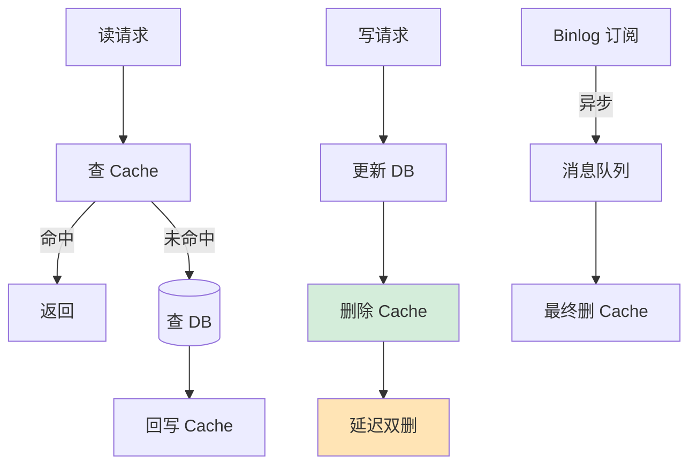

# 如何保证缓存和数据库的一致性？

### 核心策略：Cache Aside (旁路缓存)

这是业界最常用的模式。

1.  **读操作**：
    *   先读缓存。
    *   命中：直接返回。
    *   未命中：读数据库，将数据写入缓存，返回。

2.  **写操作**：
    *   **最佳实践**：**先更新数据库，再删除缓存**。
    *   **为什么是删除而不是更新缓存？**
        *   **并发写**：如果两个线程同时更新，A 先更新 DB，B 后更新 DB；若网络原因缓存更新顺序反了，导致缓存里是旧数据。删除则无此问题（脏数据概率低）。
        *   **开销**：很多时候写入的值不一定会被立即读取，直接更新缓存浪费计算资源（尤其是复杂计算后的缓存）。

---

### 强一致性方案与兜底

#### 1. 延迟双删

**目的**：解决“先更库，后删缓存”在极端并发下可能读到旧数据的问题。

**流程**：
1.  先删除缓存。
2.  更新数据库。
3.  休眠一小段时间（如 500ms，需大于数据库主从同步耗时或读请求耗时）。
4.  再次删除缓存。

#### 2. 异步监听 Binlog (最终一致性)

**目的**：解耦业务代码，保证数据最终一致。

**方案**：使用 Canal 等工具伪装成 MySQL 从库，监听 Binlog。
*   当 DB 发生变更（增删改）时，Canal 解析 Binlog。
*   发送消息到 MQ 或直接通过 RPC 调用删除缓存。

**优点**：业务代码侵入性极小，不仅服务于缓存，还可同步数据到 ES 等下游系统。

---

### 潜在异常场景分析

**场景 1：先更库，后删缓存 —— 失败了怎么办？**
*   **风险**：DB 更新成功，但缓存删除失败（如 Redis 挂了、网络抖动）。导致后续读请求一直读到旧缓存（脏数据）。
*   **解法**：
    *   **重试机制**：将删除失败的 Key 发送到消息队列，由消费者进行重试删除。
    *   **订阅 Binlog**：依赖 Binlog 的最终一致性方案兜底。

**场景 2：先删缓存，后更库 —— 并发读写导致脏数据**
*   **流程**：
    1.  线程 A 删除缓存。
    2.  线程 B 来读缓存，未命中，读 DB（此时读到旧数据），写入缓存（旧数据）。
    3.  线程 A 更新 DB（新数据）。
    *   **结果**：DB 是新数据，缓存是旧数据（永久不一致）。
*   **解法**：
    *   **延时双删**：线程 A 在更新 DB 后，隔段时间再次删除缓存，清理掉线程 B 写入的旧数据。
    *   **设置过期时间**：兜底策略，即使不一致，过期时间到了也会自动恢复。

### 实战案例
在电商库存扣减场景中，曾出现“缓存是 10，数据库是 9”的异常。原因是 Redis 宕机导致“删除缓存”操作失败。解决方案是引入 Canal 订阅 MySQL Binlog，将删除操作放入 MQ 进行“最佳努力”重试，并给缓存设置较短的随机过期时间（如 5min + 随机值）作为最终兜底。

### 代码示例
```java
// 伪代码：先更新DB，再删除缓存（含重试逻辑）
public void updateData(Data data) {
    // 1. 更新数据库
    dbMapper.updateById(data);
    
    // 2. 删除缓存
    try {
        redisTemplate.delete("key:" + data.getId());
    } catch (Exception e) {
        // 3. 失败时发送到 MQ 进行异步重试
        mqProducer.send(new CacheDeleteMsg("key:" + data.getId()));
    }
}
```

### 方案对比

| 方案 | 一致性 | 复杂度 | 性能影响 | 适用场景 |
| :--- | :--- | :--- | :--- | :--- |
| **先删缓存，再更库** | 差 (有脏数据风险) | 低 | 低 | 几乎不推荐，除非配合延时双删 |
| **先更库，再删缓存** | 较好 | 低 | 低 | 业界标准方案 |
| **延时双删** | 好 | 中 | 中 | 对一致性要求较高的场景 |
| **订阅 Binlog 异步删** | 最终一致 | 高 | 低 (异步) | 高并发、微服务、分布式架构 |


## 核心流程图



## 记忆要点

- 标准方案：Cache Aside，读先缓存后DB，写时【先更新DB，再删除缓存】。
- 为何删缓存：更新缓存易引发并发写覆盖脏数据，删除是幂等且节省无效计算开销。
- 延时双删：解决“先删缓存后更库”时，并发读写导致的脏数据回填问题。
- 强一致兜底：缓存删除失败？用MQ重试机制，或通过Canal监听Binlog异步删除。
- 最终底线：任何缓存方案必须设置合理的过期时间TTL作为最后一道防线。

## 结构化回答

**30 秒电梯演讲：** 牺牲强一致性换高性能，通过更新数据库+删除缓存兜底保证最终一致。打个比方，就像记账，改了账本（DB）后把草稿纸上的旧数（缓存）擦掉，下次用时再填。

**展开框架：**
1. **标准方案** — Cache Aside，读先缓存后DB，写时【先更新DB，再删除缓存】。
2. **为何删缓存** — 更新缓存易引发并发写覆盖脏数据，删除是幂等且节省无效计算开销。
3. **延时双删** — 解决“先删缓存后更库”时，并发读写导致的脏数据回填问题。

**收尾：** 我在项目里踩过坑——在电商库存扣减场景中，曾出现“缓存是 10，数据库是 9”的异常。您想深入聊哪一段：原理、避坑还是对比选型？

## 视频脚本

> 预计时长：3 分钟 | 由浅入深

| 时间 | 画面/字幕 | 口播台词 | 讲解要点 |
|------|----------|----------|----------|
| 0:00 | 标题卡：如何保证缓存和数据库的一致性 | "如何保证缓存和数据库的一致性？一句话——就像记账，改了账本（DB）后把草稿纸上的旧数（缓存）擦掉，下次用时再填。" | 开场钩子 |
| 0:45 | 概念动画/示意图 | "牺牲强一致性换高性能，通过更新数据库+删除缓存兜底保证最终一致——就像记账，改了账本（DB）后把草稿纸上的旧数（缓存）擦掉，下次用时再填" | 核心定义 |
| 1:30 | 标准方案示意 | "Cache Aside，读先缓存后DB，写时【先更新DB，再删除缓存】。" | 要点1 |
| 2:15 | 为何删缓存示意 | "更新缓存易引发并发写覆盖脏数据，删除是幂等且节省无效计算开销。" | 要点2 |
| 3:00 | 总结卡 | "记住这几条，面试不慌。下期讲进阶追问。" | 收尾 |
