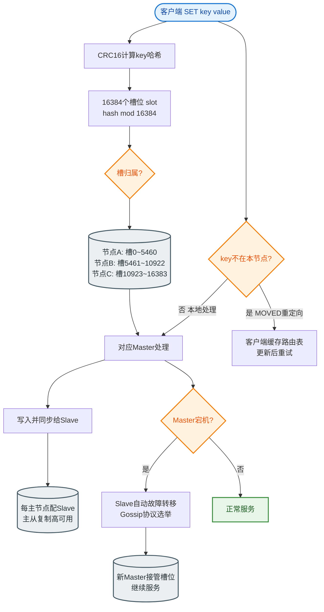
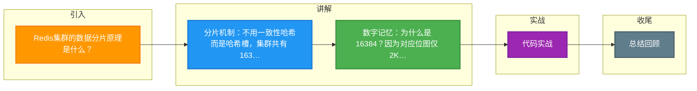

# Redis集群的数据分片原理是什么？

### 哈希槽 分片机制

Redis Cluster 不使用传统的“一致性哈希”，而是采用**哈希槽**。

1.  **槽位定义**：整个集群共有 **16384** 个槽位（编号 0 ~ 16383）。
2.  **Key 分配**：
    *   算法：`CRC16(key) % 16384`。
    *   结果：计算出一个整数，该 Key 属于这个槽位。
3.  **槽位分配**：集群中的每个 Master 节点负责一部分槽位（例如 3 个节点，Node A 负责槽 0-5000，Node B 负责 5001-10000...）。
4.  **数据迁移**：当需要扩容或缩容时，只需要移动槽位及对应的数据，而不需要重新哈希所有 Key。

---

### 架构与通信流程

#### 1. 节点间通信

使用 **Gossip 协议**：
*   每个节点都维护一份集群的状态元数据（包含其他节点信息、槽位映射关系）。
*   节点定期交换信息，传播故障检测结果。

#### 2. 客户端路由

```text
客户端请求           Redis Cluster 节点
   │                     │
   │  发送命令           │
   │  SET key value ─────┼─> 接收命令
   │                     │
   │                     │  计算 hash(key)
   │                     │  结果 = 槽位 2048
   │                     │
   │                     │  检查槽位归属:
   │                     │  本节点负责槽 0-1000?
   │                     │     NO (槽 2048 在 Node B)
   │                     │
   │  <─── MOVED 2048 ───┘  (返回重定向指令)
   │     192.168.1.2:6379   (包含 Node B 的 IP)
   │
   │  本地缓存槽位映射      │
   │  (槽 2048 -> Node B)  │
   │                     │
   │  发送命令           │
   │  SET key value ──────>  Node B (正确处理)
   │  (直连 Node B)        │
``` 
*注：客户端通常会缓存 `MOVED` 信息，后续请求会直接连接到正确的节点，减少重定向。*

---

### 为什么是 16384 个槽？

*   **心跳包传输效率**：节点之间需要交换槽位信息。槽位信息使用 Bitmap（位图）格式传输。
    *   16384 个槽 = `16384 / 8 = 2048` 字节 = **2KB**。
    *   如果是 65536 个槽 = `65536 / 8 = 8192` 字节 = **8KB**。
*   **网络开销**：Gossip 协议传输频率很高，2KB 的数据包在网络传输中非常高效且不易分片，而 8KB 会带来较大的带宽压力。
*   **数量足够**：一个集群通常只有几十个节点，16384 个槽位足够均匀分配，无需更多。

---

### ## 常见考点

1.  **Redis Cluster 的主从复制机制是怎样的？**
    *   一个 Master 负责写，可以有多个 Slave。Slave 复制 Master 的数据。Master 挂了，Slave 会通过选举升级为 Master（取决于 Failover 机制）。
2.  **如果客户端收到 `ASK` 错误和 `MOVED` 错误有什么区别？**
    *   **MOVED**：表示槽位已经永久迁移到了新节点，客户端需要更新本地缓存并直接连接新节点。
    *   **ASK**：表示槽位正在**迁移中**（数据正在搬家）。客户端需要先发一个 `ASKING` 命令给目标节点，然后再发送请求，但**不更新**本地缓存（因为只是一次临时的重定向）。
3.  **Redis Cluster 支持事务吗？**
    *   支持有限的事务。但是，要求事务中的所有 Key 必须属于**同一个槽位**（通常使用 Hash Tag `{user:1000}:profile` 这样的格式让相同前缀的 Key 落在同一个槽）。
4.  **如果连接到了错误的节点，会发生什么？**
    *   节点会计算 Key 的槽位，如果自己不负责，会返回 `-MOVED` 或 `-ASK` 重定向错误。


## 核心流程图


## 记忆要点

- 分片机制：不用一致性哈希而是哈希槽，集群共有 16384 个槽，计算公式 CRC16 % 16384
- 数字记忆：为什么是 16384？因为对应位图仅 2KB，网络传输快且不易分片
- 节点通信：节点间采用 Gossip 协议定期交换元数据；客户端错误路由会返回 MOVED 或 ASK 重定向
- 重定向对比：MOVED 表示永久迁走需更新缓存，ASK 表示迁移中临时重定向不更新缓存

## 结构化回答

**30 秒电梯演讲：** 通过预设槽位将数据打散到不同节点，解耦数据与节点的物理绑定。打个比方，图书馆有16384个书架，每本书根据名字算好归属书架，书架移动了书还在。

**展开框架：**
1. **分片机制** — 不用一致性哈希而是哈希槽，集群共有 16384 个槽，计算公式 CRC16 % 16384
2. **数字记忆** — 为什么是 16384？因为对应位图仅 2KB，网络传输快且不易分片
3. **节点通信** — 节点间采用 Gossip 协议定期交换元数据；客户端错误路由会返回 MOVED 或 ASK 重定向

**收尾：** 这三点都能配合实战聊。您想深入聊原理、对比还是避坑？

## 视频脚本

> 预计时长：3 分钟 | 由浅入深

| 时间 | 画面/字幕 | 口播台词 | 讲解要点 |
|------|----------|----------|----------|
| 0:00 | 标题卡：Redis集群的数据分片原理是什么 | "Redis集群的数据分片原理是什么？一句话——图书馆有16384个书架，每本书根据名字算好归属书架，书架移动了书还在。" | 开场钩子 |
| 0:45 | 概念动画/示意图 | "通过预设槽位将数据打散到不同节点，解耦数据与节点的物理绑定——图书馆有16384个书架，每本书根据名字算好归属书架，书架移动了书还在" | 核心定义 |
| 1:30 | 分片机制示意 | "不用一致性哈希而是哈希槽，集群共有 16384 个槽，计算公式 CRC16 % 16384" | 要点1 |
| 2:15 | 数字记忆示意 | "为什么是 16384？因为对应位图仅 2KB，网络传输快且不易分片" | 要点2 |
| 3:00 | 总结卡 | "记住这几条，面试不慌。下期讲进阶追问。" | 收尾 |

### 视频流程图



