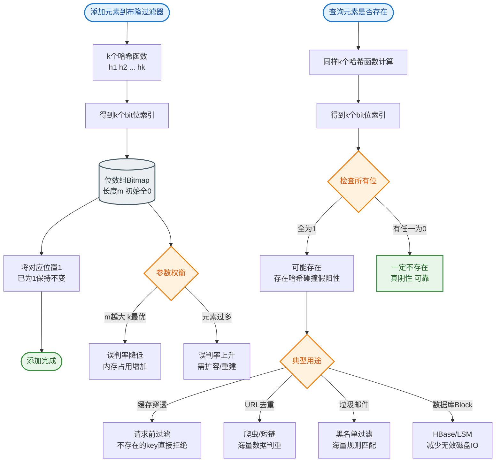

# 布隆过滤器解决缓存穿透的原理是什么？

缓存穿透：大量请求查询一个根本不存在的key，缓存和数据库都没有，每次请求都打到数据库。

**布隆过滤器原理**：
- **数据结构**：一个很长的二进制位数组（初始全0） + 多个无偏哈希函数。
- **写入过程**：
  1. 将 key 输入到 k 个不同的哈希函数中。
  2. 得到 k 个哈希值，对应位数组上的 k 个位置。
  3. 将这 k 个位置的 bit 位全部设为 1。
- **查询过程**：
  1. 将 key 同样经过 k 个哈希函数计算。
  2. 检查这 k 个位置的 bit 位。
  3. **如果所有 bit 位都是 1，则 key 可能存在**。
  4. **如果有任何 bit 位是 0，则 key 一定不存在**。

**ASCII 架构图**：
```text
写入 Key: "apple"
+-----------------------+     Hash1      +----------------------+
|     Hash Functions    |---------------->| Bit[10] = 1 (Set)    |
+-----------------------+                  +----------------------+
|  1. Hash1(key) -> 10  |
|  2. Hash2(key) -> 25  |     Hash2      +----------------------+
|  3. Hash3(key) -> 88  |---------------->| Bit[25] = 1 (Set)    |
+-----------------------+                  +----------------------+
                                       Hash3      +----------------------+
                                                  | Bit[88] = 1 (Set)    |
                                                  +----------------------+

查询 Key: "banana"
+-----------------------+     Hash1      +----------------------+
|     Hash Functions    |---------------->| Bit[10] = 1 (Check)  |
+-----------------------+                  +----------------------+
|  1. Hash1(key) -> 10  |
|  2. Hash2(key) -> 99  |     Hash2      +----------------------+
|  3. Hash3(key) -> 55  |---------------->| Bit[99] = 0 (Return  |
+-----------------------+     |           |       False)         |
                                       Hash3      +----------------------+
                                                  | Bit[55] = ? (Skip)   |
                                                  +----------------------+
```

**特点**：
- **空间效率高**：100万元素只需约1.2MB（相比 HashSet 极小）。
- **误判率**：判断存在的可能实际不存在，但概率可控。
- **不漏判**：判断不存在的一定不存在。

**缓存穿透解决方案**：
1. **布隆过滤器**：在 Redis 缓存层之前架设 BloomFilter（可以是 Redis 自带的 module 或 Guava 本地缓存），请求先过布隆过滤器，不存在直接返回，不去查 DB。
2. **缓存空值**：查不到的 key 缓存 null 值（带短 TTL，如 30s-5min），防止频繁攻击穿透。

## 常见考点
1.  **布隆过滤器的误判率**：解释为什么会有误判，以及如何通过增加哈希函数数量或增加位数组长度来降低误判率。
2.  **布隆过滤器的删除问题**：为什么布隆过滤器不支持删除元素？（因为多个 key 可能共用同一个 bit 位，删除一个 key 会误删其他 key）。如何解决？（引入计数布隆过滤器 Counting Bloom Filter）。
3.  **布隆过滤器的位置**：是放在应用内存（本地）还是 Redis 中？（本地：速度快，多实例数据需同步；Redis：集中共享，增加网络开销）。


## 核心流程图


## 记忆要点

- 一句话定义：位数组加多哈希函数，空间极小（百万级仅需 1.2MB），专治缓存穿透直打 DB
- 核心特性：没查出 1 必然不存在，查出全 1 可能有误判，不存在漏报只有误报
- 不支持删除：因为多个元素可能共用同一个 bit 位，若要删除需用计数布隆过滤器
- 业务落地：通常挡在缓存和 DB 之前，查出不存在直接拦截；也可用缓存空值应对穿透

## 结构化回答

**30 秒电梯演讲：** 用极小空间和极快速度判断数据“绝对不存在”或“可能存在”，挡住无效流量。打个比方，像是门口的安检名单，名字不在名单上的一定不准进，在名单上的还得查身份证。

**展开框架：**
1. **一句话定义** — 位数组加多哈希函数，空间极小（百万级仅需 1.2MB），专治缓存穿透直打 DB
2. **核心特性** — 没查出 1 必然不存在，查出全 1 可能有误判，不存在漏报只有误报
3. **不支持删除** — 因为多个元素可能共用同一个 bit 位，若要删除需用计数布隆过滤器

**收尾：** 这三点都能配合实战聊。您想深入聊原理、对比还是避坑？

## 视频脚本

> 预计时长：2 分钟 | 由浅入深

| 时间 | 画面/字幕 | 口播台词 | 讲解要点 |
|------|----------|----------|----------|
| 0:00 | 标题卡：布隆过滤器解决缓存穿透的原理是什么 | "布隆过滤器解决缓存穿透的原理是什么？一句话——像是门口的安检名单，名字不在名单上的一定不准进，在名单上的还得查身份证。" | 开场钩子 |
| 0:40 | 概念动画/示意图 | "用极小空间和极快速度判断数据“绝对不存在”或“可能存在”，挡住无效流量——像是门口的安检名单，名字不在名单上的一定不准进，在名单上的还得查身份证" | 核心定义 |
| 1:20 | 一句话定义示意 | "位数组加多哈希函数，空间极小（百万级仅需 1.2MB），专治缓存穿透直打 DB" | 要点1 |
| 2:00 | 总结卡 | "记住这几条，面试不慌。下期讲进阶追问。" | 收尾 |
