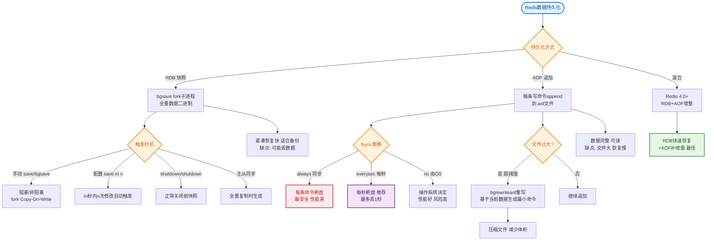
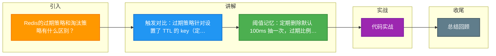

# Redis的过期策略和淘汰策略有什么区别？

过期策略（针对设置了TTL的key）：
1. **定期删除**：
   - Redis 默认每 100ms 随机抽取设置了过期时间的 key，检查是否过期。
   - 如果过期则删除。
   - 如果过期 key 比例超过 25%，会重复该过程。
   - 目的：平衡 CPU 消耗和内存占用，避免一次性扫描导致卡顿。
2. **惰性删除**：
   - 访问 key 时，检查是否过期，若过期则删除并返回空。
   - 目的：CPU 友好，但内存可能泄露（如果过期 key 不再被访问）。

淘汰策略（内存不足时的策略，由 `maxmemory` 限制触发）：
1. **noeviction**：不淘汰，写入报错（默认旧版策略，通常需手动配置）。
2. **allkeys-lru**：从所有 key 中淘汰最近最少使用（最常用的通用策略）。
3. **allkeys-lfu**：从所有 key 中淘汰最不经常使用（Redis 4.0+，适合高频热点场景）。
4. **allkeys-random**：从所有 key 中随机淘汰。
5. **volatile-lru**：从设置了 TTL 的 key 中淘汰 LRU。
6. **volatile-lfu**：从设置了 TTL 的 key 中淘汰 LFU（Redis 4.0+）。
7. **volatile-random**：从设置了 TTL 的 key 中随机淘汰。
8. **volatile-ttl**：从设置了 TTL 的 key 中淘汰即将过期的（TTL 较小的）。

**ASCII 流程图（内存淘汰决策）**：
```text
+----------------+
| Client Write   |
+-------+--------+
        |
        v
+-------+----------------------------------------+
| Check Memory Usage < maxmemory ?             |
+-------+----------------------------------------+
        |
   No   |   Yes
   +----+----+
   |         v
   |   +-----+-----------------------------+
   |   | Execute maxmemory-policy          |
   |   +-----+-----------------------------+
   |         |
   |         v
   |   +-----+-----------------------------+
   |   | Evict Keys (LRU/LFU/Random/TTL)   |
   |   +-----+-----------------------------+
   |         |
   +---------+
        |
        v
+-------+--------+
| Execute Write  |
+----------------+
```

## 常见考点
1.  **LRU 的近似实现**：Redis 的 LRU 并不是严格的 LRU（因为维护双向链表开销大），而是通过采样近似算法。Redis 默认采样 5 个 key，选出最久未用的淘汰。可以通过 `maxmemory-samples` 调整采样数（越大越精确但 CPU 消耗越高）。
2.  **LFU 的实现**：Redis 4.0 引入 LFU，它使用计数器（Morris Counter）来降低内存占用，并且会随时间递减计数，防止历史高频数据长期不淘汰。
3.  **ALLKEYS vs VOLATILE**：什么时候用 `volatile-*`？当你的数据要求“只缓存非核心数据，核心数据不能丢”时使用；一般场景推荐 `allkeys-lru`。
4.  **Lazy Free**：在 Redis 4.0+ 中，如何避免淘汰 key 时阻塞主线程？使用 `lazyfree-lazy-eviction` 配置，将删除任务放入后台异步线程处理。


## 核心流程图


## 记忆要点

- 触发对比：过期策略针对设置了 TTL 的 key（定期抽样加惰性删除）；淘汰策略由内存达 maxmemory 触发
- 阈值记忆：定期删除默认 100ms 抽一次，过期比例超 25% 会继续抽
- 策略口诀：一般用 allkeys-lru 最通用；保核心数据不丢用 volatile-* 加设 TTL
- 底层原理：LRU 是随机采样近似算法（默认抽 5 个），非严格双向链表；4.0 后可用 LFU

## 结构化回答

**30 秒电梯演讲：** 过期是被动清理垃圾，淘汰是内存爆满时的主动断舍离。打个比方，过期像食品保质到了扔掉，淘汰像房间太满了把不常用的旧书卖掉。

**展开框架：**
1. **触发对比** — 过期策略针对设置了 TTL 的 key（定期抽样加惰性删除）；淘汰策略由内存达 maxmemory 触发
2. **阈值记忆** — 定期删除默认 100ms 抽一次，过期比例超 25% 会继续抽
3. **策略口诀** — 一般用 allkeys-lru 最通用；保核心数据不丢用 volatile-* 加设 TTL

**收尾：** 这三点都能配合实战聊。您想深入聊原理、对比还是避坑？

## 视频脚本

> 预计时长：2 分钟 | 由浅入深

| 时间 | 画面/字幕 | 口播台词 | 讲解要点 |
|------|----------|----------|----------|
| 0:00 | 标题卡：Redis的过期策略和淘汰策略有什么… | "Redis的过期策略和淘汰策略有什么区别？一句话——过期像食品保质到了扔掉，淘汰像房间太满了把不常用的旧书卖掉。" | 开场钩子 |
| 0:40 | 概念动画/示意图 | "过期是被动清理垃圾，淘汰是内存爆满时的主动断舍离——过期像食品保质到了扔掉，淘汰像房间太满了把不常用的旧书卖掉" | 核心定义 |
| 1:20 | 触发对比示意 | "过期策略针对设置了 TTL 的 key（定期抽样加惰性删除）；淘汰策略由内存达 maxmemory 触发" | 要点1 |
| 2:00 | 总结卡 | "记住这几条，面试不慌。下期讲进阶追问。" | 收尾 |

### 视频流程图



