# BigKey问题如何解决？

BigKey 危害：
- **阻塞主线程**：Redis 是单线程的，操作 BigKey（如 `DEL` 大 Hash，`HGETALL`）会耗时很久，阻塞其他请求。
- **网络拥塞**：获取大 Key 会导致带宽占用过高，响应变慢。
- **集群迁移困难**：在 Redis Cluster 迁移 slot 时，BigKey 会导致迁移超时失败。
- **内存不均**：导致数据节点内存倾斜，利用率不高。

发现 BigKey：
- **离线扫描**：`redis-cli --bigkeys`（生产环境慎用，会阻塞）。
- **精准分析**：`memory usage key` 查看单个 key 实际占用内存字节数。
- **监控分析**：使用 `INFO memory` 或第三方工具（如 RdbTools 分析 RDB 文件）。

**ASCII 架构图（BigKey 拆分示例）**：
```text
拆分前 (Big Hash):
+-----------------------------+
| Key: User:1001              |
| Field: info, Value: Large   | <-- Single Key > 10MB
+-----------------------------+
            |
            | 拆分
            v
拆分后 (分片 Hash):
+---------------------+   +---------------------+
| Key: User:1001:1    |   | Key: User:1001:2    |
| Field: name         |   | Field: address      |
| Value: "Bob"        |   | Value: "Beijing..." |
+---------------------+   +---------------------+
+---------------------+   +---------------------+
| Key: User:1001:3    |   | ...                 |
| Field: history      |   |                     |
| Value: [...]        |   |                     |
+---------------------+   +---------------------+
计算 Hash: crc32("1001") % N -> 决定存储到哪个分片
```

解决方案：
1.  **拆分**：
    - **大 Hash**：将一个大 Hash 拆分成多个小 Hash（例如 `User:1001:1`, `User:1001:2`），在客户端通过分片算法聚合。
    - **大 Set/List**：拆分成多个小的 Set/List。
2.  **压缩**：
    - 如果元素内容重复多，尝试使用更紧凑的数据结构（如 Hash 结构压缩列表/ziplist，但需注意元素个数限制）。
3.  **删除**：
    - 使用 `UNLINK key` 代替 `DEL key`。`DEL` 是同步阻塞删除，`UNLINK` 是异步非阻塞删除（基于 `lazyfree-lazy-server-del`）。
4.  **设置合理 TTL**：
    - 防止冷数据堆积。

**标准建议**：
- String 类型控制在 10KB 以内。
- Hash/Set/List/ZSet 元素个数控制在 5000 以内。

## 常见考点
1.  **为什么不能用 DEL 删除 BigKey？**：`DEL` 是 O(N) 操作，会阻塞主线程。`UNLINK` 是 O(1) 操作，将 Key 加入异步队列，由后台线程释放内存。
2.  **ziplist 转换阈值**：Hash/Set/List 什么时候会从 ziplist 转换为 hashtable？（如 `hash-max-ziplist-entries` 和 `hash-max-ziplist-value`），大 Key 可能导致即使个数少但 Value 大而触发转换，需要注意内存跃升。
3.  **如何优雅地清理 BigKey？**：先使用 `SCAN` 命令配合 `HSCAN`/`SSCAN` 分批读取数据，然后分批删除或迁移，最后再 `UNLINK` 原主 Key。


## 核心流程图

```mermaid
flowchart TD
    R([Redis五大数据类型]):::start --> STR[String 字符串]
    R --> HS2[Hash 哈希表]
    R --> LST[List 列表]
    R --> SET2[Set 集合]
    R --> ZSET[ZSet 有序集合]
    STR --> STR1["单值缓存<br/>验证码/商品库存"]
    STR --> STR2[对象JSON缓存<br/>用户信息]
    STR --> STR3["计数器 incr<br/>点赞数/阅读量"]:::async
    STR --> STR4[分布式锁<br/>setnx+expire]
    STR --> STR5[Bitmap签到<br/>底层就是String]
    HS2 --> HS1[对象字段存储<br/>用户属性 商品详情]
    HS2 --> HS2A["购物车<br/>userId→{skuId:num}"]
    LST --> L1[消息队列<br/>lpush+brpop]
    LST --> L2["最新N条<br/>朋友圈/文章列表"]
    LST --> L3[操作日志栈]
    SET2 --> S1["标签/共同好友<br/>sinter交集"]
    SET2 --> S2[去重<br/>UV统计 抽奖 srandmember]
    SET2 --> S3["黑名单/白名单"]
    ZSET --> Z1["排行榜<br/>score排序 游戏/热搜"]
    ZSET --> Z2[延时队列<br/>score=到期时间戳]:::async
    ZSET --> Z3[范围查找<br/>滑动窗口限流]
        classDef start fill:#e3f2fd,stroke:#1976d2,stroke-width:2px,color:#0d47a1
    classDef decision fill:#fff3e0,stroke:#f57c00,stroke-width:2px,color:#e65100
    classDef success fill:#e8f5e9,stroke:#388e3c,stroke-width:2px,color:#1b5e20
    classDef error fill:#ffebee,stroke:#c62828,stroke-width:2px,color:#b71c1c
    classDef storage fill:#eceff1,stroke:#455a64,stroke-width:2px,color:#263238
    classDef async fill:#f3e5f5,stroke:#7b1fa2,stroke-width:2px,color:#4a148c
```


## 记忆要点

- 核心危害：单线程操作大 Key 会长时间阻塞主线程，导致集群迁移失败和内存倾斜
- 数字红线：String 控制在 10KB 内，Hash/Set/List 等元素数严控 5000 个以内
- 删除大忌：禁用同步的 DEL，必须用 UNLINK 异步非阻塞释放内存
- 解决拆分：大集合拆成小集合，清理结合 SCAN 等命令分批执行防卡顿

## 结构化回答

**30 秒电梯演讲：** 拆大变小，避免单个Key占用过多资源阻塞单线程。打个比方，搬一块大石头会累死，拆成一堆小石子分批搬就轻松多了。

**展开框架：**
1. **核心危害** — 单线程操作大 Key 会长时间阻塞主线程，导致集群迁移失败和内存倾斜
2. **数字红线** — String 控制在 10KB 内，Hash/Set/List 等元素数严控 5000 个以内
3. **删除大忌** — 禁用同步的 DEL，必须用 UNLINK 异步非阻塞释放内存

**收尾：** 这三点都能配合实战聊。您想深入聊原理、对比还是避坑？

## 视频脚本

> 预计时长：3 分钟 | 由浅入深

| 时间 | 画面/字幕 | 口播台词 | 讲解要点 |
|------|----------|----------|----------|
| 0:00 | 标题卡：BigKey问题如何解决 | "BigKey问题如何解决？一句话——搬一块大石头会累死，拆成一堆小石子分批搬就轻松多了。" | 开场钩子 |
| 0:45 | 概念动画/示意图 | "拆大变小，避免单个Key占用过多资源阻塞单线程——搬一块大石头会累死，拆成一堆小石子分批搬就轻松多了" | 核心定义 |
| 1:30 | 核心危害示意 | "单线程操作大 Key 会长时间阻塞主线程，导致集群迁移失败和内存倾斜" | 要点1 |
| 2:15 | 数字红线示意 | "String 控制在 10KB 内，Hash/Set/List 等元素数严控 5000 个以内" | 要点2 |
| 3:00 | 总结卡 | "记住这几条，面试不慌。下期讲进阶追问。" | 收尾 |
