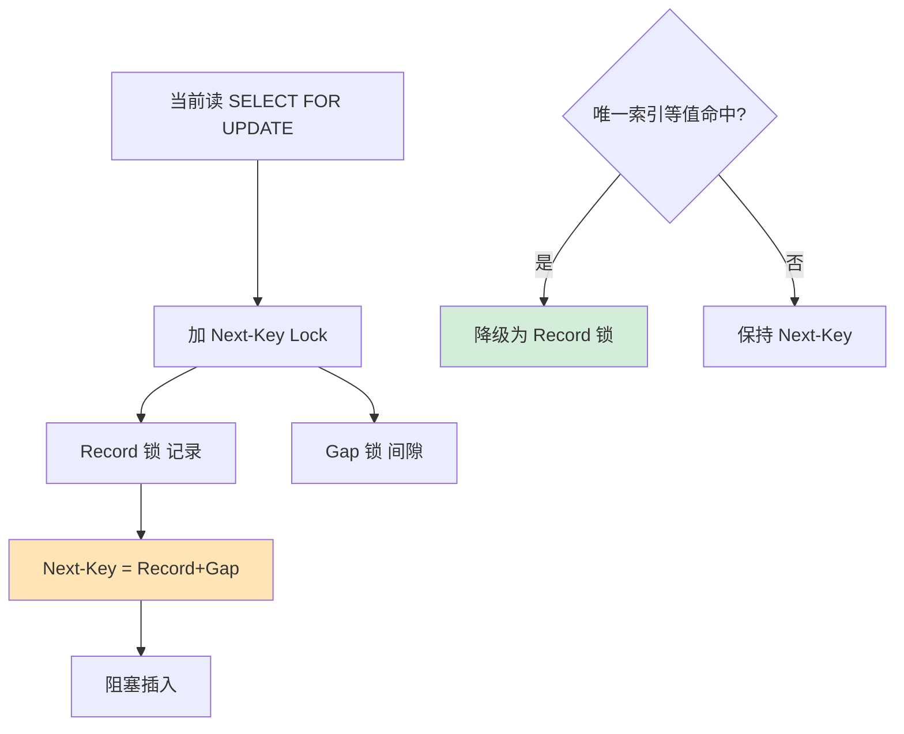

# InnoDB 的 Next-Key Lock 是什么？它如何解决幻读？Record/Gap/Next-Key 三种锁的区别？

【三种行锁】
1.  **Record Lock（记录锁）**：
    - 锁住索引上的一条精确记录。
    - 例如：`SELECT * FROM t WHERE id = 10 FOR UPDATE`，锁住 `id=10` 这一行。
2.  **Gap Lock（间隙锁）**：
    - 锁住索引记录之间的间隙，**不锁记录本身**。
    - 目的：防止幻读（Phantom Read），阻止其他事务向间隙中插入新记录。
    - 例如：现有数据 (10, 20)，间隙锁可能锁住 (10, 20) 或 (20, +∞)。
3.  **Next-Key Lock**：
    - ** = Record Lock + Gap Lock**。
    - 锁住一条记录以及它前面的间隙（左开右闭区间）。
    - 例如：锁定 (10, 20]，表示 10 和 20 之间不能插，20 这条记录也不能被修改/插入。

**ASCII 示意图（锁范围）**：
```text
假设索引数据为: 10, 20, 30
区间划分: (-∞, 10), (10, 20), (20, 30), (30, +∞)

1. Next-Key Lock (20, 30]:
   锁住范围: (20, 30) 间隙 + 30 记录
   |--- 10 ---|--- 20 ---|======Gap======|---[Rec(30)]---|--- 40 ---|
                         ^^^^^^^^^^^^^^^    ^^^^^^^^^^^^^
                         Gap Lock          Record Lock

2. Gap Lock (20, 30):
   锁住范围: 仅 (20, 30) 间隙
   |--- 10 ---|--- 20 ---|======Gap======|--- 30 ---|

3. Record Lock (30):
   锁住范围: 仅 30 这一行
   |--- 10 ---|--- 20 ---|--- 30 ---|
```

【如何解决幻读？】
- **快照读（普通 SELECT）**：依靠 MVCC（多版本并发控制），通过 ReadView 读取历史版本，看到的始终是事务开始时的数据， naturally 避免了幻读。
- **当前读（FOR UPDATE / UPDATE / DELETE）**：依靠 Next-Key Lock。通过锁定查询范围内的所有间隙和记录，物理上阻止其他事务在该范围内插入新数据，从而解决幻读。

【示例】
表有 `id=10, 20, 30`。
- `SELECT * FROM t WHERE id > 20 AND id < 30 FOR UPDATE`
- RR 级别下，会加 Next-Key Lock 锁住 `(20, 30]` 和 Gap Lock 锁住 `(30, +∞)`（为了防止插入 30 后面的数据影响下次查询）。
- 结果：`INSERT id=25` 被阻塞，`INSERT id=28` 被阻塞，`INSERT id=35` 被阻塞。

【降级规则（关键优化）】
InnoDB 会根据查询条件优化锁的粒度，以减少锁冲突：
1.  **唯一索引等值查询**：
    - **记录存在**：Next-Key Lock **降级为 Record Lock**（因为唯一性保证了不会有间隙插入冲突）。
    - **记录不存在**：Next-Key Lock **退化为 Gap Lock**（锁住该不存在的记录周围的间隙）。
2.  **普通索引等值查询**：无论记录是否存在，都会锁住对应的 Gap 和 Record（因为普通索引不唯一）。
3.  **范围查询**：通常不会降级，会使用 Next-Key Lock 锁住扫描到的所有区间。

## 常见考点
1.  **Gap Lock 只在 RR 级别生效**：在 Read Committed (RC) 隔离级别下，没有 Gap Lock，因此无法解决当前读的幻读问题，也无法阻止插入。
2.  **Gap Lock 的主要目的是什么**：不是为了解决重复读，而是为了解决**幻读**（阻止其他事务插入）。
3.  **什么情况下锁冲突最少**：如果是查询不存在的数据，RC 没有锁，RR 只有 Gap Lock；如果是查询存在的唯一数据，RC 和 RR（RR降级后）都只有 Record Lock。
4.  **临键锁在什么情况下会锁住插入**：例如 `SELECT * FROM t WHERE id = 5 FOR UPDATE`（id 是主键，无记录5），在 RR 下会锁住 (5的相邻记录之间) 的间隙，导致其他事务无法插入 5。


## 核心流程图




## 记忆要点

- 锁拆解：Next-Key Lock = Record Lock（锁记录本身） + Gap Lock（锁记录前方的间隙）
- 防幻读：快照读靠 MVCC 看历史版本；当前读靠 Next-Key Lock 物理锁死间隙阻止插入
- 降级条件：唯一索引等值且命中记录，Next-Key 降级为 Record；记录不存在则退化为 Gap
- 级别生效：Gap Lock 和 Next-Key 仅在 RR 级别存在，RC 级别下只有 Record Lock

## 结构化回答

**30 秒电梯演讲：** 记录锁与间隙锁的组合，锁住记录及其前方的间隙，杜绝幻影插入。打个比方，不仅占住座位（记录），还把座位两边的过道（间隙）也封死，别人插不进来。

**展开框架：**
1. **锁拆解** — Next-Key Lock = Record Lock（锁记录本身） + Gap Lock（锁记录前方的间隙）
2. **防幻读** — 快照读靠 MVCC 看历史版本；当前读靠 Next-Key Lock 物理锁死间隙阻止插入
3. **降级条件** — 唯一索引等值且命中记录，Next-Key 降级为 Record；记录不存在则退化为 Gap

**收尾：** 这三点都能配合实战聊。您想深入聊原理、对比还是避坑？

## 视频脚本

> 预计时长：3 分钟 | 由浅入深

| 时间 | 画面/字幕 | 口播台词 | 讲解要点 |
|------|----------|----------|----------|
| 0:00 | 标题卡：InnoDB 的 Next-Key … | "InnoDB 的 Next-Key Lock 是什么？它如何解决幻读？Record/Gap/Next-Key 三种锁的区别？一句话——不仅占住座位（记录），还把座位两边的过道（间隙）也封死，别人插不进来。" | 开场钩子 |
| 0:45 | 概念动画/示意图 | "记录锁与间隙锁的组合，锁住记录及其前方的间隙，杜绝幻影插入——不仅占住座位（记录），还把座位两边的过道（间隙）也封死，别人插不进来" | 核心定义 |
| 1:30 | 锁拆解示意 | "Next-Key Lock = Record Lock（锁记录本身） + Gap Lock（锁记录前方的间隙）" | 要点1 |
| 2:15 | 防幻读示意 | "快照读靠 MVCC 看历史版本；当前读靠 Next-Key Lock 物理锁死间隙阻止插入" | 要点2 |
| 3:00 | 总结卡 | "记住这几条，面试不慌。下期讲进阶追问。" | 收尾 |
