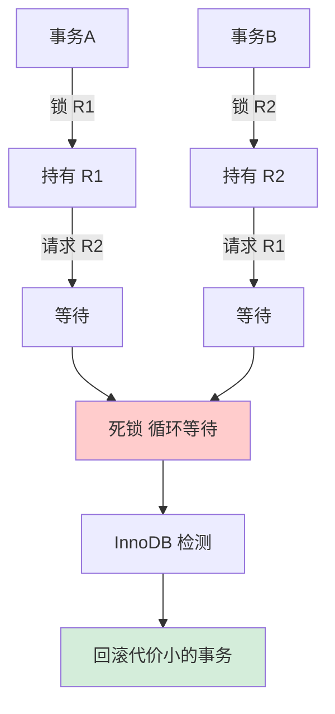

# MySQL 死锁是如何产生的？如何排查和预防？

【死锁产生原理】
死锁是指两个或多个事务在执行过程中，因争夺资源而造成的一种互相等待的现象。在 InnoDB 中，本质是**循环等待加锁资源**。

**必要条件**：
1. 互斥条件：资源是排他锁（X锁）。
2. 请求与保持：持有锁的同时请求新锁。
3. 不剥夺：锁不能被强行释放。
4. 循环等待：A等B的锁，B等A的锁。

**死锁检测机制**：
- InnoDB 默认开启 `innodb_deadlock_detect=ON`。
- 使用**等待图**算法。当事务 T1 请求锁被 T2 持有，且 T2 请求锁被 T1 持有时，构建环，检测到死锁。
- **回滚策略**：选择“代价最小”的事务回滚（通常是 `undo log` 记录最少，即改动量最小的）。

【死锁排查流程】
1. **开启日志**：`SET GLOBAL innodb_print_all_deadlocks = ON;` (将死锁信息写入 error log)。
2. **现场分析**：执行 `SHOW ENGINE INNODB STATUS;`，查看 `LATEST DETECTED DEADLOCK` 部分。
   - 输出包含：(1) 涉及的事务 ID；(2) 正在执行的 SQL；(3) 持有的锁；(4) 等待的锁。
3. **定位 SQL**：通过 SQL 分析业务逻辑，找到加锁顺序不一致的地方。

【死锁预防策略】
1. **固定加锁顺序**：
   - 这是预防死锁最有效的方法。例如，所有涉及修改订单和库存的事务，都先改订单表，再改库存表。如果两个事务都按 A->B 顺序，不会发生死锁。
2. **缩短事务持有锁的时间**：
   - 事务中不要进行网络调用（如调第三方 API）。
   - 避免大事务，尽快提交。
3. **降低隔离级别（RC vs RR）**：
   - RC 级别没有 Gap Lock（间隙锁），只有 Record Lock，大大减少锁冲突和死锁概率。
4. **合理使用索引**：
   - 如果 UPDATE/DELETE 语句没走索引，会进行全表扫描并给所有行加锁（甚至升级为表锁），极易死锁。务必确保索引有效。
5. **添加乐观锁**：
   - 使用 `version` 字段，`UPDATE ... SET version=version+1 WHERE id=? AND version=old_version`。无锁并发，失败重试。

## 常见考点
1. **MySQL 默认会自动处理死锁，为什么还要排查和优化？**（死锁检测和回滚本身消耗 CPU，频繁死锁严重影响业务吞吐量）
2. **行锁升级为表锁的场景有哪些？**（如批量操作未走索引、显式锁表、触发器等）
3. **如果是高并发简单更新，关闭死锁检测 (`innodb_deadlock_detect=off`) 可以提升性能吗？**（可行，但需配合 `innodb_lock_wait_timeout` 防止资源饿死，适用于热点行更新竞争极其剧烈的场景）

## 技术原理

死锁的产生和 InnoDB 的处理机制，要从锁的层级和检测算法理解：

- **InnoDB 的两阶段锁协议**：事务执行过程中按需加锁（行锁、间隙锁），但所有锁在事务 COMMIT 或 ROLLBACK 时才一次性释放。这意味着事务持有锁的时间 = 整个事务时长。如果两个事务交叉请求对方持有的锁（T1 锁了行 A 请求行 B，T2 锁了行 B 请求行 A），就形成循环等待——这就是死锁的"循环等待"必要条件。
- **等待图（Wait-for Graph）检测算法**：InnoDB 在每次锁等待发生时，构建一个有向图——节点是事务，边表示"T1 等待 T2 持有的锁"。若图里出现环（T1→T2→T1），就检测到死锁。这个检测发生在锁请求的热路径上，高并发热点行更新时检测本身会成为 CPU 瓶颈（O(n²) 的环检测）。
- **回滚代价最小的选择**：检测到死锁后，InnoDB 选择 undo log 体积最小（改动量最少）的事务作为 victim 回滚，这样回滚成本最低、重做成本也最低。被回滚的事务会收到 `ERROR 1213 (40001): Deadlock found`。
- **RR 隔离级别下的间隙锁放大**：RR（可重复读）为了防幻读会加 Next-Key Lock（Record Lock + Gap Lock）。Gap Lock 之间不冲突但和 Insert 意向锁冲突，两个事务各自持有间隙锁又试图在对方间隙插入，极易死锁。降级到 RC 消除 Gap Lock 能大幅降低死锁概率。

## 注意事项

1. **更新必须走索引**：UPDATE/DELETE 没走索引会全表扫描并给所有行加锁（甚至升级为表锁），极易死锁，务必确保 WHERE 条件命中索引。
2. **固定加锁顺序**：涉及多表或多行的事务，所有事务按相同顺序加锁（如都先订单后库存），从根本上破坏循环等待条件。
3. **缩短事务持锁时间**：事务里别做网络调用（调第三方 API）、别做大计算，尽快提交，减少锁持有窗口。
4. **高并发热点行可关检测**：极热点行更新时死锁检测本身是瓶颈，可关 `innodb_deadlock_detect` 靠 `innodb_lock_wait_timeout` 超时回滚，但要防资源饿死。

## 代码示例

```sql
-- 1. 开启死锁日志（排查必备）
SET GLOBAL innodb_print_all_deadlocks = ON;

-- 2. 查看最近一次死锁现场
SHOW ENGINE INNODB STATUS\G
-- 关注 LATEST DETECTED DEADLOCK 段：事务ID、执行的SQL、持有/等待的锁

-- 3. 查看当前锁等待（实时排查）
SELECT * FROM performance_schema.data_locks;        -- 8.0+ 查看持有的锁
SELECT * FROM performance_schema.data_lock_waits;   -- 查看锁等待关系

-- 4. 关闭死锁检测（仅极热点行场景，需配合超时）
SET GLOBAL innodb_deadlock_detect = OFF;
SET GLOBAL innodb_lock_wait_timeout = 5;  -- 锁等待5秒超时自动回滚
```

```java
// 乐观锁替代方案：高并发更新用 version 字段，避免行锁竞争死锁
@Update("UPDATE account SET balance = balance - #{amount}, version = version + 1 " +
        "WHERE id = #{userId} AND version = #{oldVersion}")
int deduct(@Param("userId") Long userId, @Param("amount") BigDecimal amount,
           @Param("oldVersion") int oldVersion);

// 调用处：失败重试（CAS 思想）
public void transfer(Long from, Long to, BigDecimal amount) {
    for (int i = 0; i < 3; i++) {
        Account acc = mapper.getById(from);
        if (mapper.deduct(from, amount, acc.getVersion()) > 0) {
            mapper.add(to, amount);
            return;
        }
        // version 不匹配，说明被其他事务改过，重试
    }
    throw new RuntimeException("转账失败，请重试");
}
```


## 核心流程图



## 核心知识点图


## 记忆要点

- 死锁本质：两个事务循环等待对方持有的资源（排他 X 锁）造成互相阻塞
- 自动处理：InnoDB 默认开启死锁检测，发现死锁后主动回滚代价最小（改动最少）的事务
- 排查命令：开启 innodb_print_all_deadlocks，通过 SHOW ENGINE INNODB STATUS 看死锁现场
- 预防核心：业务侧保证固定顺序加锁；更新必须走索引；高并发场景推荐降级到 RC 或用乐观锁

## 结构化回答

**30 秒电梯演讲：** 并发事务因循环等待资源而互相阻塞，死锁检测机制自动回滚其中一方。打个比方，两车在窄桥相遇互不相让，必须倒一辆车才能通行。

**展开框架：**
1. **死锁本质** — 两个事务循环等待对方持有的资源（排他 X 锁）造成互相阻塞
2. **自动处理** — InnoDB 默认开启死锁检测，发现死锁后主动回滚代价最小（改动最少）的事务
3. **排查命令** — 开启 innodb_print_all_deadlocks，通过 SHOW ENGINE INNODB STATUS 看死锁现场

**收尾：** 这三点都能配合实战聊。您想深入聊原理、对比还是避坑？

## 视频脚本

> 预计时长：3 分钟 | 由浅入深

| 时间 | 画面/字幕 | 口播台词 | 讲解要点 |
|------|----------|----------|----------|
| 0:00 | 标题卡：MySQL 死锁是如何产生的？如何排… | "MySQL 死锁是如何产生的？如何排查和预防？一句话——两车在窄桥相遇互不相让，必须倒一辆车才能通行。" | 开场钩子 |
| 0:45 | 概念动画/示意图 | "并发事务因循环等待资源而互相阻塞，死锁检测机制自动回滚其中一方——两车在窄桥相遇互不相让，必须倒一辆车才能通行" | 核心定义 |
| 1:30 | 死锁本质示意 | "两个事务循环等待对方持有的资源（排他 X 锁）造成互相阻塞" | 要点1 |
| 2:15 | 自动处理示意 | "InnoDB 默认开启死锁检测，发现死锁后主动回滚代价最小（改动最少）的事务" | 要点2 |
| 3:00 | 总结卡 | "记住这几条，面试不慌。下期讲进阶追问。" | 收尾 |
