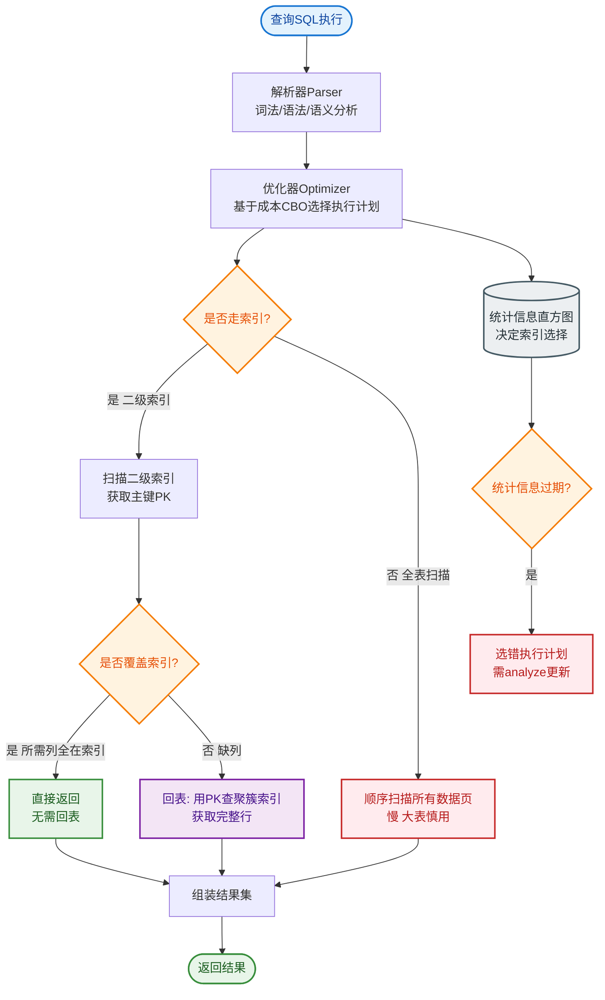

# 联合索引的最左前缀原则是什么？为什么 (a,b,c) 的索引查 b 或 c 走不了索引？

【最左前缀原则原理】
联合索引 (a, b, c) 底层是一颗 B+ 树，排序规则是：
1. 先按 `a` 字段排序。
2. `a` 相同时，按 `b` 字段排序。
3. `b` 相同时，按 `c` 字段排序。

**查询条件必须从最左边开始匹配**，原因在于 B+ 树的查找依赖二分查找，必须先确定高位（`a`）的范围，才能利用低位（`b`, `c`）的有序性。如果跳过 `a` 直接查 `b`，`b` 的值在全局范围内是无序的，无法使用索引。

【索引匹配场景详解】
假设索引为 `INDEX(a, b, c)`：

| 查询条件 | 是否走索引 | 使用索引列 | 说明 |
| :--- | :--- | :--- | :--- |
| `WHERE a=1` | ✅ | a | 精确匹配最左列 |
| `WHERE a=1 AND b=2` | ✅ | a, b | 精确匹配前两列 |
| `WHERE a=1 AND b=2 AND c=3` | ✅ | a, b, c | 全覆盖匹配 |
| `WHERE a=1 AND c=3` | ✅ | a | 只用了 a，c 虽然在索引中但 b 断了 |
| `WHERE b=2` | ❌ | None | a 缺失，全局无序 |
| `WHERE a=1 AND b>2 AND c=3` | ✅ | a, b | b 是范围，c 无法用索引（范围后失效）|
| `WHERE a=1 AND b IN (1,2) AND c=3` | ✅ | a, b, c | IN 列表在 MySQL 中被视为多次等值，c 可能用到 |
| `WHERE a=1 ORDER BY b` | ✅ | a, b | 利用索引避免 filesort |
| `WHERE b=2 ORDER BY a` | ❌ | None | 即使 a 排序，但 where 缺 a，优化器通常选全表扫描 |

**范围查询中断原理图**：
```text
索引数据结构示意
      Root
       │
       ├─ a=1 ──────────┬─ b=1 ── c=10
       │               ├─ b=2 ── c=20
       │               └─ b=3 ── c=30  <-- 范围查询 b > 2
       │                       ...
       │                       └─ c=999 (b>2时，c值依然是递增的，但对于b>2这个集合，b是变化的)
       │
       └─ a=2 ...
```
当 `b > 2` 时，索引定位到 `a=1` 下 `b>2` 的范围。在这个范围内，`b` 是递增的，但 `b` 不是定值，`c` 随 `b` 排序。只要 `b` 发生变化，`c` 的相对顺序对于优化器来说难以直接通过二分定位精确的 `c=3`，因此 `c` 的索引失效。

【索引下推（Index Condition Pushdown, ICP）】
- **场景**：`SELECT * FROM t WHERE a=1 AND c=3`
- **5.6 之前**：Server 层利用索引找到 `a=1` 的所有行主键 ID，回表查询整行数据，再在 Server 层判断 `c=3`。
- **5.6 之后（ICP）**：InnoDB 引擎层在遍历索引 `a=1` 时，直接在索引页中检查 `c=3` 是否满足。不满足则直接丢弃，**不回表**。
- **效果**：减少回表次数，降低 IO。

【设计建议】
1. **区分度**：将区分度高（筛选性强）的列放在前面。
2. **覆盖索引**：如果查询只需索引列，避免回表（如 `SELECT a, b FROM t WHERE a=1`）。
3. **等值在前，范围在后**：如 `(a, b, c)`，若 `b` 通常是范围查询，而 `c` 是精确查询，索引效率不如 `(a, c, b)`。

## 常见考点
1. **什么叫回表？如何减少回表？**（二级索引查到主键后去聚簇索引查数据；使用覆盖索引）
2. **`LIKE 'abc%'` 和 `LIKE '%abc'` 走索引吗？**（前者走，后者不走）
3. **联合索引 (a, b) 对查询 `WHERE b=1 AND a=1` 走索引吗？**（走，MySQL 优化器会自动重排序条件以匹配索引顺序）


## 核心流程图


## 记忆要点

- 底层是B+树按字段顺序排序，跳过首列查后续列会导致全局无序而失效
- 遇范围查询（如>、<、between）则其右侧的联合索引列全部失效
- IN被视为等值查询不中断，MySQL优化器会自动调整WHERE条件顺序匹配索引
- 索引下推（ICP）在5.6后引入，直接在引擎层过滤索引，减少回表次数

## 结构化回答


**30 秒电梯演讲：** 查字典必须先查首字母，跳过首字母直接查第二个字母很难。

**展开框架：**
1. **索引按列定义** — 索引按列定义顺序构建B+树
2. **跳过最左列或遇到范围查询** — 跳过最左列或遇到范围查询会导致后续列索引失效
3. **索引下推** — 索引下推可优化部分失效场景的过滤效率

**收尾：** 索引下推（ICP）和最左前缀有什么关系？


## 视频脚本

> 预计时长：4 分钟 | 由浅入深

| 时间 | 画面/字幕 | 口播台词 | 讲解要点 |
|------|----------|----------|----------|
| 0:00 | 标题卡：联合索引的最左前缀原则是什么？为什么… | "联合索引的最左前缀原则是什么？为什么 (a,b,c) 的索引查 b 或 c 走不了索引？一句话——查字典必须先查首字母，跳过首字母直接查第二个字母很难。" | 开场钩子 |
| 0:48 | 概念动画/示意图 | "联合索引按定义顺序排序，查询必须从左边开始匹配才能利用索引有序性——查字典必须先查首字母，跳过首字母直接查第二个字母很难" | 核心定义 |
| 1:36 | 要点1图解示意 | "跳过首列查后续列会导致全局无序而失效" | 要点1 |
| 2:24 | 要点2图解示意 | "遇范围查询（如>、<、between）则其右侧的" | 要点2 |
| 3:12 | IN被视为等值查询不中断示意 | "MySQL优化器会自动调整WHERE条件顺序匹配索引" | 要点3 |
| 4:00 | 总结卡 | "记住这几条，面试不慌。下期讲进阶追问。" | 收尾 |
