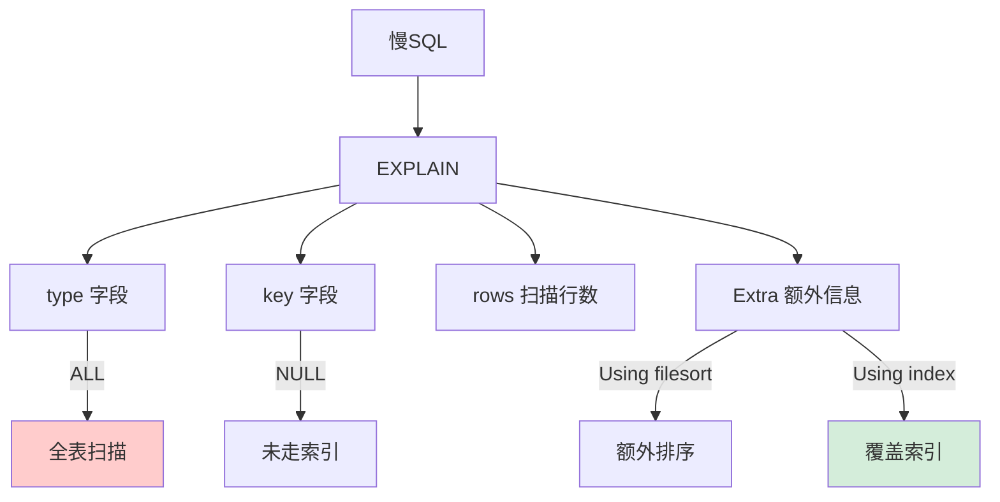

# 如何用 EXPLAIN 分析和优化慢 SQL？重点关注哪些字段？

【EXPLAIN 分析慢 SQL 核心字段】

1. **id**：SELECT 查询的序列号，表示查询中执行 SELECT 子句或操作表的顺序。
   - id 相同：执行顺序从上往下。
   - id 不同：id 越大越先执行（子查询）。
   - id 为 NULL：通常是结果集合并。

2. **type（访问类型）**：性能关键指标，从好到坏排序：
   `system` > `const` > `eq_ref` > `ref` > `range` > `index` > `ALL`
   - **const**：主键/唯一索引等值查询，最多返回 1 行。
   - **eq_ref**：连接查询中，对于前表的每一行，后表只读取一行（通常使用主键或唯一索引连接）。
   - **ref**：非唯一性索引等值查询，可能找到多行。
   - **range**：索引范围扫描（>, <, BETWEEN, IN）。
   - **index**：索引全扫描（通常发生在覆盖索引但需要扫描全部索引树，比 ALL 快但不代表好）。
   - **ALL**：全表扫描，需要优化。

3. **key**：实际使用的索引名。如果是 `NULL`，表示没有使用索引。

4. **key_len**：使用的索引字节数。
   - 计算规则：允许 `NULL` 占 1 字节，变长字段（VARCHAR）占 2 字节长度信息。
   - **作用**：判断联合索引是否被完全使用。例如联合索引，`key_len` 只对应 Col1 的长度，说明只用到了 Col1。

5. **rows**：预估需要扫描的行数。越小越好，但也只是预估值。

6. **Extra（重要补充信息）**：
   - **Using index**：覆盖索引，直接从索引获取数据，无需回表（性能极好）。
   - **Using filesort**：无法利用索引完成排序，需要外部排序（ filesort 或临时表），消耗 CPU 和内存，需优化。
   - **Using temporary**：使用了临时表处理查询（常见于 GROUP BY, ORDER BY 联合操作），通常意味着需要优化。
   - **Using where**：在存储引擎检索后，Server 层再进行过滤（说明索引没过滤掉所有数据）。
   - **Using index condition**：索引下推（ICP），在存储引擎层根据索引条件过滤数据，减少回表次数。

【优化实战策略】

1. **type 是 ALL**：
   - 检查 WHERE 条件字段是否有索引。
   - 检查是否发生了隐式类型转换（如字符串字段传了数字，导致索引失效）。

2. **key 为 NULL**：
   - 确认 WHERE、JOIN、ORDER BY 字段是否建立了合适的索引。
   - 检查是否对索引列进行了函数运算（如 `WHERE SUBSTR(name, 1, 3) = 'abc'`）。解决：修改为 `WHERE name LIKE 'abc%'` 或使用函数索引（MySQL 8.0+）。

3. **Extra 有 Using filesort**：
   - **场景**：`ORDER BY a, b` 但索引是 `b, a`（不符合最左前缀），或者 `SELECT *` 包含了非索引列导致无法利用索引有序性。
   - **优化**：调整索引顺序以匹配 `ORDER BY`，或只 Select 索引列配合 `filesort` 优化（但这还是会 filesort，最好改索引）。

4. **Extra 有 Using temporary**：
   - **场景**：`GROUP BY a` 但索引是 `b, a`。
   - **优化**：调整索引顺序使其支持分组，或者利用 `WHERE` 提前减少数据量。

5. **大分页优化**：
   - **问题**：`LIMIT 100000, 10` 需要扫描 100010 行。
   - **方案**：利用游标分页（延迟关联）
     ```sql
     -- 优化前
     SELECT * FROM t_order ORDER BY id LIMIT 100000, 10;
     -- 优化后
     SELECT t.* FROM t_order t INNER JOIN (SELECT id FROM t_order ORDER BY id LIMIT 100000, 10) d ON t.id = d.id;
     ```

## 常见考点
1. **什么是覆盖索引？为什么快？**
   索引的叶子节点已经包含了查询所需的所有字段（SELECT 中的字段都在索引中），无需回表查询聚簇索引，减少随机 I/O。
2. **最左前缀原则是什么？****
   对于联合索引 `(a, b, c)`，查询条件必须从最左侧 `a` 开始，`a` 和 `b`，或者 `a, b, c` 才能命中索引。如果跳过 `a` 直接查 `b`，索引失效。
3. **什么情况下索引会失效？**
   - 使用 `NOT IN`, `<>`, `!=`（虽然 MySQL 8.0 有优化，但仍需谨慎）。
   - 对索引列进行函数运算或数学运算。
   - 隐式类型转换（如字符串转数字）。
   - `LIKE '%abc'`（左模糊）。
   - `OR` 连接的字段未全有索引。


## 核心流程图



## 记忆要点

- type看性能：从好到坏为 const > eq_ref > ref > range > index > ALL，至少达到range
- Extra看补充：Using index代表覆盖索引免回表，filesort和temporary必须优化
- key_len算长度：用于判断联合索引用了几个字段，注意可空和变长字段额外占字节
- 隐式转换或对索引列使用函数会导致key为NULL，走全表扫描

## 结构化回答

**30 秒电梯演讲：** 通过EXPLAIN分析SQL执行计划，定位扫描行数多和回表次数多的瓶颈。打个比方，出门前先看导航路线图，避开拥堵路段。

**展开框架：**
1. **type看性能** — 从好到坏为 const > eq_ref > ref > range > index > ALL，至少达到range
2. **Extra看补充** — Using index代表覆盖索引免回表，filesort和temporary必须优化
3. **key_len算长度** — 用于判断联合索引用了几个字段，注意可空和变长字段额外占字节

**收尾：** 这三点都能配合实战聊。您想深入聊原理、对比还是避坑？

## 视频脚本

> 预计时长：3 分钟 | 由浅入深

| 时间 | 画面/字幕 | 口播台词 | 讲解要点 |
|------|----------|----------|----------|
| 0:00 | 标题卡：如何用 EXPLAIN 分析和优化慢… | "如何用 EXPLAIN 分析和优化慢 SQL？重点关注哪些字段？一句话——出门前先看导航路线图，避开拥堵路段。" | 开场钩子 |
| 0:45 | 概念动画/示意图 | "通过EXPLAIN分析SQL执行计划，定位扫描行数多和回表次数多的瓶颈——出门前先看导航路线图，避开拥堵路段" | 核心定义 |
| 1:30 | type看性能示意 | "从好到坏为 const > eq_ref > ref > range > index > ALL，至少达到range" | 要点1 |
| 2:15 | Extra看补充示意 | "Using index代表覆盖索引免回表，filesort和temporary必须优化" | 要点2 |
| 3:00 | 总结卡 | "记住这几条，面试不慌。下期讲进阶追问。" | 收尾 |
