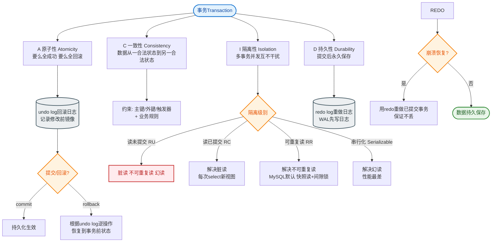

# 事务的四大特性有哪些

### 事务的四大特性（ACID）

1. **原子性**：事务是不可分割的最小工作单元，事务中的所有操作要么全部成功，要么全部失败回滚，不会停留在中间状态。
   - **实现原理**：利用 **Undo Log（回滚日志）**。当事务执行失败或调用 ROLLBACK 时，利用 Undo Log 中的信息将数据回滚到修改前的状态。

2. **一致性**：事务执行前后，数据库的完整性约束没有被破坏，数据从一个一致性状态变换到另一个一致性状态（如转账前后总金额不变）。
   - **关注点**：这是事务的最终目标。A、I、D 是手段，C 是结果。它依赖于应用层逻辑（如转账逻辑）和数据库层面的约束（外键、唯一索引）共同保障。

3. **隔离性**：一个事务的执行不应受其他并发事务的干扰，事务中间状态对其他事务不可见（通常通过锁或 MVCC 实现）。
   - **实现原理**：
     - **锁机制**：共享锁与排他锁，解决写-写冲突。
     - **MVCC（多版本并发控制）**：通过 Read View 和 Undo Log 实现读写并发，解决读-写冲突，提供快照读（一致性读），避免加锁。

4. **持久性**：事务一旦提交，其对数据的修改就是永久性的，即使数据库发生故障也不会丢失。
   - **实现原理**：利用 **Redo Log（重做日志）**。MySQL 采用 WAL（Write-Ahead Logging）机制，事务提交时先写日志再异步刷盘数据页。宕机重启时，通过 Redo Log 恢复未落盘的数据。

```text
      MySQL 事务执行与日志关系
      ┌─────────────┐
      │  开启事务   │
      └──────┬──────┘
             │
      ┌──────▼──────────────────────────────┐
      │  执行 SQL (修改内存 Buffer Pool)    │
      │  写入 Undo Log (用于回滚)           │
      │  写入 Redo Log (用于崩溃恢复)       │
      └──────┬──────────────────────────────┘
             │
      ┌──────▼──────┐
      │   COMMIT    │  (持久性保证)
      │ Redo落盘    │
      └─────────────┘
```

## 常见考点
1. **Redo Log 和 Undo Log 的区别是什么？**
   - **Redo Log**：记录数据修改后的值（物理日志），用于**未提交数据的持久化**（提交后也需保留以确保持久化），解决**崩溃恢复**问题，保证持久性。
   - **Undo Log**：记录数据修改前的值（逻辑日志），用于**回滚**和**MVCC**（构建旧版本数据），保证原子性和隔离性。
2. **ACID 中哪一个最难保证？**
   通常认为 **一致性（Consistency）** 最难，因为它不仅依赖于数据库内部机制（AID），更严重依赖应用层的业务逻辑正确性（如余额是否扣对、库存是否扣对）。
3. **如果不开启事务，SQL 语句是原子的吗？**
   是的。在 MySQL 中，单条 SQL 语句（非 DDL）默认就是一个事务，隐式提交，具有原子性。
4. **什么是 WAL 机制？**
   Write-Ahead Logging，先写日志再写数据。Redo Log 是顺序写，数据页是随机写，顺序写性能远高于随机写，因此利用 WAL 技术可以大幅提升数据库写入性能。


## 核心流程图


## 记忆要点

- ACID中，AID是手段，C是最终结果（一致性依赖应用层和数据库约束共同保障）
- 原子性靠Undo Log实现，失败则利用记录的旧值数据回滚
- 持久性靠Redo Log实现，先写日志(WAL机制)再异步刷数据盘防宕机
- 隔离性靠锁和MVCC实现，解决并发场景下的读写冲突

## 结构化回答

**30 秒电梯演讲：** 事务是数据库操作的逻辑单元，保证数据操作的原子、一致、隔离和持久。打个比方，银行转账：要么同时成功，要么同时失败，不能只扣钱不到账。

**展开框架：**
1. **ACID中** — AID是手段，C是最终结果（一致性依赖应用层和数据库约束共同保障）
2. **原子性靠Undo Log实现** — 失败则利用记录的旧值数据回滚
3. **持久性靠Redo Log实现** — 先写日志(WAL机制)再异步刷数据盘防宕机

**收尾：** 这三点都能配合实战聊。您想深入聊原理、对比还是避坑？

## 视频脚本

> 预计时长：2 分钟 | 由浅入深

| 时间 | 画面/字幕 | 口播台词 | 讲解要点 |
|------|----------|----------|----------|
| 0:00 | 标题卡：事务的四大特性有哪些 | "事务的四大特性有哪些？一句话——银行转账：要么同时成功，要么同时失败，不能只扣钱不到账。" | 开场钩子 |
| 0:40 | 概念动画/示意图 | "事务是数据库操作的逻辑单元，保证数据操作的原子、一致、隔离和持久——银行转账：要么同时成功，要么同时失败，不能只扣钱不到账" | 核心定义 |
| 1:20 | ACID中示意 | "AID是手段，C是最终结果（一致性依赖应用层和数据库约束共同保障）" | 要点1 |
| 2:00 | 总结卡 | "记住这几条，面试不慌。下期讲进阶追问。" | 收尾 |
