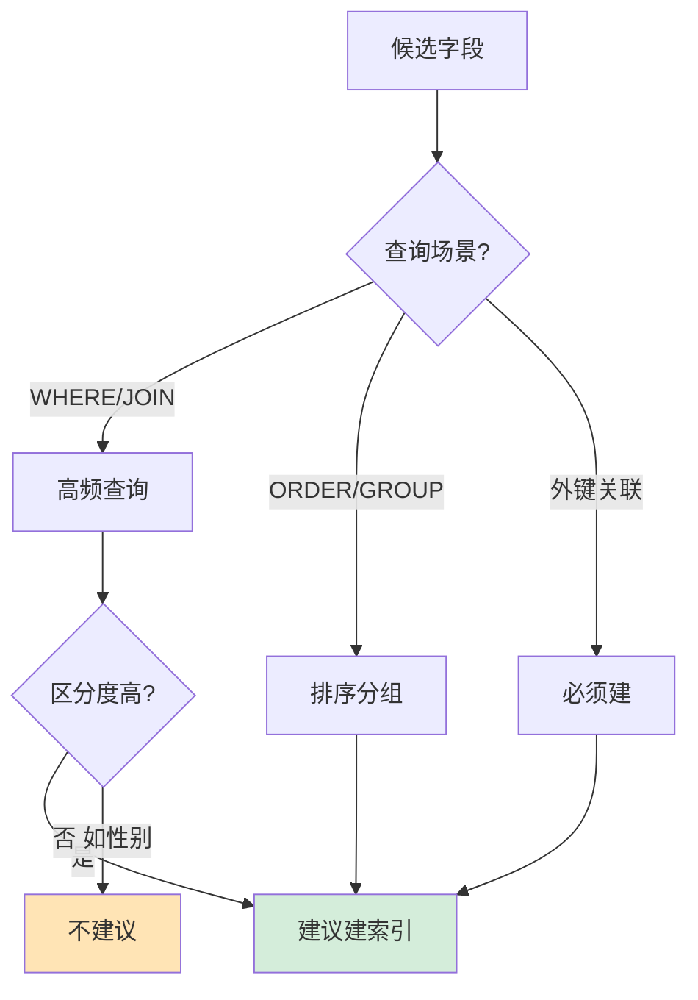

# 什么时候需要创建索引

### 什么时候需要创建索引

**适合创建索引的场景**：
1. **主键自动创建**：表的主关键字会自动建立唯一索引。
2. **频繁作为查询条件的字段**：经常出现在 WHERE 子句中的字段，能显著提高查询速度。
3. **关联表字段**：用于 JOIN 连接的字段，建立索引可以加速表连接。
4. **排序字段**：经常用于 ORDER BY 或 GROUP BY 的字段，索引可以避免额外的排序开销。
5. **统计或分组字段**：需要频繁进行 COUNT 或 GROUP BY 的字段。
6. **区分度高的字段**：如身份证号、用户名等，筛选效率高。

**原理细节与补充**：
*   **区分度计算**：`count(distinct col) / count(col)`，越接近 1 效果越好。通常超过 10% 的区分度才有索引价值，但如果是状态类字段（如只有 0 和 1），区分度极低，索引反而失效。
*   **覆盖索引**：如果查询的字段全部包含在索引中（如 `SELECT id FROM user WHERE name='xx'`），索引无需回表，性能极大提升。创建索引时可考虑将常查询列加入联合索引。
*   **左前缀原则**：对于联合索引 `(a, b, c)`，查询条件必须包含最左侧列 `a`，索引才能生效。

**注意事项**：
- 索引不是越多越好，写入操作频繁的表需权衡索引维护成本。
- 索引会占用磁盘空间，且修改数据时需要更新索引树，影响写入性能。

**5. 实战补充**
- **实战案例**：在某社交系统中，对 `is_deleted`（0/1）字段建立索引导致全表扫描，不仅没加速，反而因优化器计算成本错误选择了错误的执行计划。后来改为通过业务逻辑过滤掉已删除数据，不再为该低区分度字段建索引。在订单表优化中，将 `(shop_id, status)` 建为联合索引，完美支持了“商家查看所有待发货订单”的高频查询。
- **代码示例**：
```sql
-- 分析字段区分度，决定是否建索引
SELECT 
  COUNT(DISTINCT user_id) / COUNT(*) as selectivity 
FROM orders; 
-- 结果接近 1，适合建索引

-- 创建联合索引优化排序和分组
ALTER TABLE orders ADD INDEX idx_shop_status_time (shop_id, status, created_at);
-- 该索引可加速 WHERE shop_id=? AND status=? ORDER BY created_at
```
- **对比表格**：B+树索引 vs Hash索引选型
| 对比维度 | B+树索引 | Hash 索引 |
| :--- | :--- | :--- |
| **查询类型** | 等值、范围查询、排序、前缀模糊 | 仅支持等值查询 (=, IN) |
| **排序/分组** | 天然支持（索引有序） | 不支持（无序存储） |
| **内存消耗** | 较高（多路树结构） | 较低（仅存储键值指针） |
| **适用场景** | OLTP 业务，大多数场景 | Memory 引擎，键值对缓存 |

## 常见考点
1.  **为什么索引不建议建立在性别、状态这种区分度低的字段上？**
2.  **什么是最左前缀匹配原则？联合索引 (a, b) 执行 `WHERE b=1` 会走索引吗？**
3.  **什么是聚簇索引和非聚簇索引？**


## 核心流程图




## 记忆要点

- 高频查询（WHERE）、排序（ORDER BY）和连接（JOIN）的字段必须建索引
- 字段区分度公式 count(distinct col)/count(*) 接近1，低区分度建索引反而失效
- 联合索引设计：把区分度高且等值查询的列放左边，范围查询列放右边
- 索引维护有成本：占用磁盘且写入数据需更新索引树，写多场景需权衡

## 结构化回答

**30 秒电梯演讲：** 在频繁查询、排序或连接的字段上建立索引，用空间换时间。打个比方，在图书馆常借的热门书籍旁贴上醒目标签，方便快速找到。

**展开框架：**
1. **高频查询（WHERE）、排序（ORDER BY）** — 和连接（JOIN）的字段必须建索引
2. **联合索引设计** — 把区分度高且等值查询的列放左边，范围查询列放右边
3. **字段区分度公式 count(distinct c** — ol)/count(*) 接近1，低区分度建索引反而失效

**收尾：** 我在项目里踩过坑——COUNT(DISTINCT user_id) / COUNT() as selectivity。您想深入聊哪一段：原理、避坑还是对比选型？

## 视频脚本

> 预计时长：2 分钟 | 由浅入深

| 时间 | 画面/字幕 | 口播台词 | 讲解要点 |
|------|----------|----------|----------|
| 0:00 | 标题卡：什么时候需要创建索引 | "什么时候需要创建索引？一句话——在图书馆常借的热门书籍旁贴上醒目标签，方便快速找到。" | 开场钩子 |
| 0:40 | 概念动画/示意图 | "在频繁查询、排序或连接的字段上建立索引，用空间换时间——在图书馆常借的热门书籍旁贴上醒目标签，方便快速找到" | 核心定义 |
| 1:20 | 要点1图解示意 | "高频查询（WHERE）、排序（ORDER BY）" | 要点1 |
| 2:00 | 总结卡 | "记住这几条，面试不慌。下期讲进阶追问。" | 收尾 |
