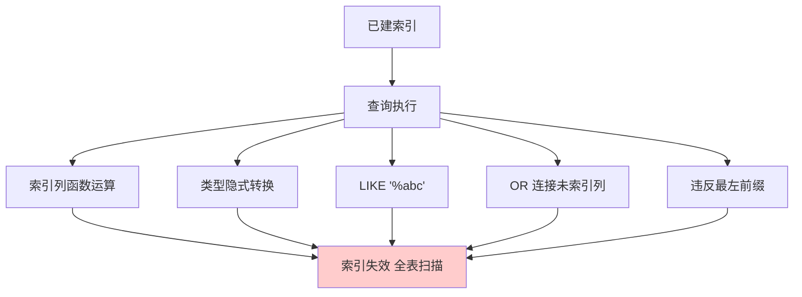

# 索引失效的场景有哪些

### 索引失效的场景有哪些

**常见导致索引失效的情况**：

1. **使用函数或运算**：在索引列上进行函数计算（如 `WHERE YEAR(create_time) = 2023`）或加减运算。
2. **类型转换**：查询条件中隐式类型转换（如字符串字段存了数字，查询时用数字匹配）。
3. **Like 前缀模糊匹配**：使用 `LIKE '%abc'` 或 `LIKE '%abc%'`，以通配符开头会导致全表扫描（`LIKE 'abc%'` 不会失效）。
4. **违反最左前缀原则**：联合索引未使用最左侧列或中间列断开。
5. **范围查询后的列**：联合索引中，如果某列进行了范围查询（>、<、between），其后的列索引无法使用。
6. **不等于操作**：使用 `<>` 或 `!=`，通常会导致索引失效转为全表扫描。
7. **IS NULL 或 IS NOT NULL**：视优化器而定，有时索引无法有效利用。
8. **OR 连接未索引列**：`OR` 连接的两个字段中，有一个没有索引，则全表扫描。

**原理细节与补充**：
*   **计算在列左边**：数据库优化器无法将索引树的值与计算后的表达式进行匹配，必须取出每一行数据进行计算，因此导致全表扫描。应改为 `WHERE create_time BETWEEN '2023-01-01' AND '2023-12-31'`。
*   **隐式转换本质**：如列是 varchar 类型，查询 `WHERE col = 123`，MySQL 需要将每行的 col 转为数字再比较，相当于对列做了函数操作。**解决方法**：保证参数类型与字段定义一致，使用字符串参数 `WHERE col = '123'`。
*   **OR 的逻辑**：`OR` 意味着满足任一条件即可。如果其中一个条件无索引，数据库为了确保不漏数据，往往被迫全表扫描。除非两个条件都有索引，且优化器选择使用 Index Merge（索引合并）。
*   **范围查询截断**：对于联合索引 `(name, age, address)`，如果执行 `WHERE name='A' AND age > 20 AND address='Beijing'`，只有 `name` 和 `age` 部分生效，`address` 索引失效。因为范围查询后的值是无序的，无法直接利用 B+ 树的有序性。

**5. 实战补充**
- **实战案例**：曾遇到生产环境 CPU 飙高，排查发现某 Java 代码中 MyBatis 查询 `WHERE phone = #{param}`，参数传入了 Long 型，而数据库字段为 varchar。导致隐式转换，全表扫描拖垮数据库。另外，对于 `LIKE '%关键词'` 需求，引入 ElasticSearch 后，MySQL 数据压力降低了 90%。
- **代码示例**：
```sql
-- 错误：索引列上使用函数导致失效
-- SELECT * FROM users WHERE YEAR(birthday) = 1990;

-- 正确：使用范围查询替代函数计算
SELECT * FROM users WHERE birthday BETWEEN '1990-01-01' AND '1990-12-31';

-- 隐式转换演示
-- 假设 code 字段类型为 VARCHAR
-- 下方查询会导致全表扫描
-- SELECT * FROM goods WHERE code = 1001; 
-- 修正：使用字符串
SELECT * FROM goods WHERE code = '1001';
```
- **对比表格**：索引生效 vs 失效场景对比
| 场景描述 | 索引状态 | 说明 |
| :--- | :--- | :--- |
| `WHERE col LIKE 'abc%'` | **生效** | 前缀匹配，利用索引有序性 |
| `WHERE col LIKE '%abc'` | **失效** | 无法利用索引顺序，全表扫描 |
| `WHERE col + 1 = 10` | **失效** | 列参与运算，无法利用索引树 |
| `WHERE col = 9` (col为varchar) | **失效** | 发生隐式类型转换 |
| `WHERE a=1 AND b>10 AND c=1` (索引abc) | **部分失效** | a、b生效，c因范围查询后失效 |

## 常见考点
1.  **如何优化 `LIKE '%字符串%'` 这种全模糊查询？**（提示：ES、倒排索引、覆盖索引）
2.  **`OR` 在什么情况下会走索引？**（提示：Index Merge）
3.  **为什么 `IS NULL` 有时会走索引，有时不走？**


## 核心流程图



## 核心知识点图


## 记忆要点

- 索引列做运算或使用函数（含隐式类型转换）会破坏匹配导致失效
- 模糊匹配LIKE以%开头（左模糊）会走全表扫描，而右模糊可走索引
- 联合索引未符合最左前缀，或范围查询右侧的列，均无法使用索引
- OR连接的条件中，若存在任意一个无索引的字段，则整体失效退化为全表扫描

## 结构化回答


**30 秒电梯演讲：** 电话簿按姓氏排序，如果你想找“姓张的人”，电话簿没用，只能翻遍整本。

**展开框架：**
1. **对索引列进行函数** — 运算或类型转换会导致失效
2. **Like以%开头** — 、不等于、OR连接未索引列会导致失效
3. **联合索引不满足最** — 左前缀或出现范围截断会导致失效

**收尾：** 这是我实战中的理解，您想深入哪一段？


## 视频脚本

> 预计时长：2 分钟 | 由浅入深

| 时间 | 画面/字幕 | 口播台词 | 讲解要点 |
|------|----------|----------|----------|
| 0:00 | 标题卡：索引失效的场景有哪些 | "索引失效的场景有哪些？一句话——电话簿按姓氏排序，如果你想找“姓张的人”，电话簿没用，只能翻遍整本。" | 开场钩子 |
| 0:40 | 概念动画/示意图 | "当查询条件无法利用索引的有序性或需要对索引列进行计算时，索引失效——电话簿按姓氏排序，如果你想找“姓张的人”，电话簿没用，只能翻遍整本" | 核心定义 |
| 1:20 | 要点1图解示意 | "索引列做运算或使用函数（含隐式类型转换）会破坏匹" | 要点1 |
| 2:00 | 总结卡 | "记住这几条，面试不慌。下期讲进阶追问。" | 收尾 |
