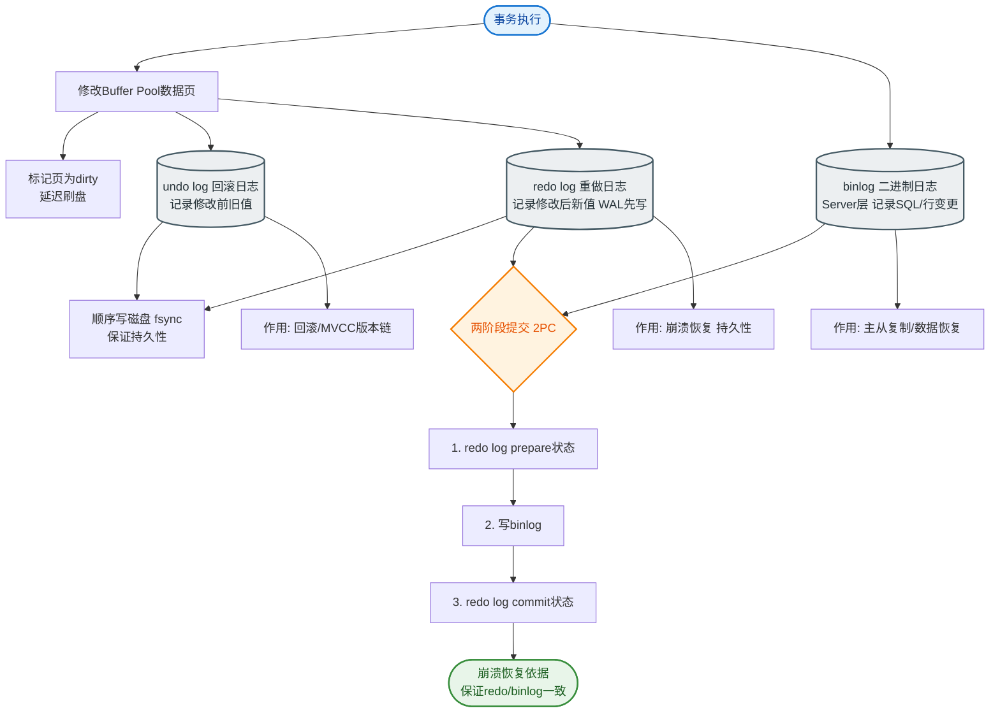

# MySQL日志文件有哪几种

### MySQL 日志文件有哪几种

MySQL 主要包含以下几种重要的日志文件：

1. **错误日志**
   记录 MySQL 服务器启动、关闭或运行过程中遇到的严重错误信息。

2. **查询日志**
   记录客户端所有的查询语句，包括 SELECT、UPDATE 等。由于日志量巨大，通常仅在调试时开启，生产环境建议关闭。

3. **慢查询日志**
   记录执行时间超过 `long_query_time`（默认 10 秒）的查询语句，或者未使用索引的查询。主要用于定位性能瓶颈和 SQL 优化。

4. **二进制日志**
   **作用**：记录所有修改数据的语句（如 INSERT、UPDATE、DELETE、DDL），不记录查询语句。主要用于**数据恢复**和**主从复制**。
   **格式**：分为 Statement（基于 SQL 语句）、Row（基于行数据）和 Mixed（混合模式）。

5. **事务日志**
   这是 InnoDB 存储引擎特有的日志，包括两部分：
   *   **Redo Log（重做日志）**：物理日志，记录数据页的修改。用于实现事务的持久性，崩溃恢复时可以将未写入磁盘的数据恢复。
   *   **Undo Log（回滚日志）**：逻辑日志，记录修改前的数据。用于实现事务的原子性和 MVCC（多版本并发控制），当事务回滚或读取旧版本数据时使用。

**原理细节与补充**：
*   **WAL 技术**：Write-Ahead Logging。InnoDB 更新数据时，先写日志，再更新内存，最后异步刷盘。即使系统崩溃，只要 Redo Log 存在，数据就能恢复。
*   **Redo Log 循环写**：Redo Log 是固定大小的，写满后覆盖从头开始写。
*   **Binlog vs Redo Log**：
    - Redo Log 是 InnoDB 特有的，物理日志，循环写入，用于崩溃恢复。
    - Binlog 是 Server 层的，逻辑日志，追加写入，用于主从复制和数据归档。

**MySQL 更新语句执行流程图**（以 `UPDATE user SET name='A' WHERE id=1` 为例）：

```text
执行器 -> 引擎
   |        |
   |  1. 查询数据页（Buffer Pool）
   |
   |  2. 写 Undo Log (记录旧值)
   |
   |  3. 更新内存数据
   |
   |  4. 写 Redo Log (Prepare 状态)
   |
   |-----------------> 5. 写 Binlog
   |
   |<----------------- 6. 提交事务 (Redo Log Commit)
   |
   v
  返回结果
```

**6. 实战补充**
- **实战案例**：在一次误删数据的事故中，通过分析最近的 Binlog 文件（`mysqlbinlog --base64-output=DECODE-ROWS -v binlog.00000x`），定位到了误执行的 DELETE 语句，将其转换为 INSERT 语句并反向执行，成功恢复了数据。另外，开启 `slow_query_log` 曾帮助我们发现某报表 SQL 每次执行耗时 30 秒，经优化后降至 0.5 秒。
- **代码示例**：
```sql
-- 配置开启慢查询日志（my.cnf 或 运行时设置）
SET GLOBAL slow_query_log = 'ON';
SET GLOBAL long_query_time = 1; -- 超过1秒记录

-- 查看 Binlog 日志列表
SHOW BINARY LOGS;

-- 使用 mysqlbinlog 工具解析 binlog 恢复数据
-- shell 命令：
-- mysqlbinlog --start-datetime="2023-10-01 00:00:00" --stop-datetime="2023-10-01 12:00:00" binlog.000123 | mysql -u root -p
```
- **对比表格**：Binlog vs Redo Log
| 特性 | Binlog (二进制日志) | Redo Log (重做日志) |
| :--- | :--- | :--- |
| **归属层级** | MySQL Server 层 | InnoDB 存储引擎层 |
| **日志内容** | 逻辑日志（SQL语句或行变更） | 物理日志（数据页物理修改） |
| **写入方式** | 追加写，文件无限增长 | 循环写，固定大小空间 |
| **主要用途** | 主从复制、数据备份/恢复 | 崩溃恢复、保证事务持久性 |

## 常见考点
1.  **两阶段提交（2PC）是什么？为什么需要 Binlog 和 Redo Log 两阶段提交？**（保持数据一致性）
2.  **Undo Log 除了回滚，还有什么作用？**（提示：MVCC 快照读）
3.  **Redo Log 为什么能够提升性能？**（提示：顺序写 vs 随机写）


## 核心流程图


## 记忆要点

- Redo Log属InnoDB物理日志用于崩溃恢复，Binlog属Server层逻辑日志用于主从同步
- Redo Log循环写固定大小，Binlog追加写文件无限增长
- Undo Log记录修改前逻辑值，不仅用于事务回滚，更是MVCC的核心组件
- 两阶段提交（写Redo Prepare -> 写Binlog -> 提交Commit）保障日志一致性

## 结构化回答


**30 秒电梯演讲：** 像飞机的黑匣子、行车记录仪和记账本，分别记录故障、全过程操作和具体账目细节。

**展开框架：**
1. **Error** — Error Log记录服务器启动和运行错误
2. **Slow** — Slow Log记录超时查询，用于性能优化
3. **Binlog** — Binlog记录数据变更，用于主从复制和恢复

**收尾：** 这是我实战中的理解，您想深入哪一段？


## 视频脚本

> 预计时长：2 分钟 | 由浅入深

| 时间 | 画面/字幕 | 口播台词 | 讲解要点 |
|------|----------|----------|----------|
| 0:00 | 标题卡：MySQL日志文件有哪几种 | "MySQL日志文件有哪几种？一句话——像飞机的黑匣子、行车记录仪和记账本，分别记录故障、全过程操作和具体账目细节。" | 开场钩子 |
| 0:40 | 概念动画/示意图 | "MySQL通过不同日志记录运行状态、数据变更及事务细节，保障安全、恢复与复制——像飞机的黑匣子、行车记录仪和记账本，分别记录故障、全过程操作和具体账目细节" | 核心定义 |
| 1:20 | 要点1图解示意 | "Redo Log属InnoDB物理日志用于崩溃恢复，Binlog属Server层逻辑日志用于" | 要点1 |
| 2:00 | 总结卡 | "记住这几条，面试不慌。下期讲进阶追问。" | 收尾 |
