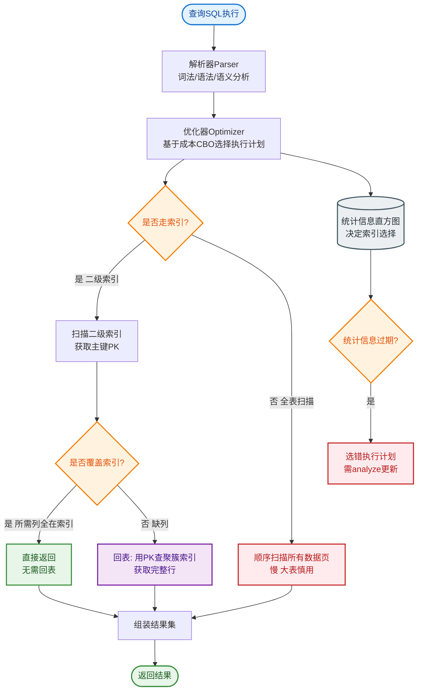

# 数据库-MySQL

### I/O 多路复用

I/O 多路复用允许单个线程同时监视多个文件描述符（Socket），当某个描述符就绪（如可读或可写）时，应用程序能收到通知并进行操作。它避免了为每个连接创建线程的资源开销。

**主要机制**：

*   **Select**：
    *   机制：使用位图来存储文件描述符，通过轮询检查状态。
    *   缺点：有最大连接数限制（通常 1024），且随着连接数增加，线性轮询效率显著下降（O(N)）。

*   **Poll**：
    *   机制：使用链表或数组结构存储文件描述符，解决了连接数限制问题。
    *   缺点：本质上仍是轮询，当连接数很多但活跃连接很少时，效率依然低下（O(N)）。

*   **Epoll (Linux 特有)**：
    *   机制：基于事件驱动。使用 `epoll_ctl` 管理描述符，内部通过红黑树存储；使用 `epoll_wait` 等待事件，当描述符就绪时通过回调函数放入就绪链表。
    *   优点：O(1) 的时间复杂度，不受连接总数影响，只处理活跃连接，性能极高。

**I/O 模型对比图**：

```text
┌─────────────┐     select/poll      ┌──────────────┐
│   Application│ <──────────────────> │    Kernel     │
└─────────────┘   (遍历所有 fd)       └──────────────┘

┌─────────────┐     epoll_wait       ┌──────────────┐
│   Application│ <──────────────────> │    Kernel     │
└─────────────┘   (只返回活跃 fd)      └──────────────┘
                     │
                     │ (回调机制)
                     ▼
               ┌───────────┐
               │ Ready List│
               └───────────┘
```

### MySQL 基础概念

1.  **主键**
    *   唯一标识表中的每一行数据。
    *   主键的值不能重复，也不能为 NULL。
    *   一个表只能有一个主键。

2.  **外键**
    *   用于建立两个表之间的关联，指向另一张表的主键。
    *   主要作用是保证数据的参照完整性（如不能插入不存在关联 ID 的记录）。

3.  **索引**
    *   是帮助 MySQL 高效获取数据的数据结构（如 B+ 树）。
    *   目的是提高查询和排序的速度，以空间换时间。

4.  **区别与联系**
    *   主键是唯一的索引，且不允许为空。
    *   外键通常也会自动创建索引以提高连接查询性能，但其核心是逻辑关联。
    *   索引可以是普通索引、唯一索引等，不一定是主键或外键。

**MySQL 架构简图**：

```text
┌─────────────────────┐
│    Connection Layer │ (连接器)
└──────────┬──────────┘
           │
┌──────────▼──────────┐
│    SQL Interface    │ (服务层: 分析器, 优化器)
└──────────┬──────────┘
           │
┌──────────▼──────────┐
 │   Pluggable Storage │
 │      Engines       │ <── InnoDB, MyISAM
 └─────────────────────┘
           │
┌──────────▼──────────┐
 │    File System     │ (数据文件: .ibd, .myd)
 └─────────────────────┘
```

### 常见考点

1.  **Select、Poll、Epoll 的区别？为什么 Epoll 性能最高？**

    **实战案例**：在开发高并发网关服务时，曾遇到 C10K 问题。初始使用 Select 因连接数超过 1024 限制导致服务拒绝连接，且 CPU 飙升。切换至 Epoll (LT 模式) 后，单机轻松支撑 5W+ 长连接，且 CPU 占用率维持在低位。

    **对比表格**：

    | 特性 | Select | Poll | Epoll |
    | :--- | :--- | :--- | :--- |
    | **底层数据结构** | Bitmap (位图) | 数组/链表 | 红黑树 + 就绪链表 |
    | **最大连接数** | 有限制 (默认 1024) | 无限制 | 无限制 (受系统内存限制) |
    | **时间复杂度** | O(N) | O(N) | O(1) (仅处理活跃连接) |
    | **消息传递方式** | 每次调用都进行内核拷贝 | 每次调用都进行内核拷贝 | 使用 mmap 共享内存，仅在就绪时拷贝 |
    | **适用场景** | 连接数少，跨平台要求高 | 连接数多但活跃度高 | 高并发，大量空闲连接 (C10K) |

2.  **MySQL 的查询执行流程是怎样的？**（连接器 -> 分析器 -> 优化器 -> 执行器 -> 引擎）

    **实战案例**：曾排查过一条慢 SQL，发现明明有索引却未命中。通过 `EXPLAIN` 分析执行计划，发现优化器选择了“全表扫描”而非预期的索引。这是因为索引区分度不高（数据倾斜），优化器判断回表成本高于全表扫描。后续我们通过 `FORCE INDEX` 强制指定索引解决了性能抖动问题。

3.  **聚簇索引和非聚簇索引的区别是什么？**

    **实战案例**：在做订单系统分库分表时，利用聚簇索引的特性，将 `order_id` 设为聚簇索引，并基于 `user_id` 建立二级索引进行分片。查询时先通过 `user_id` 找到主键，再回表获取订单详情，虽然多了回表步骤，但保证了分布式查询的一致性和写入性能。

    **代码示例（SQL 覆盖索引优化）**：
    ```sql
    -- 假设表结构：user(id PK, name, age, email)
    -- 场景：查询年龄和姓名
    
    -- 未优化：需要回表查询 (Secondary Index -> Clustered Index)
    SELECT name, age FROM user WHERE age > 20;
    
    -- 优化：建立联合索引 (age, name) 实现覆盖索引
    ALTER TABLE user ADD INDEX idx_age_name (age, name);
    -- 此时查询直接从索引树获取数据，无需回表
    ```


## 核心流程图


## 记忆要点

- I/O多路复用核心：单线程监控多Socket，避免为每个连接建线程。
- Select/Poll对比：均需遍历O(N)，Select限1024，Poll无限制但依然效率低。
- Epoll性能最高：基于红黑树+就绪链表事件驱动，仅处理活跃连接，复杂度O(1)。
- MySQL架构分层：连接层 -> SQL服务层(分析/优化) -> 插件式存储引擎层。
- 概念区分：主键唯一且不为空，外键保参照完整性，索引以空间换时间。

## 结构化回答

**30 秒电梯演讲：** I/O多路复用让单线程高效监控海量连接；主键/外键/索引分别保证唯一性、关联性和查询速度。打个比方，多路复用像个“前台接待员”同时盯着多部电话；主键是身份证号，外键是订单上的用户ID，索引是书本目录。

**展开框架：**
1. **I/O多路复用核心** — 单线程监控多Socket，避免为每个连接建线程。
2. **Select/Poll对比** — 均需遍历O(N)，Select限1024，Poll无限制但依然效率低。
3. **Epoll性能最高** — 基于红黑树+就绪链表事件驱动，仅处理活跃连接，复杂度O(1)。

**收尾：** 这三点都能配合实战聊。您想深入聊原理、对比还是避坑？

## 视频脚本

> 预计时长：2 分钟 | 由浅入深

| 时间 | 画面/字幕 | 口播台词 | 讲解要点 |
|------|----------|----------|----------|
| 0:00 | 标题卡：数据库-MySQL | "数据库-MySQL？一句话——多路复用像个“前台接待员”同时盯着多部电话；主键是身份证号，外键是订单上的用户ID，索引是书本目录。" | 开场钩子 |
| 0:40 | 概念动画/示意图 | "I/O多路复用让单线程高效监控海量连接；主键/外键/索引分别保证唯一性、关联性和查询速度——多路复用像个“前台接待员”同时盯着多部电话；主键是身份证号，外键是订单上的用户ID，索引是书本目录" | 核心定义 |
| 1:20 | I/O多路复用核心示意 | "单线程监控多Socket，避免为每个连接建线程。" | 要点1 |
| 2:00 | 总结卡 | "记住这几条，面试不慌。下期讲进阶追问。" | 收尾 |

### 视频流程图


