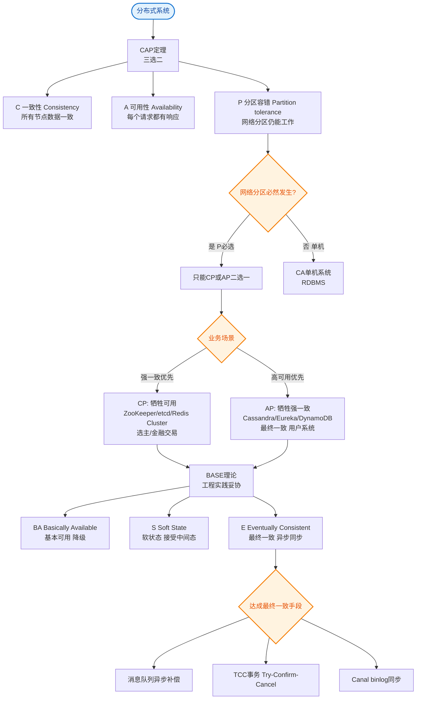

# Key Space（对应SQL数据库中的database）

### Key Space（键空间）

**概念**：
在 Cassandra 数据模型中，**Key Space** 是最顶层的命名空间，它对应于关系型数据库（RDBMS）中的 **Database（数据库）** 或 **Schema**。它是数据管理的边界。

**作用**：
*   **数据隔离**：定义了一个数据隔离的容器，不同的 Key Space 数据互不干扰。
*   **结构定义**：一个 Key Space 中可以包含多个 **Column Families（列族）**（对应 SQL 中的 Table）或 CQL 中的 Table。
*   **策略配置**：在 Key Space 层面，通常设置全局的数据分布策略，例如：
    *   **Replication Strategy（复制策略）**：如 `SimpleStrategy`（单数据中心）或 `NetworkTopologyStrategy`（多数据中心）。
    *   **Replication Factor（副本因子）**：决定数据在集群中复制多少份（如 3 副本）。

**架构层级图**：
```text
Cluster (集群)
  │
  └── Keyspace (数据库 / Schema) 
          │
          ├── Strategy: NetworkTopologyStrategy
          ├── Replication Factor: 3
          │
          ├── Column Family / Table (表 1)
          │       └── Partition (Row) -> Columns
          │
          └── Column Family / Table (表 2)
                  └── Partition (Row) -> Columns
```

**实战案例**：
在跨机房容灾演练中，曾因误将测试环境的 Keyspace 配置为 `NetworkTopologyStrategy` 但仅指向单机房，导致生产环境切换时机房数据丢失。正确的做法是为不同业务域（如用户域、订单域）严格隔离 Keyspace，防止相互影响。

**代码示例**：
```cql
-- 创建一个支持双机房容灾的 Keyspace
CREATE KEYSPACE my_app_prod 
WITH replication = {
  'class': 'NetworkTopologyStrategy', 
  'dc1': '3', -- 机房1，3副本
  'dc2': '2'  -- 机房2，2副本
};
```

**策略选型对比**：

| 特性 | SimpleStrategy | NetworkTopologyStrategy |
| :--- | :--- | :--- |
| **适用场景** | 单数据中心、开发测试环境 | 生产环境、多数据中心容灾 |
| **副本分布** | 仅根据 Token 环顺时针寻找节点 | 根据 Snitch 配置，将副本散布在不同机架/机房 |
| **机架感知** | 无 | 有（可避免单机柜故障导致数据不可用） |
| **配置复杂度** | 低 | 高（需配置数据中心名称） |

## 常见考点
1.  **多数据中心容灾**：如何在创建 Keyspace 时配置 `NetworkTopologyStrategy` 以实现跨机房容灾？
2.  **副本因子调整**：副本因子设置过高或过低分别有什么影响？如何在线修改 Keyspace 的副本因子？


## 核心流程图


## 记忆要点

- 定位：Cassandra的Keyspace是最顶层命名空间，直接对应SQL的Database。
- 作用：用于数据隔离，其下包含多张表。
- 核心配置：必须在Keyspace层面定义复制策略和副本因子(RF)。
- 策略对比：SimpleStrategy适用于单机房；NetworkTopologyStrategy用于多机房容灾。

## 结构化回答

**30 秒电梯演讲：** Cassandra中最外层的命名空间，用于组织数据，相当于SQL中的Database。打个比方，像是一栋大楼的名字，大楼里有多个房间。

**展开框架：**
1. **定位** — Cassandra的Keyspace是最顶层命名空间，直接对应SQL的Database。
2. **作用** — 用于数据隔离，其下包含多张表。
3. **核心配置** — 必须在Keyspace层面定义复制策略和副本因子(RF)。

**收尾：** 我在项目里踩过坑——在跨机房容灾演练中，曾因误将测试环境的 Keyspace 配置为 `NetworkTopologyStrategy` 但仅指向单机房，导致生产环境切换时机房数据丢失。您想深入聊哪一段：原理、避坑还是对比选型？

## 视频脚本

> 预计时长：3 分钟 | 由浅入深

| 时间 | 画面/字幕 | 口播台词 | 讲解要点 |
|------|----------|----------|----------|
| 0:00 | 标题卡：Key Space（对应SQL数据库… | "Key Space（对应SQL数据库中的database）？一句话——像是一栋大楼的名字，大楼里有多个房间。" | 开场钩子 |
| 0:45 | 概念动画/示意图 | "Cassandra中最外层的命名空间，用于组织数据，相当于SQL中的Database——像是一栋大楼的名字，大楼里有多个房间" | 核心定义 |
| 1:30 | 定位示意 | "Cassandra的Keyspace是最顶层命名空间，直接对应SQL的Database。" | 要点1 |
| 2:15 | 作用示意 | "用于数据隔离，其下包含多张表。" | 要点2 |
| 3:00 | 总结卡 | "记住这几条，面试不慌。下期讲进阶追问。" | 收尾 |

### 视频流程图


