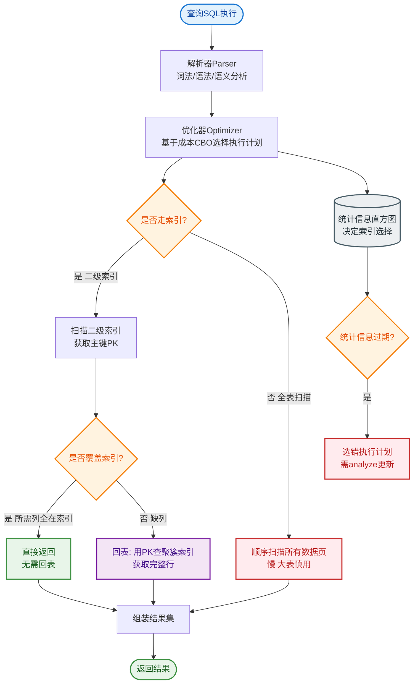
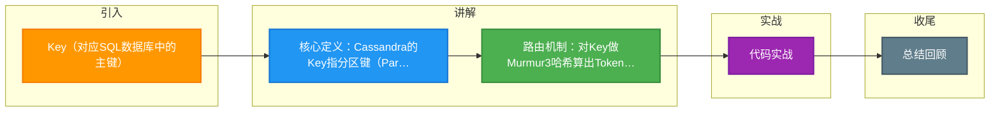

# Key（对应SQL数据库中的主键）

### Key（行键 / Partition Key）

**概念**：
在 Cassandra 中，**Key** 主要指 **Partition Key（分区键）**。它是数据分布的基础，对应于 SQL 数据库中的 **主键** 的一部分（或全部），用于唯一标识数据并决定数据存储的节点。

**特点**：
*   **唯一性**：每个 Partition Key 对应一个 Partition（分区），在逻辑上唯一标识一组相关的行数据。
*   **数据定位**：Cassandra 通过对 Partition Key 进行 Hash 计算（通常是 **Murmur3Partitioner**），将数据均匀映射到集群环形拓扑中的具体节点。
*   **索引机制**：Cassandra 不支持传统的 JOIN，所有查询必须尽可能带上 Partition Key。通过 Partition Key 查询数据的效率极高（时间复杂度取决于节点查找，通常极快）。

**结构细节**：
*   **Composite Key（复合主键）**：由 Partition Key 和 Clustering Key（集群键）组成。
    *   `PRIMARY KEY ((pk1, pk2), ck1, ck2)`
    *   `(pk1, pk2)` 决定了数据在**哪个节点**。
    *   `(ck1, ck2)` 决定了数据在节点磁盘上的**排序顺序**。

**数据写入流程图**：
```text
Client Request
    │
    ▼
1. Hash(Partition Key) ──> Token
    │
    ▼
2. 查询 Token Map (Ring Topology)
    │
    ▼
3. 写入 Primary Node (及 Replica Nodes)
    │
    ▼
4. Commit Log (顺序写，持久化)
    │
    ▼
5. MemTable (内存表)
    │
    └─> Flush ──> SSTable (磁盘文件, 不可变)
```

**实战案例**：
在物联网设备数据采集中，直接使用设备ID作为分区键导致某台高频采集设备形成“巨型分区”，超过100GB，引发节点OOM。后改为 `设备ID_日期` 作为复合分区键，将数据分摊到每天，解决了热点问题。

**代码示例**：
```java
// Java 示例：计算 Token 并分析数据分布（仅作理解原理）
Murmur3Partitioner partitioner = new Murmur3Partitioner();
String partitionKey = "user_123";
Long token = partitioner.getToken(partitionKey.getBytes()).token;
// Token 决定了数据落在 Ring 的哪个位置，从而定位到具体 Node
System.out.println("Token for key '" + partitionKey + "': " + token);
```

**Partitioner 对比**：

| Partitioner | 特性 | 数据分布 | 顺序扫描 | 适用场景 |
| :--- | :--- | :--- | :--- | :--- |
| **Murmur3Partitioner** | 默认，使用 MurmurHash | 均匀 | 不支持（Token随机） | 通用绝大多数场景 |
| **RandomPartitioner** | MD5 Hash | 均匀 | 不支持 | 旧版本默认，现已被 Murmur3 替代 |
| **ByteOrderedPartitioner** | 按字节值排序 | 易倾斜 | 支持 | 极少使用，仅特定范围查询场景 |

## 常见考点
1.  **数据热点**：如果 Partition Key 选取不当（如随机数过小或枚举值），会导致数据倾斜，某些节点负载过高，如何解决？
2.  **查询效率**：为什么在 Cassandra 中进行全表扫描是非常低效的操作？
3.  **Partitioner 区别**：Murmur3Partitioner 与 RandomPartitioner 和 ByteOrderedPartitioner 的区别是什么？


## 核心流程图


## 记忆要点

- 核心定义：Cassandra的Key指分区键(Partition Key)，决定数据存哪个节点。
- 路由机制：对Key做Murmur3哈希算出Token，映射到集群环拓扑的具体节点。
- 复合主键：Partition Key决定节点，Clustering Key决定节点内排序。
- 热点解决：设计不当会导致数据倾斜，实战常加日期组合成复合Key打散。

## 结构化回答

**30 秒电梯演讲：** Cassandra中唯一标识数据行的键，决定数据在集群中的存储位置，对应SQL的主键。打个比方，像是字典的词条索引，通过这个词能直接找到对应内容的页码。

**展开框架：**
1. **核心定义** — Cassandra的Key指分区键(Partition Key)，决定数据存哪个节点。
2. **路由机制** — 对Key做Murmur3哈希算出Token，映射到集群环拓扑的具体节点。
3. **复合主键** — Partition Key决定节点，Clustering Key决定节点内排序。

**收尾：** 我在项目里踩过坑——在物联网设备数据采集中，直接使用设备ID作为分区键导致某台高频采集设备形成“巨型分区”，超过100GB，引发节点OOM。您想深入聊哪一段：原理、避坑还是对比选型？

## 视频脚本

> 预计时长：3 分钟 | 由浅入深

| 时间 | 画面/字幕 | 口播台词 | 讲解要点 |
|------|----------|----------|----------|
| 0:00 | 标题卡：Key（对应SQL数据库中的主键） | "Key（对应SQL数据库中的主键）？一句话——像是字典的词条索引，通过这个词能直接找到对应内容的页码。" | 开场钩子 |
| 0:45 | 概念动画/示意图 | "Cassandra中唯一标识数据行的键，决定数据在集群中的存储位置，对应SQL的主键——像是字典的词条索引，通过这个词能直接找到对应内容的页码" | 核心定义 |
| 1:30 | 核心定义示意 | "Cassandra的Key指分区键(Partition Key)，决定数据存哪个节点。" | 要点1 |
| 2:15 | 路由机制示意 | "对Key做Murmur3哈希算出Token，映射到集群环拓扑的具体节点。" | 要点2 |
| 3:00 | 总结卡 | "记住这几条，面试不慌。下期讲进阶追问。" | 收尾 |

### 视频流程图



