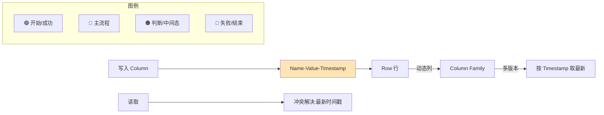

# column（对应SQL数据库中的列）

### Column（列）

**概念**：
在 Cassandra 中，**Column** 是数据存储的最基本单元，对应于 SQL 数据库中的 **列**。但它本质上是一个 Name/Value 对，更加动态和灵活。

**组成**：
Cassandra 中的 Column 通常是一个三元组，包含三个部分：
1.  **Name**：列名（二进制格式）。在宽行模型中，Name 本身也可以作为数据的一部分（例如作为时间戳或索引值）。
2.  **Value**：列对应的值（二进制格式）。
3.  **Timestamp**：时间戳（微秒级），用于记录数据写入的时间，Cassandra 利用它进行**冲突解决**（Last Write Wins - LWW），保留时间戳最新的数据。

**特点**：
*   **灵活性**：虽然现代 CQL（Cassandra Query Language）倾向于预定义表结构（类似 SQL），但在底层存储层面，Cassandra 依然是无模式的。每一行的列数量可以不同（稀疏性）。
*   **稀疏性**：某一行没有数据的列不占用存储空间（没有 Null 标记位开销），这对于字段繁多但实际值稀疏的场景非常节省空间。
*   **TTL (Time To Live)**：每个列或每行可以设置 TTL，过期后自动删除，适用于缓存类数据。

**实战案例**：
在设计即时通讯消息表时，曾遇到读取旧消息报错的问题。原因在于使用了 `INSERT` 而非 `UPDATE`，导致客户端时间戳回拨时，Cassandra 依据 LWW 策略判定旧时间戳的消息无效而覆盖了新消息。务必保证服务器侧生成精确的时间戳。

**代码示例**：
```cql
-- 插入数据并设置 TTL（例如验证码有效期 5 分钟）
INSERT INTO user_codes (user_id, code, created_at) 
VALUES ('user_123', '4829', toTimestamp(now())) 
USING TTL 300;

-- 查看某列的剩余 TTL（调试用）
SELECT TTL(code) FROM user_codes WHERE user_id = 'user_123';
```

**Cassandra 与 SQL 列特性对比**：

| 特性 | Cassandra Column | SQL Column | 备注 |
| :--- | :--- | :--- | :--- |
| **Null 存储** | 不占用空间（稀疏） | 通常占用空间（NULL 标记） | Cassandra 对稀疏数据友好 |
| **更新机制** | 原子性追加（Append/Replace） | 原地更新（In-place） | Cassandra 写性能更高 |
| **冲突解决** | 基于 Timestamp (LWW) | 基于锁或事务 | Cassandra 允许最终一致性写入 |
| **生命周期** | 支持 TTL 自动过期 | 需通过 Job 轮询清理 | Cassandra TTL 更高效 |

## 常见考点
1.  **TTL 机制**：Cassandra 的 TTL 是如何实现的？TTL 过期后数据是立即删除吗？
2.  **Tombstone（墓碑）**：删除一个 Column 或更新数据为 Null 时，Cassandra 内部是如何处理的？为什么大量删除会导致查询变慢？
3.  **宽行与窄行**：在什么设计下，Column 的 Name 会存储大量业务数据（如时间序列数据）？

## 技术原理

Cassandra 的 Column 不是一个简单的"字段值"，而是**分布式存储引擎为冲突解决和稀疏存储设计的原子单元**。它用 Name/Value/Timestamp 三元组替代 SQL 的"列名+值"，背后是为了支撑海量写入和多副本最终一致性：

- **三元组设计的本质——把版本信息内化进数据单元**：SQL 的列值没有版本概念，冲突靠事务锁串行化。Cassandra 走 AP 路线（允许多副本短时不一致），把 Timestamp 直接放进每个 Column，读修复和反熵时用 LWW（Last Write Wins）自动收敛——副本间不需要协调，谁的 Timestamp 新谁胜出。这是 Cassandra 高写入吞吐的根本：写不需要分布式锁，追加即可。
- **稀疏存储的实现机制**：Cassandra 的底层存储格式（SSTable）按 (RowKey, ColumnName) 排序存储，没有值的列根本不存在记录，不需要 NULL 标记位。对比 SQL 表（固定 schema，每行每列都要有 NULL 标记），稀疏场景下 Cassandra 节省大量空间。这也支持了"动态列"——每行可以有完全不同的列集合。
- **TTL 的实现——过期不立即删除，靠墓碑标记**：带 TTL 的 Column 写入时记录 `localDeletionTime = now + TTL`，到了时间点 Column 变成"Tombstone（墓碑）"。墓碑在下次 Compaction 时才真正物理删除，查询时跳过。所以 TTL 过期后数据不会立即消失，读请求仍可能读到墓碑（被过滤），大量墓碑会拖慢查询（Tombstone Overload）。
- **写性能高的根因——LSM Tree 追加模型**：Cassandra 用 LSM Tree（日志结构合并树），写入先追加到 MemTable（内存），顺序写 CommitLog 落盘，再 flush 到 SSTable。没有 SQL 的"原地更新"（要找位置、改页、记 WAL），纯追加写让随机写变顺序写，吞吐远高于 B+ Tree。

## 代码示例

```cql
-- 1. 建表：无模式灵活性体现在底层，CQL 表面是预定义 schema
CREATE TABLE IF NOT EXISTS user_codes (
    user_id text,              -- RowKey（分区键）
    code text,                 -- Column Name
    created_at timestamp,
    PRIMARY KEY (user_id)
) WITH default_time_to_live = 86400;  -- 表级默认 TTL（秒）

-- 2. 写入带 TTL（如验证码 5 分钟过期）
INSERT INTO user_codes (user_id, code, created_at)
VALUES ('user_123', '4829', toTimestamp(now()))
USING TTL 300;

-- 3. 查看剩余 TTL（判断验证码还有多久过期）
SELECT TTL(code), writetime(code) FROM user_codes WHERE user_id = 'user_123';
-- TTL(code) 返回剩余秒数；writetime 返回写入的微秒时间戳

-- 4. 删除会生成 Tombstone（墓碑），不是物理删除
DELETE FROM user_codes WHERE user_id = 'user_123';
-- 内部：写入一条 Tombstone 记录，Compaction 时才真正清除
```

```python
# 5. Python 驱动：批量写入时务必用服务器时间戳，避免客户端时钟漂移
from cassandra.cluster import Cluster
from cassandra.query import BatchStatement

cluster = Cluster(['127.0.0.1'])
session = cluster.connect('mykeyspace')

# 错误写法：依赖客户端时间，多机时钟不一致会导致 LWW 错乱
# session.execute("INSERT INTO msgs ...")  # 用客户端 now()

# 正确写法：用服务器端 now()，保证时间戳单调
insert = session.prepare(
    "INSERT INTO msgs (user_id, msg_id, content) "
    "VALUES (?, ?, ?) USING TIMESTAMP toUnixTimestamp(now())")
batch = BatchStatement()
for msg in message_list:
    batch.add(insert, (msg.user_id, msg.id, msg.content))
session.execute(batch)   # 批量顺序写，吞吐高
```

## 对比选型

| 维度 | Cassandra Column | SQL Column (MySQL/PG) | HBase Cell |
| :--- | :--- | :--- | :--- |
| **结构** | Name/Value/Timestamp 三元组 | Name/Value 二元组 | RowKey/Family/Qualifier/Value/Timestamp |
| **版本/冲突** | 内置 Timestamp，LWW 自动收敛 | 靠事务锁，无内置版本 | 多版本保留，可查历史 |
| **NULL 存储** | 不占空间（稀疏） | 占 NULL 标记位 | 不占空间（稀疏） |
| **更新机制** | 追加写（LSM Tree） | 原地更新（B+ Tree） | 追加版本（LSM Tree） |
| **写吞吐** | 极高（顺序追加） | 中（随机写） | 极高 |
| **TTL** | 原生支持（列/行级） | 需定时任务清理 | 支持（列族级） |
| **适用场景** | 海量写入、最终一致 | 强一致、复杂查询 | 海量稀疏宽表 |

## 常见坑

- **务必用服务器时间戳**：客户端机器时钟会回拨（NTP 同步、VM 漂移），用客户端时间生成 Timestamp 会导致旧消息覆盖新消息（LWW 判定错乱）。必须用 `toTimestamp(now())` 或 `USING TIMESTAMP` 指定服务器时间，保证单调性。
- **大量删除会触发 Tombstone Overload**：DELETE 不是物理删除，而是写墓碑。删除几百万行后查询要扫描过滤墓碑，性能急剧下降（默认 1000 墓碑就告警）。对策：用 TTL 让数据自然过期（不产生墓碑），或定期手动触发 `nodetool compact`。
- **INSERT 和 UPDATE 不等价**：CQL 表面看 INSERT/UPDATE 类似，但在带 Counter 列、集合列时行为不同。IM 场景用 INSERT 写消息，时钟回拨会导致"旧消息覆盖新消息"——必须用服务器时间或 `USING TIMESTAMP` 指定。
- **TTL 不能改只能重写**：已有数据的 TTL 无法修改，必须重新写入（带新 TTL）覆盖。批量更新 TTL 时要小心写入放大。
- **宽行设计的陷阱**：把时间序列数据塞进 Column Name（一行百万列），单行过大会触发 `max_columns` 限制和读放大。时间序列应该用聚簇键（Clustering Key）做分行存储，而不是宽行。


## 核心流程图




## 记忆要点

- 底层结构：列本质是Name/Value/Timestamp三元组，支持稀疏不占Null空间。
- 冲突解决：基于Timestamp微秒级时间戳，采用LWW(最后写入胜出)策略。
- 生命周期：列和行均支持设置TTL，到期自动过期删除，极适合缓存场景。
- 对比SQL：Cassandra无模式，空列不占空间；写是追加更新，性能极高。

## 结构化回答

**30 秒电梯演讲：** Cassandra数据的最小单元，由名、值和时间戳组成的三元组。打个比方，像是Excel表格里的一个单元格，但自带了修改时间。

**展开框架：**
1. **底层结构** — 列本质是Name/Value/Timestamp三元组，支持稀疏不占Null空间。
2. **冲突解决** — 基于Timestamp微秒级时间戳，采用LWW(最后写入胜出)策略。
3. **生命周期** — 列和行均支持设置TTL，到期自动过期删除，极适合缓存场景。

**收尾：** 我在项目里踩过坑——在设计即时通讯消息表时，曾遇到读取旧消息报错的问题。您想深入聊哪一段：原理、避坑还是对比选型？

## 视频脚本

> 预计时长：3 分钟 | 由浅入深

| 时间 | 画面/字幕 | 口播台词 | 讲解要点 |
|------|----------|----------|----------|
| 0:00 | 标题卡：column（对应SQL数据库中的列… | "column（对应SQL数据库中的列）？一句话——像是Excel表格里的一个单元格，但自带了修改时间。" | 开场钩子 |
| 0:45 | 概念动画/示意图 | "Cassandra数据的最小单元，由名、值和时间戳组成的三元组——像是Excel表格里的一个单元格，但自带了修改时间" | 核心定义 |
| 1:30 | 底层结构示意 | "列本质是Name/Value/Timestamp三元组，支持稀疏不占Null空间。" | 要点1 |
| 2:15 | 冲突解决示意 | "基于Timestamp微秒级时间戳，采用LWW(最后写入胜出)策略。" | 要点2 |
| 3:00 | 总结卡 | "记住这几条，面试不慌。下期讲进阶追问。" | 收尾 |
