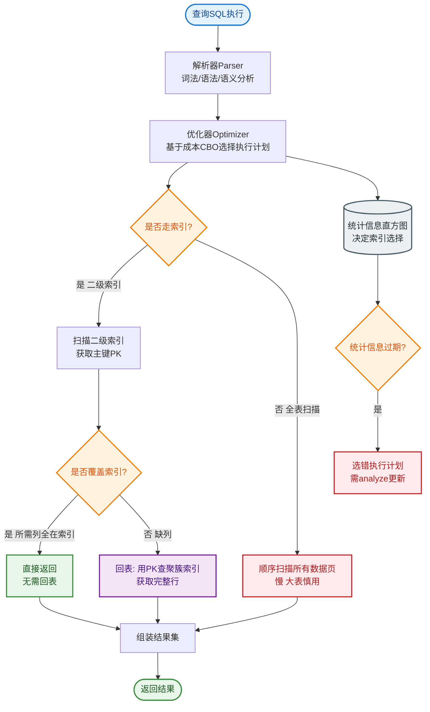

# super column（SQL数据库不支持）

### Super Column（超级列）

**概念**：
Super Column 是 Cassandra 早期数据模型（Thrift API 时代）中的一个概念，是一个嵌套的结构，可以视为包含多个子列的超级字典。SQL 数据库不支持这种嵌套结构。注意：在 CQL（Cassandra Query Language）及现代版本中，Super Column 已被废弃，推荐使用复合主键或用户自定义类型（UDT）替代。

**结构**：
*   它本身是一个键值对（Name/Value），其中 **Value** 是一个 Map（键值列表），即包含多个普通的 Sub-Column（子列）。
*   格式可理解为：
    ```text
    Super Column Name
        │
        ├── Sub-Column A (Name, Value, Timestamp)
        ├── Sub-Column B (Name, Value, Timestamp)
        └── ...
    ```

**作用与局限**：
*   **分组**：主要用于将相关的列分组存储，例如存储一个用户在不同时间段的多个档案信息。
*   **局限性（痛点）**：
    1.  **缺乏独立时间戳**：Super Column 本身没有时间戳，只有内部的 Sub-Column 有。冲突解决粒度太粗。
    2.  **反序列化开销**：Super Column 是作为一个整体被读取的。即使你只需要读取其中的一个 Sub-Column，Cassandra 也必须将整个 Super Column 的所有 Sub-Column 反序列化到内存中。这导致极高的内存消耗和延迟。
    3.  **不可索引**：很难对 Super Column 内部的 Sub-Column 建立二级索引。

**替代方案架构图**：
```text
【旧版 Super Column 结构 (不推荐)】
RowKey: UserID_1
│
└── SuperColumn: Profile
      ├── Name: "Age"    Value: "25"
      └── Name: "Gender" Value: "M"

【新版 Composite Key (推荐)】
PRIMARY KEY (UserID, Profile_Type)
RowKey: UserID_1
│
├── (Profile_Type="Age", Value="25")
└── (Profile_Type="Gender", Value="M")
```

**实战案例**：
维护一套基于 Thrift 的旧系统时，频繁出现 GC 停顿。经排查是读取 Super Column 导致单次请求加载了数 MB 的无效子列数据到堆内存。迁移方案是将其展平为使用 `CLUSTERING KEY` 的普通表，内存占用降低了 90% 且读取延迟显著下降。

**代码示例**：
```cql
-- 推荐替代方案：使用 Composite Primary Key + UDT 模拟分组
CREATE TYPE profile_item (
  key text,
  value text
);

CREATE TABLE user_profiles (
  user_id uuid,
  category text,  -- 替代 Super Column Name
  profile frozen<profile_item>,
  PRIMARY KEY (user_id, category)
);
```

**Super Column 与现代方案对比**：

| 特性 | Super Column (已废弃) | Composite Primary Key / UDT (推荐) |
| :--- | :--- | :--- |
| **读取粒度** | 粗粒度（必须读整个 Super Column） | 细粒度（可按 Clustering Key 读取） |
| **内存开销** | 高（易触发 OOM） | 低（按需加载） |
| **二级索引** | 不支持 | 支持（可对 Clustering Column 建索引） |
| **CQL 支持** | 极差/不支持 | 原生支持 |

## 常见考点
1.  **废弃原因**：为什么 Super Column 在现代 Cassandra 中被废弃？具体的性能瓶颈在哪里？
2.  **替代方案**：如何使用 Composite Partition Key 或 Clustering Key 来模拟 Super Column 的分组功能？
3.  **历史兼容**：现在的 Cassandra 版本还能使用 Super Column 吗？


## 核心流程图


## 记忆要点

- 定义：早期支持的嵌套结构(含多个子列)，SQL不支持，现已废弃。
- 性能痛点：缺乏独立时间戳，且读取须将整体反序列化进内存，极易OOM。
- 索引局限：很难对其内部的子列建立二级索引，查询非常不灵活。
- 替代方案：推荐使用复合主键或UDT(用户自定义类型)替代，实现细粒度读取。

## 结构化回答

**30 秒电梯演讲：** 包含多个子列的嵌套结构，用于数据分组，但性能较差，已被复合主键取代。打个比方，像是一个大文件夹，里面装着多个小文件。

**展开框架：**
1. **定义** — 早期支持的嵌套结构(含多个子列)，SQL不支持，现已废弃。
2. **性能痛点** — 缺乏独立时间戳，且读取须将整体反序列化进内存，极易OOM。
3. **索引局限** — 很难对其内部的子列建立二级索引，查询非常不灵活。

**收尾：** 我在项目里踩过坑——维护一套基于 Thrift 的旧系统时，频繁出现 GC 停顿。您想深入聊哪一段：原理、避坑还是对比选型？

## 视频脚本

> 预计时长：3 分钟 | 由浅入深

| 时间 | 画面/字幕 | 口播台词 | 讲解要点 |
|------|----------|----------|----------|
| 0:00 | 标题卡：super column（SQL数据… | "super column（SQL数据库不支持）？一句话——像是一个大文件夹，里面装着多个小文件。" | 开场钩子 |
| 0:45 | 概念动画/示意图 | "包含多个子列的嵌套结构，用于数据分组，但性能较差，已被复合主键取代——像是一个大文件夹，里面装着多个小文件" | 核心定义 |
| 1:30 | 定义示意 | "早期支持的嵌套结构(含多个子列)，SQL不支持，现已废弃。" | 要点1 |
| 2:15 | 性能痛点示意 | "缺乏独立时间戳，且读取须将整体反序列化进内存，极易OOM。" | 要点2 |
| 3:00 | 总结卡 | "记住这几条，面试不慌。下期讲进阶追问。" | 收尾 |

---

## 延伸：Super Column Family（SQL数据库不支持）

> 合并自 `jkc-049`（相似度 67%）

### Super Column Family（超级列族）

**概念**：
Super Column Family 是 Cassandra 早期版本（Thrift API 时代）的一种特殊列族，其每一行包含一个 Key 以及若干个 **Super Column**。这相当于一种“两层嵌套”结构。这是传统 SQL 数据库不支持的结构。

**结构**：
*   每一行：`Key -> { SuperColumn1, SuperColumn2, ... }`
*   每个 Super Column：`{ SubColumn1, SubColumn2, ... }`

**架构示意**：
```text
+---------------------------------------------------------------+
| Super Column Family                                           |
+---------------------------------------------------------------+
| Row Key: "user_activity"                                      |
| +-----------------------------+                               |
| | Super Column: "2023-10-01"  |                               |
| | +-------------------------+ | +-------------------------+ | |
| | | SubCol: page_views      | | | SubCol: duration        | | |
| | | Value: 150              | | | Value: 3600             | | |
| | +-------------------------+ | +-------------------------+ | |
| +-----------------------------+                               |
| +-----------------------------+                               |
| | Super Column: "2023-10-02"  | ...                           |
| | ...                         |                               |
| +-----------------------------+                               |
+---------------------------------------------------------------+
```

**应用场景**：
用于存储多维数据。例如，在一个追踪不同用户在不同时间访问状态的系统中：
*   Row Key：用户 ID
*   Super Column：时间戳（如日期）
*   Sub Column：具体的状态属性（如点击量、停留时长）

**现状与替代方案**：
*   **过时原因**：Super Column 有严重的性能缺陷。读取一个 Super Column 时，必须将该 Super Column 下的所有 Sub Columns 都反序列化到内存中，即使你只需要其中一个小列。这导致极高的内存消耗和延迟。
*   **序列化问题**：Super Column 内部的 Sub Columns 通常没有独立的索引，只能通过 Super Column Key 访问。
*   **推荐做法**：在现代 Cassandra 的 CQL 3 中，**已被弃用**。推荐使用 **复合主键** 来实现类似功能：
    *   定义表时，使用 `PRIMARY KEY ((user_id), date)`。
    *   `user_id` 为分区键，`date` 为聚类列。
    *   这样数据物理上按 `(user_id, date)` 排序，可以高效查询特定用户在特定日期的数据，且支持按日期范围切片查询，性能远超 Super Column。

#### 实战案例
早期物联网项目使用 Super Column 存储设备每分钟上报的几十个传感器数值，导致每次读取单个传感器状态都需要加载该分钟所有数据，引发频繁 Full GC，最终不得不重构为 CQL 复合主键表。

#### 代码示例
```cql
-- 现代 CQL 替代方案：使用复合主键和 Clustering Column
CREATE TABLE device_data (
    device_id uuid,
    event_date timestamp,
    sensor_name text,
    value double,
    PRIMARY KEY ((device_id), event_date, sensor_name)
);
-- 此时查询只需特定 sensor，无需反序列化整行
```

#### 对比表格

| 特性 | Super Column Family (Legacy) | 复合主键 / 宽行 (Modern CQL) |
| :--- | :--- | :--- |
| **数据读取** | 读取时需反序列化整个 Super Column | 只读取请求的 Column，支持按切片查询 |
| **内部索引** | Sub Column 无独立索引 | Clustering Column 支持高效范围查询与排序 |
| **灵活性** | 结构固定，Schema 变更难 | 支持 CQL 标准类型，操作灵活 |
| **性能** | 内存占用高，大对象易导致 OOM | 利用 Cassandra 原生压缩与存储优化 |

## 常见考点
1.  **为什么 Super Column Family 被废弃了？**

## 记忆要点

- 结构特性：两层嵌套，Row Key下挂载多个Super Column，再含普通子列。
- 废弃原因：整体反序列化开销极大，读取单列需加载整个父结构，易内存溢出。
- 内部缺陷：子列无独立索引，只能依赖Super Column的Key访问。
- 现代替代：使用CQL复合主键(分区键+聚类列)替代，支持高效范围切片查询。

## 结构化回答

**30 秒电梯演讲：** 包含Super Column的列族，支持多层嵌套结构，现已过时。打个比方，像是三层收纳盒：箱子(CF) -> 盒子 -> 物品。

**展开框架：**
1. **结构特性** — 两层嵌套，Row Key下挂载多个Super Column，再含普通子列。
2. **废弃原因** — 整体反序列化开销极大，读取单列需加载整个父结构，易内存溢出。
3. **内部缺陷** — 子列无独立索引，只能依赖Super Column的Key访问。

**收尾：** 我在项目里踩过坑——早期物联网项目使用 Super Column 存储设备每分钟上报的几十个传感器数值，导致每次读取单个传感器状态都需要加载该分钟所有数据，引发频繁 Full GC，最终不得不重构为 CQL 复合主键表。您想深入聊哪一段：原理、避坑还是对比选型？

## 视频脚本

> 预计时长：3 分钟 | 由浅入深

| 时间 | 画面/字幕 | 口播台词 | 讲解要点 |
|------|----------|----------|----------|
| 0:00 | 标题卡：Super Column Famil… | "Super Column Family（SQL数据库不支持）？一句话——像是三层收纳盒：箱子(CF) -> 盒子 -> 物品。" | 开场钩子 |
| 0:45 | 概念动画/示意图 | "包含Super Column的列族，支持多层嵌套结构，现已过时——像是三层收纳盒：箱子(CF) -> 盒子 -> 物品" | 核心定义 |
| 1:30 | 结构特性示意 | "两层嵌套，Row Key下挂载多个Super Column，再含普通子列。" | 要点1 |
| 2:15 | 废弃原因示意 | "整体反序列化开销极大，读取单列需加载整个父结构，易内存溢出。" | 要点2 |
| 3:00 | 总结卡 | "记住这几条，面试不慌。下期讲进阶追问。" | 收尾 |
