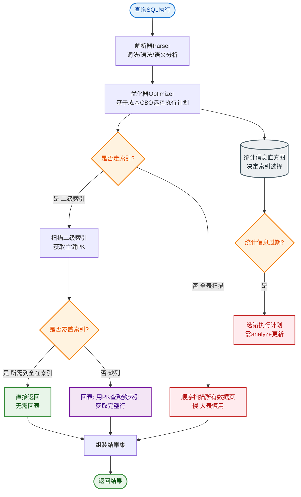

# 行缓存和键缓存请求流程图

### Cassandra 读请求流程与缓存机制

当 Cassandra 接收读请求时，会按照以下顺序在 MemTable 和 SSTable 中查找数据，并利用多种缓存和索引结构优化性能。

#### 1. 检查 Row Cache (行缓存) - *第一步*
*   **作用**：缓存整个 Partition（分区）的完整数据（包含所有列）。
*   **位置**：堆外内存。
*   **机制**：
    *   如果命中：直接反序列化返回数据，**跳过**后续所有步骤（无需查 MemTable、Bloom Filter、磁盘等）。这是最快的路径。
    *   如果未命中：进入步骤 2。
*   **注意**：Row Cache 不是写更新的。如果某行被更新，缓存会失效（或者等待配置的时间窗口失效），直到该行被再次读取才会重新缓存。开启 Row Cache 会消耗大量内存，通常只适用于热点数据。

#### 2. 检查 MemTable (内存表)
*   **作用**：MemTable 是内存中的写缓冲区，保存最新的写入数据。
*   **机制**：如果数据在 MemTable 中，记录下来，随后需要与 SSTable 中的数据进行合并（版本根据时间戳确定最新值）。

#### 3. 检查 Key Cache (键缓存) - *加速索引*
*   **注意**：此处顺序在不同版本描述中可能互换，通常 Key Cache 用于加速寻找 SSTable 索引。

#### 4. 检查 Bloom Filter (布隆过滤器)
*   **作用**：快速判断请求的 Partition Key **可能** 存在于哪个 SSTable 中。
*   **位置**：堆外内存 (与 SSTable 文件关联)。
*   **原理**：一种概率型数据结构。
    *   **结果为 False**：Key **肯定不存在**该 SSTable，直接跳过该文件（极大减少磁盘 I/O）。
    *   **结果为 True**：Key **可能存在**，需要进一步查找索引。

#### 5. 检查 Partition Summary (分区索引摘要)
*   **作用**：存储 Partition Index 的样本数据（例如每隔 N 个 Key 取一个样本）。
*   **机制**：如果 Key Cache 未命中，Cassandra 会先在 Summary 中定位 Key 的大致范围，然后再去磁盘读取 Partition Index 精确查找。这大大减少了需要扫描的索引数据量（通常是只读取几个 KB 的索引数据而不是整个索引文件）。

#### 6. 读取 Partition Index (磁盘索引)
*   **位置**：磁盘。
*   **作用**：存储所有 Partition Keys 及其在磁盘数据文件中的偏移量。

#### 7. 读取 Compression Offset Map (压缩偏移映射)
*   **位置**：堆外内存。
*   **作用**：存储数据块在磁盘中的准确位置。Cassandra 数据通常是压缩存储的，该 Map 用于快速找到对应的压缩块。

#### 8. 从 SSTable 读取数据
*   根据 Compression Offset Map 找到位置，从磁盘读取数据块，解压并获取所需的数据行。

---

### 读请求流程图

```text
                  Client Read Request
                           |
                           v
              +-----------------------+
              |   Coordinator Node    |
              +-----------------------+
                           |
             +-------------+-------------+
             |                           |
             v                           v
    +----------------+          +----------------+
    |  Check Row     | --------> |  Check Mem     |
    |  Cache         | (Miss)    |  Table
```

#### 实战案例
某监控系统中，对用户 Profile 表开启了 Row Cache，导致堆外内存飙升，触发 OOM。随后调整为只对极少量热点 Config 表开启 Row Cache，将大表依赖 Key Cache 和 Bloom Filter，TP99 恢复正常。

#### 代码示例
```cassandra
// cassandra.yaml 调优实战片段
// 仅对特定 Keyspace/表开启 Row Cache，避免全局开启导致内存耗尽
row_cache_size_in_mb: 200  // 全局限制，而非无限制
row_cache_provider: SerializingCacheProvider
// Key Cache 通常建议开启，显著减少磁盘索引寻址
key_cache_size_in_mb: 400
key_cache_save_period: 14400
```

#### 对比表格

| 缓存/索引组件 | 存储位置 | 主要作用 | 命中/未命中影响 | 适用场景 |
| :--- | :--- | :--- | :--- | :--- |
| **Row Cache** | 堆外内存 | 缓存整行数据 (Partition) | 命中则直接返回，极快；未命中走后续流程 | 读多写少、行数据小、极度热点数据 |
| **Key Cache** | 堆外内存 | 缓存 Partition Key -> 磁盘偏移量映射 | 命中则跳过 Partition Summary/Index 查找 | 几乎所有场景均建议开启 |
| **Bloom Filter** | 堆外内存 | 快速判断 Key 是否**可能**在 SSTable 中 | 判定为不存在则直接跳过该 SSTable，省去磁盘 I/O | 读多写少、防止读放大 |
| **Partition Summary** | 堆内内存 | 索引的索引，定位 Key 大致范围 | 缩小磁盘 Index 扫描范围 | 所有场景（通常每 128KB 数据一个索引项） |


## 核心流程图


## 记忆要点

- 首要两步：先查Row Cache(整行缓存，未命中全跳过)，再查MemTable内存表。
- 快速过滤：利用Bloom Filter快速排除Key肯定不存在的SSTable，极大减少IO。
- 磁盘定位：未命中Key Cache则读索引摘要定位，再查压缩偏移映射找数据块。
- 调优建议：Row Cache极耗内存只建议小表用，大表核心依赖Key Cache和布隆过滤。

## 结构化回答

**30 秒电梯演讲：** Cassandra利用多层缓存和索引结构，从内存到磁盘逐级过滤，实现高效的数据读取。打个比方，像找书：先看手边，再查目录索引，缩小范围后去书架上找具体书页。

**展开框架：**
1. **首要两步** — 先查Row Cache(整行缓存，未命中全跳过)，再查MemTable内存表。
2. **快速过滤** — 利用Bloom Filter快速排除Key肯定不存在的SSTable，极大减少IO。
3. **磁盘定位** — 未命中Key Cache则读索引摘要定位，再查压缩偏移映射找数据块。

**收尾：** 我在项目里踩过坑——某监控系统中，对用户 Profile 表开启了 Row Cache，导致堆外内存飙升，触发 OOM。您想深入聊哪一段：原理、避坑还是对比选型？

## 视频脚本

> 预计时长：4 分钟 | 由浅入深

| 时间 | 画面/字幕 | 口播台词 | 讲解要点 |
|------|----------|----------|----------|
| 0:00 | 标题卡：行缓存和键缓存请求流程图 | "行缓存和键缓存请求流程图？一句话——像找书：先看手边，再查目录索引，缩小范围后去书架上找具体书页。" | 开场钩子 |
| 0:48 | 概念动画/示意图 | "Cassandra利用多层缓存和索引结构，从内存到磁盘逐级过滤，实现高效的数据读取——像找书：先看手边，再查目录索引，缩小范围后去书架上找具体书页" | 核心定义 |
| 1:36 | 首要两步示意 | "先查Row Cache(整行缓存，未命中全跳过)，再查MemTable内存表。" | 要点1 |
| 2:24 | 快速过滤示意 | "利用Bloom Filter快速排除Key肯定不存在的SSTable，极大减少IO。" | 要点2 |
| 3:12 | 磁盘定位示意 | "未命中Key Cache则读索引摘要定位，再查压缩偏移映射找数据块。" | 要点3 |
| 4:00 | 总结卡 | "记住这几条，面试不慌。下期讲进阶追问。" | 收尾 |
