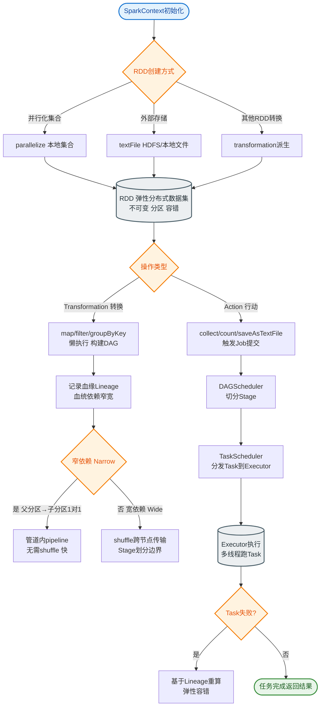
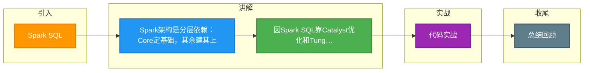

# Spark SQL

### 概念
Spark 提供了一个全面、统一的框架用于管理各种有着不同性质（文本数据、图表数据等）的数据集和数据源（批量数据或实时的流数据）的大数据处理需求。其核心在于实现“一键栈”，即在一个框架下解决批处理、流处理、SQL查询和机器学习任务，避免不同组件间数据迁移的开销。

### 核心架构

**Spark Core**
包含 Spark 的基本功能；尤其是定义 RDD 的 API、操作以及这两者上的动作。其他 Spark 的库都是构建在 RDD 和 Spark Core 之上的。它负责调度、内存管理、故障恢复以及与存储系统的交互。

**Spark SQL**
*   提供通过 Apache Hive 的 SQL 变体 HiveQL 以及 JDBC/ODBC 与 Spark 进行交互的 API。
*   **核心组件**：Catalyst 优化器（负责查询优化）、Tungsten 执行引擎（负责内存管理和二进制处理）。
*   **DataFrame/Dataset**：Spark SQL 不再直接操作 RDD，而是操作 DataFrame 和 Dataset（在 Spark 2.0+ 中统一为 Dataset API）。它们是有 Schema 的分布式数据集合，Spark SQL 会利用 Schema 信息进行深度优化。
*   每个数据库表被当做一个 DataFrame，Spark SQL 查询被经过 Catalyst 优化器转换为优化的 RDD 操作执行。

**Spark Streaming**
*   对实时数据流进行处理和控制。Spark Streaming 允许程序能够像普通 RDD 一样处理实时数据（DStream）。
*   **原理**：微批处理。将实时数据流按时间间隔（如 500ms）切分成一个个小的批次，然后交由 Spark Engine 处理。
*   **进化**：目前推荐使用 Structured Streaming（基于 Spark SQL 引擎），提供更低延迟和 Exactly-Once 语义。

**MLlib (Machine Learning Library)**
*   一个常用机器学习算法库，算法被实现为对 DataFrame/Dataset 的 Spark 操作。这个库包含可扩展的学习算法，比如分类、回归、聚类、协同过滤等需要对大量数据集进行迭代的操作。
*   **优势**：相比 MapReduce，Spark 的内存计算能力使得机器学习算法的迭代速度提升数倍甚至数十倍。

**GraphX**
*   控制图、并行图操作和计算的一组算法和工具的集合。GraphX 扩展了 RDD API，引入了 Graph（图抽象）和 Vertex/Edge（顶点/边）。
*   它支持 Pregel API，可以方便地实现图算法（如 PageRank, 连通分量）。

### 架构图

```text
+-------------------------------------------------------+
|                 User Applications                     |
|   (SQL Queries, Streaming Jobs, ML Scripts, etc.)    |
+--------------------------+----------------------------+
                           |
+-------------------------------------------------------+
|                  Spark SQL / Streaming / MLlib / GraphX |
|              (High-Level APIs & Libraries)             |
+-------------------------------------------------------+
|                        Spark Core                     |
|       (RDDs, Scheduling, Memory Management, I/O)       |
+-------------------------------------------------------+
|         Cluster Managers (Standalone, YARN, K8s)      |
+---------------------------
```

#### 实战案例
某离线数仓任务原使用 RDD 开发，代码极其冗长且难以维护。后重构为 Spark SQL，利用 Catalyst 优化器自动推裁剪掉了 80% 的无效分区，且通过 Tungsten 引擎优化了内存使用，任务耗时减少了 40%。

#### 代码示例
```scala
// Spark SQL 与 DataFrame 操作实战
val spark = SparkSession.builder().appName("Example").getOrCreate()

// 读取 JSON 数据并直接创建 DataFrame（自动推断 Schema）
val df = spark.read.json("s3a://bucket/events/")

// 创建临时视图并运行 SQL
val result = df.createOrReplaceTempView("events")
spark.sql("""SELECT user_id, count(*) as cnt FROM events 
             WHERE date = '2023-10-01' GROUP BY user_id""").show()
```

#### 对比表格

| 组件 | 底层抽象 | 核心特点 | 典型应用场景 |
| :--- | :--- | :--- | :--- |
| **Spark Core** | RDD | 弱类型、容错性强、底层控制力高 | 复杂 ETL、底层系统开发 |
| **Spark SQL** | DataFrame / Dataset | 强类型、Schema 信息、Catalyst 深度优化 | 交互式查询、结构化数据处理 |
| **Spark Streaming** | DStream (Micro-batch) | 微批处理、高吞吐 | 准实时流计算、日志处理 |
| **Structured Streaming** | Dataset | 连续处理、Exactly-Once 语义 | 实时数仓、复杂事件处理


## 核心流程图


## 记忆要点

- Spark架构是分层依赖：Core定基础，其余建其上
- 因Spark SQL靠Catalyst优化和Tungsten引擎，所以能自动转高效RDD
- Spark Streaming本质是微批处理，而Structured Streaming基于SQL引擎
- MapReduce落盘慢，而Spark基于RDD内存计算，故极快适合迭代计算
- 因DataFrame带Schema，所以Spark能进行底层深度优化

## 结构化回答

**30 秒电梯演讲：** 基于内存的统一大数据计算引擎，支持批处理、流处理、SQL等。打个比方，多合一瑞士军刀，切图、挖木、拧螺丝用同一把刀。

**展开框架：**
1. **Spark架构是分层依赖** — Core定基础，其余建其上
2. **因Spark SQL靠Catalyst优化和Tu** — ngsten引擎，所以能自动转高效RDD
3. **Spark Streaming本质是微批处理** — 而Structured Streaming基于SQL引擎

**收尾：** 我在项目里踩过坑——某离线数仓任务原使用 RDD 开发，代码极其冗长且难以维护。您想深入聊哪一段：原理、避坑还是对比选型？

## 视频脚本

> 预计时长：2 分钟 | 由浅入深

| 时间 | 画面/字幕 | 口播台词 | 讲解要点 |
|------|----------|----------|----------|
| 0:00 | 标题卡：Spark SQL | "Spark SQL？一句话——多合一瑞士军刀，切图、挖木、拧螺丝用同一把刀。" | 开场钩子 |
| 0:40 | 概念动画/示意图 | "基于内存的统一大数据计算引擎，支持批处理、流处理、SQL等——多合一瑞士军刀，切图、挖木、拧螺丝用同一把刀" | 核心定义 |
| 1:20 | Spark架构是分层依赖示意 | "Core定基础，其余建其上" | 要点1 |
| 2:00 | 总结卡 | "记住这几条，面试不慌。下期讲进阶追问。" | 收尾 |

### 视频流程图



