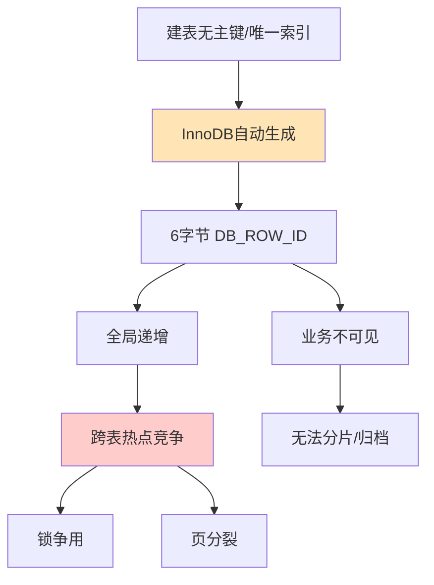

# MySQL 8.0 引入了隐藏主键，对于 InnoDB 存储引擎，如果建表时既没有定义主键也没有定义唯一索引，底层是如何处理行数据的？这对线上业务有什么潜在风险？

在 MySQL 8.0 中，若建表未指定主键且无唯一索引，InnoDB 会自动生成一个 6 字节的隐藏主键（DB_ROW_ID），该 ID 是全局递增的。所有二级索引的叶子节点实际上都会存储这个隐藏主键的值来进行回表查询。潜在风险在于：由于隐藏主键是全局递增的，在高并发插入场景下，不同的表竞争同一个全局自增值，会导致索引页底部的“热点”竞争，引发锁争用和性能瓶颈（类似自增 ID 的页分裂问题）。此外，业务无法利用该主键进行分库分表或数据归档，无法控制数据物理分布。因此，最佳实践是必须定义显式主键，推荐使用有序但非连续的 ID（如雪花算法）来分散写入压力。

## 技术原理

- **机制：无主键时自动生成 6 字节全局递增的 DB_ROW_ID**：InnoDB 是索引组织表（IOT），必须有一个聚簇索引来组织行数据。如果建表时既没有显式主键，也没有任何非空唯一索引，InnoDB 会自动生成一个 6 字节的隐藏列 `DB_ROW_ID`（注意：是全局共享的 dict_sys->row_id，不是每表独立）作为聚簇索引键。所有二级索引叶子节点都存这个隐藏主键值用于回表。
- **性能：全局递增导致跨表热点竞争**：因为 `DB_ROW_ID` 来自全局计数器，所有无主键的表共享同一个序列。高并发插入时多张表竞争同一个全局自增值，该计数器在 `dict_sys` 上由互斥锁保护，成为性能瓶颈；同时全局单调递增的插入都落在 B+ 树最右叶子页，引发页分裂和"热点页"争用。
- **运维：业务不可见，无法利用主键做分片、归档或范围查询**：隐藏主键对业务完全透明，无法在 SQL 里引用，无法用它做分库分表的分片键，也无法基于它做时间范围归档或数据迁移。一旦数据已写入，几乎无法补主键（要重建整张表）。

## 命令演示

验证无主键表的隐藏列（通过 `innodb_sys_tables` / `innodb_sys_columns`）：

```sql
-- 建一张无主键无唯一索引的表
CREATE TABLE t_no_pk (name VARCHAR(50));

-- 查 InnoDB 内部视图，能看到自动生成的 DB_ROW_ID 等隐藏列
SELECT c.name, c.mtype, c.prtype
FROM innodb_sys_tables t
JOIN innodb_sys_columns c ON c.table_id = t.table_id
WHERE t.name = 'test/t_no_pk';
-- 结果会出现 DB_ROW_ID, DB_TRX_ID, DB_ROLL_PTR 等隐藏列

-- 最佳实践：显式定义有序但非连续的主键（雪花算法）
CREATE TABLE t_best (
    id      BIGINT      PRIMARY KEY COMMENT '雪花ID，有序非连续',
    name    VARCHAR(50),
    created DATETIME(3)
);
```

## 对比/选型

| 主键方案 | 有序性 | 单调递增 | 写入热点 | 适用场景 |
|----------|--------|----------|----------|----------|
| InnoDB 隐藏 DB_ROW_ID | 全局单调 | 是 | 严重（全局+最右页） | 应避免 |
| MySQL 自增 AUTO_INCREMENT | 表内单调 | 是 | 有（最右页争用） | 单机、顺序写 |
| 雪花算法 Snowflake | 时间有序 | 否（非连续） | 分散 | 分布式、分库分表 |
| UUID v4 | 无序 | 否 | 最差（随机插入页分裂） | 几乎不推荐 |
| UUID v7 / ULID | 时间有序 | 否 | 分散 | 分布式、可排序 |

## 常见坑/注意事项

- **隐藏主键是全局共享而非每表独立**：很多人误以为每张无主键表有独立自增列，实际是全实例共享一个 `dict_sys->row_id`，多表并发写会争抢同一把锁，这是性能问题的根源。
- **无主键还会放大从库延迟**：基于 RBR 的复制，无主键行更新/删除在从库要全表扫描定位，导致严重延迟，MGR 甚至要求必须有主键。
- **AUTO_INCREMENT 也有热点**：即便显式定义自增主键，高并发插入仍会争抢最右叶子页和自增锁；可配 `innodb_autoinc_lock_mode=2`（interleave）缓解。
- **不要用 UUID v4 做主键**：随机插入导致 B+ 树频繁页分裂和缓冲池污染，性能比自增差数倍；若必须用 UUID 选 v7/ULID 这类时间有序变种。
- **大表事后补主键代价极高**：线上表若已无主键运行一段时间，补主键会触发整表重建（拷贝全表数据、改二级索引引用），期间锁表或产生海量 binlog 拖垮主从。应在建表阶段就规划好主键，别等线上跑起来再补。
- **复合主键的权衡**：业务天然唯一键（如 `user_id + biz_id`）做复合主键可省自增 ID，但二级索引叶子节点要存完整复合主键（空间膨胀），且字段顺序仍会影响写入热点分布，要按"高频查询列在前、有序性好的列在后"设计。


## 核心流程图




## 记忆要点

- 若建表无主键无唯一索引，则InnoDB自动生成6字节隐藏主键
- 因隐藏主键是全局递增，所以高并发写多表会引发全局热点竞争
- 因隐藏主键不受业务控制，所以无法用于分库分表和物理分布
- 最佳实践：显式定义主键，推荐雪花算法等有序非连续ID

## 结构化回答

**30 秒电梯演讲：** 无主键自动生成全局递增隐藏ID，引发并发热点竞争与运维不可控。打个比方，就像去超市买东西没拿会员卡，收银员只能按全超市唯一的单号给你结账。大家都挤在同一个号码机旁排队（热点竞争），你也无法凭号去查账或积攒积分（运维不可控）。

**展开框架：**
1. **若建表无主键无唯一索引** — 则InnoDB自动生成6字节隐藏主键
2. **因隐藏主键是全局递增** — 所以高并发写多表会引发全局热点竞争
3. **因隐藏主键不受业务控制** — 所以无法用于分库分表和物理分布

**收尾：** 这三点都能配合实战聊。您想深入聊原理、对比还是避坑？

## 视频脚本

> 预计时长：2 分钟 | 由浅入深

| 时间 | 画面/字幕 | 口播台词 | 讲解要点 |
|------|----------|----------|----------|
| 0:00 | 标题卡：MySQL 8.0 引入了隐藏主键，… | "MySQL 8.0 引入了隐藏主键，对于 InnoDB 存储引擎，如果建表时既没有定义主键也没有定义唯一索引，底层是如何处理行数据的？这对线上业务有什么潜在风险？一句话——就像去超市买东西没拿会员卡，收银员只能按全超市唯一的单号给你结账。大家都挤在同一个号码机旁排队（热点竞争），你也无法凭号去查账或积攒积分（运维不可控）。" | 开场钩子 |
| 0:40 | 概念动画/示意图 | "无主键自动生成全局递增隐藏ID，引发并发热点竞争与运维不可控——就像去超市买东西没拿会员卡，收银员只能按全超市唯一的单号给你结账。大家都挤在同一个号码机旁排队（热点竞争），你也无法凭号去查账或积攒积分（运维不可控）" | 核心定义 |
| 1:20 | 若建表无主键无唯一索引示意 | "则InnoDB自动生成6字节隐藏主键" | 要点1 |
| 2:00 | 总结卡 | "记住这几条，面试不慌。下期讲进阶追问。" | 收尾 |
