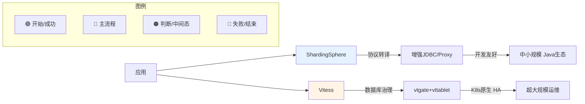
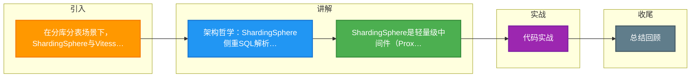

# 在分库分表场景下，ShardingSphere与Vitess在架构哲学上有什么根本不同？如何选型？

ShardingSphere（尤其是Proxy模式）和Vitess都提供数据库中间件功能，但架构哲学迥异。ShardingSphere更像是“增强的JDBC”或“智能Proxy”，侧重于在应用层和数据库之间提供标准化的分片、读写分离、加密等功能，协议兼容性是核心，适合已有MySQL生态迁移。Vitess则源自YouTube，定位于“Database as a Service”，架构上借鉴了Google Spanner，引入了VTGate、Vttablet等复杂组件，深度管理MySQL拓扑，支持Reparenting（主从切换）和在线DDL，适合超大规模集群运维。选型建议：如果是Java技术栈为主的常规分库分表，ShardingSphere生态集成更好；如果是大规模多租户、强运维需求（如K8s环境下的MySQL集群管理），Vitess更具优势。

**实战案例**：某初创公司使用 ShardingSphere-JDBC 快速实现了 SaaS 平台的多租户数据隔离，开发成本低且配合 Spring Boot 体验极佳。而某头部视频平台在处理千级 MySQL 实例运维时，选择了 Vitess，利用其 VTOrc 组件在主节点宕机时秒级完成自动故障转移，这是 ShardingSphere 社区版难以企及的高可用运维能力。

**对比表格**：
| 维度 | ShardingSphere | Vitess |
| :--- | :--- | :--- |
| **架构哲学** | 侧重 SQL 解析与路由 | 侧重 数据库集群治理与服务化 |
| **核心组件** | Proxy (可选), JDBC (SDK) | VTGate (路由), Vttablet (数据节点), VTOrc (高可用) |
| **部署形态** | 网络代理侧 或 应用侧嵌入 | 重度依赖 K8s，云原生架构 |
| **故障转移** | 依赖外部 HA (如 MHA/Orchestrator) | 内置 VTOrc，自动处理 Reparenting |
| **语言生态** | Java (对 Spring 极其友好) | Go (云原生标准) |
| **适用规模** | 中小规模、复杂业务逻辑分片 | 超大规模、单表破亿、强运维需求 |

**代码示例 (YAML配置)**：
```yaml
# ShardingSphere-JDBC 配置示例 (分片策略)
dataSources:
  ds_0: !!com.zaxxer.hikari.HikariDataSource
    jdbcUrl: jdbc:mysql://localhost:3306/demo_ds_0
rules:
- !SHARDING
  tables:
    t_order:
      actualDataNodes: ds_${0..1}.t_order_${0..1}
      tableStrategy:
        standard:
          shardingColumn: order_id
          shardingAlgorithmName: t_order_inline
  shardingAlgorithms:
    t_order_inline:
      type: INLINE
      props:
        algorithm-expression: t_order_${order_id % 2}
```

## 技术原理

ShardingSphere 与 Vitess 的差异源于两者对"中间件"定位的根本不同，理解这一点才能解释所有选型分歧：

- **协议层 vs 治理层的分层差异**：ShardingSphere 的核心是一个 SQL 解析器 + 路由引擎——它把应用发的 SQL 当字符串，词法/语法解析后改写并路由到对应分片，本质是在 **协议层（Protocol Layer）** 做转译，对底层 MySQL 实例"无感"（MySQL 不知道它的存在）。Vitess 则深入 **数据节点治理层**——每个 MySQL 实例旁部署一个 Vttablet sidecar，它以 MySQL 的从库协议连接，直接干预 binlog、Schema 迁移、备份、故障转移，是真正"管 MySQL"的组件。
- **ShardingSphere 的双模式架构**：JDBC 模式是一个 JAR 包嵌入应用，零额外部署但与进程耦合（语言绑定 Java）；Proxy 模式是独立服务，应用通过 MySQL 协议连它，多语言友好但多一跳网络。两种模式共享同一套分片/加密/读写分离规则引擎，是"业务增强"定位。
- **Vitess 的 DBaaS 架构**：借鉴 Google Spanner 的设计，VTGate 是无状态代理（类似查询网关），Vttablet 是有状态 sidecar（每个 MySQL 一个），VTOrc 基于 Paxos 做主从选举和故障转移，Vtctld 是控制面。整套架构面向 K8s 设计，原生支持滚动升级、在线 Schema 变更（VReplication），是"集群治理"定位。
- **故障转移的本质差异**：ShardingSphere 把 MySQL 当黑盒，主从切换依赖外部组件（MHA/Orchestrator），切换时 Proxy 需感知并重连，秒级到分钟级抖动难避免。Vitess 的 VTOrc 直接管理 Vttablet，故障检测 + Reparenting 在秒级完成，且应用连接 VTGate 完全无感知——这是大规模运维的关键差异。

## 注意事项

1. **不要被"功能列表"误导选型**：两者都支持分片、读写分离，但 ShardingSphere 是"业务中间件"（关注开发体验），Vitess 是"运维平台"（关注集群稳定）。选型看的不是功能多少，而是团队是 Java 业务团队还是 SRE/平台团队。
2. **ShardingSphere-JDBC 的语言绑定**：JDBC 模式只支持 Java，Go/Python/Node 应用要用必须走 Proxy 模式，多了一跳网络延迟和单点风险（需配合 Proxy 集群 + 负载均衡）。
3. **Vitess 的运维门槛高**：部署 Vitess 需要熟悉 K8s、CRD、Vttablet 生命周期管理，学习曲线陡峭。中小团队强行引入反而拖慢迭代，建议规模到几百个 MySQL 实例再考虑。
4. **跨分片事务的坑**：两者对分布式事务的支持都有限。ShardingSphere 提供 XA / BASE / LOCAL 事务，但 XA 性能差、BASE 最终一致有业务改造成本。Vitess 早期不支持跨分片事务（后引入 VTxid）。涉及强一致跨分片写入的业务要提前评估。

## 代码示例

```yaml
# Vitess 部署示例（K8s CRD，体现 DBaaS 治理定位）
apiVersion: planetscale.com/v2
kind: VitessCluster
metadata:
  name: commerce
spec:
  images:
    vtgate: vitess/latest
    vttablet: vitess/latest
  cells:
  - name: zone1
    gateway:
      replicas: 2                # VTGate 无状态代理，水平扩展
  keyspaces:
  - name: commerce
    turmination:
      shards:
      - name: "0"                # 分片定义
        replicas: 3              # Vttablet sidecar，每个 MySQL 一个
```

```bash
# Vitess 在线 Schema 变更（VReplication，不锁表）
vtctldclient ApplySchema --sql "ADD COLUMN price DECIMAL(10,2)" commerce/0
# ShardingSphere 无此能力，Schema 变更需手动用 pt-online-schema-change 等工具
```


## 核心流程图




## 记忆要点

- 架构哲学：ShardingSphere侧重SQL解析路由，而Vitess侧重数据库集群治理
- ShardingSphere是轻量级中间件(Proxy/JDBC)，Java生态友好
- Vitess定位于DBaaS，深度依赖K8s，适合超大规模云原生架构
- 高可用差异：ShardingSphere依赖外部HA组件，而Vitess内置VTOrc秒级故障转移

## 结构化回答

**30 秒电梯演讲：** ShardingSphere做协议转译适配，Vitess做数据库全生命周期治理。打个比方，ShardingSphere像个万能转接头，帮你插上各种分库分表功能；Vitess像个自动化机房管家，专门替你管庞大的服务器集群。

**展开框架：**
1. **架构哲学** — ShardingSphere侧重SQL解析路由，而Vitess侧重数据库集群治理
2. **ShardingSphere是轻量级中间件** — (Proxy/JDBC)，Java生态友好
3. **Vitess定位于DBaaS** — 深度依赖K8s，适合超大规模云原生架构

**收尾：** 我在项目里踩过坑——某初创公司使用 ShardingSphere-JDBC 快速实现了 SaaS 平台的多租户数据隔离，开发成本低且配合 Spring Boot 体验极佳。您想深入聊哪一段：原理、避坑还是对比选型？

## 视频脚本

> 预计时长：2 分钟 | 由浅入深

| 时间 | 画面/字幕 | 口播台词 | 讲解要点 |
|------|----------|----------|----------|
| 0:00 | 标题卡：在分库分表场景下，ShardingS… | "在分库分表场景下，ShardingSphere与Vitess在架构哲学上有什么根本不同？如何选型？一句话——ShardingSphere像个万能转接头，帮你插上各种分库分表功能；Vitess像个自动化机房管家，专门替你管庞大的服务器集群。" | 开场钩子 |
| 0:40 | 概念动画/示意图 | "ShardingSphere做协议转译适配，Vitess做数据库全生命周期治理——ShardingSphere像个万能转接头，帮你插上各种分库分表功能；Vitess像个自动化机房管家，专门替你管庞大的服务器集群" | 核心定义 |
| 1:20 | 架构哲学示意 | "ShardingSphere侧重SQL解析路由，而Vitess侧重数据库集群治理" | 要点1 |
| 2:00 | 总结卡 | "记住这几条，面试不慌。下期讲进阶追问。" | 收尾 |

### 视频流程图



