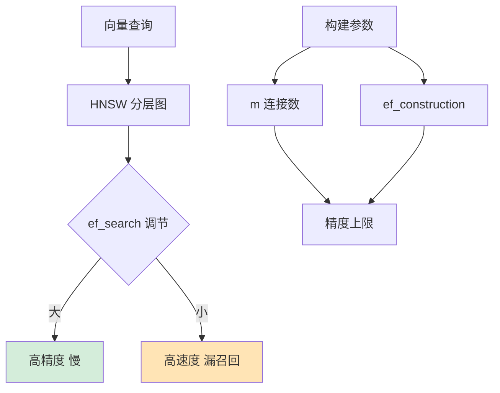

# PostgreSQL的pgvector扩展在使用HNSW索引进行向量检索时，是如何平衡查询精度与召回率的？

pgvector的HNSW索引通过`ef_search`参数动态调节查询时遍历图节点的数量来平衡精度与召回率。增大`ef_search`会遍历更多节点，提高召回率和精度但增加延迟；减小`ef_search`则提升速度但可能漏掉相似向量。此外，构建时的参数`m`（最大连接数）决定了图的密度，`ef_construction`决定了构建质量，两者共同设定了索引精度的上限。实战中，通常根据负载在高峰期调低`ef_search`以保性能，在闲时调高以保精度。

## 技术原理

- **ef_search 是查询时的核心调节参数：越大越准越慢，越小越快越漏**：HNSW 是分层小世界图，查询时从最顶层入口出发逐层贪心搜索，`ef_search` 控制在底层（最密层）动态候选集的大小。`ef_search` 越大，候选集保留越多邻居，越可能找到真正的最近邻（高召回率），但要计算的距离更多，延迟上升；反之则快但易漏。pgvector 里 `ef_search` 是会话级参数，可在线热调。
- **m 和 ef_construction 是构建时的地基参数，决定了精度的上限**：`m` 是每个节点的最大连接数，决定图的密度和连通性（太低会断连，太高增加内存和搜索开销）；`ef_construction` 是建索引时的搜索宽度，决定图结构质量（越高图越精确但构建越慢）。这两个参数在 `CREATE INDEX` 时固定，事后改要重建索引。查询时的 `ef_search` 只能在地基给定的上限内调节，地基差再调 `ef_search` 也补不回来。
- **实战策略：业务高峰降 ef_search 保性能，闲时升 ef_search 保召回**：因为 `ef_search` 可热调且单次查询生效，常做动态调节——高峰期降到 40-60 保延迟 SLA，夜间离线任务升到 200+ 保召回做全量重排。

## 命令演示

pgvector 创建 HNSW 索引并调节参数：

```sql
-- 1. 建表 + 向量列
CREATE TABLE items (id bigint PRIMARY KEY, embedding vector(768));

-- 2. 建索引时固定 m 和 ef_construction（地基参数）
CREATE INDEX ON items USING hnsw (embedding vector_cosine_ops)
  WITH (m = 16, ef_construction = 128);

-- 3. 查询时动态调节 ef_search（会话级，可热调）
SET hnsw.ef_search = 60;                       -- 默认 40，高峰可调小
SELECT id, embedding <=> '[0.1,...]'::vector AS dist
FROM items ORDER BY embedding <=> '[0.1,...]'::vector LIMIT 10;

-- 闲时离线任务调大保召回
SET hnsw.ef_search = 200;
```

## 对比/选型

| 参数 | 何时设定 | 作用 | 调节代价 |
|------|----------|------|----------|
| `m` | 建索引 | 图密度/连通性/内存 | 重建索引 |
| `ef_construction` | 建索引 | 图结构质量上限 | 重建索引 |
| `ef_search` | 查询时 | 召回 vs 延迟 | 会话级热调，零代价 |

| 索引类型 | 召回率 | 构建速度 | 查询速度 | 适用 |
|----------|--------|----------|----------|------|
| HNSW | 高（95%+） | 慢 | 快 | 在线检索、要求召回 |
| IVFFlat | 中（90%） | 快 | 中 | 数据量大、可接受漏召 |
| 暴力扫描 | 100% | 无 | 极慢 | 小数据集、ground truth |

## 常见坑/注意事项

- **ef_search 必须 ≥ LIMIT**：HNSW 的候选集大小必须不小于返回条数，否则结果不足；pgvector 会自动取 `max(ef_search, LIMIT)`，但显式设置更可控。
- **地基参数 m/ef_construction 别拍脑袋**：`m` 过低（如 4）图会断连召回骤降，过高（如 64）内存爆炸；经验值 m=16/ef_construction=128 适合大多数场景，数据量大可调到 m=32。
- **HNSW 索引构建慢且占空间**：百万级向量建 HNSW 可能几分钟，索引大小可能超过原始向量；建议在副本上建或用并行构建。
- **召回率要量化**：用 ` Recall@k = |ANN结果 ∩ 暴力结果| / k` 离线评估，不要凭感觉调参；线上 A/B 看业务指标更可靠。
- **pgvector 0.5+ 才有 HNSW**：老版本只有 IVFFlat，升级前确认版本；HNSW 在 0.5+ 默认推荐。


## 核心流程图




## 记忆要点

- HNSW通过`ef_search`参数动态调节查询遍历的节点数量
- 调大`ef_search`则提高召回率和精度但增加延迟，调小则反之
- 构建时的`m`(连接数)和`ef_construction`(构建质量)决定了精度的上限
- 负载策略：高峰期调小保性能，闲时调大保精度

## 结构化回答


**30 秒电梯演讲：** 就像找人，花更多时间打听（调大ef_search）能找得更准，但走得慢；只问熟人（调小ef_search）跑得快，但容易漏掉目标。

**展开框架：**
1. **ef_search是查询时的核心调节参数** — 越大越准越慢，越小越快越漏
2. **m和ef_con** — m和ef_construction是构建时的地基参数，决定了精度的上限
3. **实战策略** — 业务高峰降ef_search保性能，闲时升ef_search保召回

**收尾：** 这是我实战中的理解，您想深入哪一段？


## 视频脚本

> 预计时长：2 分钟 | 由浅入深

| 时间 | 画面/字幕 | 口播台词 | 讲解要点 |
|------|----------|----------|----------|
| 0:00 | 标题卡：PostgreSQL的pgvecto… | "PostgreSQL的pgvector扩展在使用HNSW索引进行向量检索时，是如何平衡查询精度与召回率的？一句话——就像找人，花更多时间打听（调大ef_search）能找得更准，但走得慢；只问熟人（调小ef_search）跑得快，但容易漏掉目标。" | 开场钩子 |
| 0:40 | 概念动画/示意图 | "HNSW通过动态调整搜索范围(ef_search)在速度与精度间做权衡——就像找人，花更多时间打听（调大ef_search）能找得更准，但走得慢；只问熟人（调小ef_search）跑得快，但容易漏掉目标" | 核心定义 |
| 1:20 | 要点1图解示意 | "HNSW通过`ef_search`参数动态调节查" | 要点1 |
| 2:00 | 总结卡 | "记住这几条，面试不慌。下期讲进阶追问。" | 收尾 |
