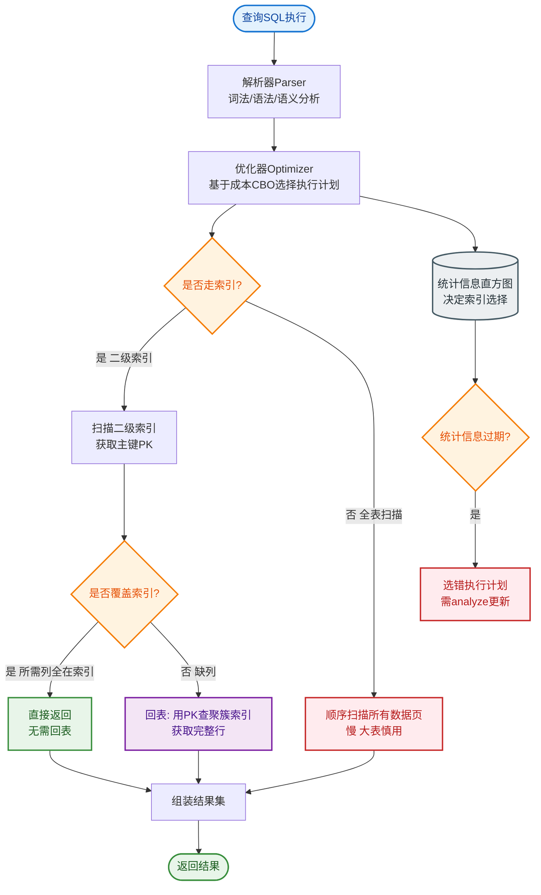
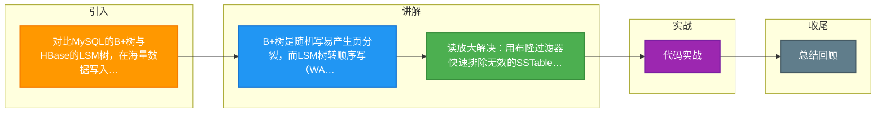

# 对比MySQL的B+树与HBase的LSM树，在海量数据写入场景下为什么LSM树性能更优？LSM树又是如何解决读取性能问题的？

MySQL的B+树在写入时需要随机磁盘I/O来更新索引页，且频繁的页分裂会导致写放大，因此在极高并发写入下性能受限。而LSM树（Log-Structured Merge Tree）将写操作转换为顺序写，所有写入首先记录在内存表和WAL（Write Ahead Log）中，内存满后不可变地刷入磁盘形成SSTable文件。这种机制极大地提升了写入吞吐量。

LSM树的缺点是读取可能需要遍历多层SSTable，性能不如B+树。为了解决读取问题，HBase引入了布隆过滤器，快速判断Key是否可能存在于某个SSTable中，避免无效磁盘读取；同时使用BlockCache缓存热点数据；后台定期执行Compaction操作，将多个小SSTable合并成大文件并清理无效数据（被覆盖或删除的数据），从而减少文件层级，优化读取性能。

**实战案例**：在双11大促的实时风控日志写入场景中，早期使用MySQL遭遇严重的锁等待和IO瓶颈，迁移至HBase后，利用LSM树的顺序写特性，即使TPS飙升至5万+，写入延迟依然稳定在10ms以内，但要注意Compaction期间由于IO占用导致的读写毛刺问题。

**代码示例（Java：模拟LSM写入）**：
```java
public class LSMStore {
    MemTable memTable = new MemTable();
    WAL wal = new WAL("data.wal");
    public void put(byte[] key, byte[] value) {
        wal.append(key, value); // 1. 顺序写WAL
        memTable.put(key, value); // 2. 写内存(无锁或轻量级锁)
        if (memTable.size() > THRESHOLD) {
            flush(); // 3. 异步刷盘为不可变SSTable
        }
    }
}
```

**对比表格**：

| 维度 | B+树 (MySQL) | LSM树 (HBase/RocksDB) |
| :--- | :--- | :--- |
| **写入方式** | 随机写，可能产生页分裂 | 顺序写，WAL + 内存批量Flush |
| **读取性能** | 稳定，读取路径固定 | 波动大，可能需查多层SSTable + 布隆过滤器 |
| **空间利用率** | 页分裂产生碎片 | 写放大，Compaction合并清理碎片 |
| **适用场景** | 读多写少，强一致性需求 | 写多读少，海量数据吞吐 |

## 技术原理

LSM 树（Log-Structured Merge Tree）写优化的核心是**把随机写转换为顺序写**——磁盘的顺序写速度远超随机写（机械盘差 100 倍，SSD 也差 5~10 倍），所以牺牲读性能换写吞吐：

- **LSM 写入流程（三级结构）**：
  1. **WAL（Write Ahead Log）**：写入先追加到 WAL 日志（顺序写），保证 crash 后能恢复。
  2. **MemTable（内存表）**：写入到内存的有序结构（跳表/红黑树），内存操作极快。
  3. **SSTable（磁盘有序文件）**：MemTable 满后（如 64MB），不可变地刷盘为一个 SSTable 文件（顺序写）。
  这样一次写入 = 1 次顺序写 WAL + 1 次内存写，全程无随机 IO，吞吐极高。
- **B+ 树为什么写慢**：B+ 树写入要在叶子页定位插入位置，往往触发**页分裂**（页满时一分为二，涉及数据搬移和父节点指针更新），这是随机 IO。高并发写入下页分裂频繁，写放大严重（写 1 字节实际触发多次 IO）。
- **LSM 读放大的根源**：数据可能散落在 MemTable + 多层 SSTable（Level 0/1/2...）中，同一 Key 可能在多个文件都有版本。读取时要从 MemTable 开始逐层查找，最坏情况遍历所有层，读放大严重。
- **读放大的三大补救**：
  1. **布隆过滤器**：每个 SSTable 附带一个 Bloom Filter，读取前先查布隆——若 Key 不在过滤器里，直接跳过该文件，避免无效磁盘读。
  2. **BlockCache**：缓存热点数据块在内存，热点 Key 直接命中内存。
  3. **Compaction（后台合并）**：把多个小 SSTable 合并成大文件，清理被覆盖/删除的旧版本，减少层级。合并是 LSM 的"垃圾回收"。

## 代码示例

LSM 树写入和读取的最小骨架（Java 伪代码）：

```java
import java.util.*;
import java.io.*;

public class SimpleLSMStore {
    private final TreeMap<String, String> memTable = new TreeMap<>();  // 内存表（有序）
    private final List<SSTable> sstables = new ArrayList<>();          // 磁盘文件
    private final WAL wal;
    private static final int MEMTABLE_THRESHOLD = 1000;

    public SimpleLSMStore(String dir) throws IOException {
        this.wal = new WAL(dir + "/data.wal");
        recoverFromWAL();   // 启动时重放 WAL 恢复 MemTable
    }

    // 写入：顺序写 WAL + 写内存，无随机 IO
    public synchronized void put(String key, String value) throws IOException {
        wal.append(key, value);       // 1. 顺序写 WAL（crash-safe）
        memTable.put(key, value);     // 2. 写内存表（极快）
        if (memTable.size() >= MEMTABLE_THRESHOLD) {
            flush();                  // 3. 内存满，刷盘为 SSTable
        }
    }

    // 读取：MemTable -> Level0 -> Level1... 逐层找，带布隆过滤
    public String get(String key) {
        // 1. 先查内存表（最新数据）
        if (memTable.containsKey(key)) return memTable.get(key);
        // 2. 逐层查 SSTable（从新到旧）
        for (SSTable sst : sstables) {
            if (!sst.bloomFilter.mightContain(key)) continue;  // 布隆过滤跳过
            String val = sst.get(key);
            if (val != null) return val;
        }
        return null;
    }

    // 刷盘：MemTable -> 不可变 SSTable（顺序写）
    private void flush() throws IOException {
        SSTable sst = new SSTable(memTable);   // 序列化为有序磁盘文件
        sstables.add(0, sst);                  // 新文件在最前（优先查）
        memTable.clear();
        if (sstables.size() > 4) compaction(); // 层数过多触发合并
    }

    // 后台合并：多个小 SSTable -> 一个大文件，清理旧版本
    private void compaction() throws IOException {
        List<SSTable> toMerge = sstables.subList(0, Math.min(4, sstables.size()));
        SSTable merged = SSTable.merge(toMerge);   // 归并排序，保留最新版本
        toMerge.clear();
        sstables.add(0, merged);
    }
}
```

## 注意事项

- **Compaction 会造成读写毛刺**：合并时大量占用磁盘 IO 和 CPU，可能让读写延迟突增。生产环境要配置合并的 IO 限流（如 RocksDB 的 `rate_limit`），并在业务低峰期调度大合并。
- **写放大是隐性成本**：LSM 的同一份数据在多次 Compaction 中被反复重写（写一次可能在 Level 0/1/2 各写一遍），总写入量可能是逻辑写入的 10~30 倍。SSD 寿命要提前评估。
- **B+ 树并非一无是处**：读多写少、强一致性、范围查询密集的场景（OLTP 交易系统），B+ 树的读性能稳定且无读放大，仍优于 LSM。别盲目追求 LSM。
- **LSM 适合写多读少 + 海量数据**：时序数据、日志、事件流这类"写多读少、按 Key 查询"的场景是 LSM 的主场（HBase、RocksDB、Cassandra 都用它）。点查热点数据要配合 BlockCache 才能保证读延迟。


## 核心流程图


## 记忆要点

- B+树是随机写易产生页分裂，而LSM树转顺序写(WAL+内存)极大提升吞吐
- 读放大解决：用布隆过滤器快速排除无效的SSTable查询
- 缓存与合并：用BlockCache缓存热点，用后台Compaction合并清理碎片
- 适用场景：MySQL适合读多写少，而HBase适合海量写入吞吐

## 结构化回答

**30 秒电梯演讲：** LSM树以读换写，用顺序写放大换取写性能。打个比方，写日记像B+树，每篇都要插到特定页，翻找麻烦；LSM树像流水账，直接在末尾顺次记，写完再回头整理（合并）目录。

**展开框架：**
1. **B+树是随机写易产生页分裂** — 而LSM树转顺序写(WAL+内存)极大提升吞吐
2. **读放大解决** — 用布隆过滤器快速排除无效的SSTable查询
3. **缓存与合并** — 用BlockCache缓存热点，用后台Compaction合并清理碎片

**收尾：** 我在项目里踩过坑——在双11大促的实时风控日志写入场景中，早期使用MySQL遭遇严重的锁等待和IO瓶颈，迁移至HBase后，利用LSM树的顺序写特性，即使TPS飙升至5万+，写入延迟依然稳定在10ms以内，但要注意Compaction期间由于IO占用导致的读写毛刺问题。您想深入聊哪一段：原理、避坑还是对比选型？

## 视频脚本

> 预计时长：2 分钟 | 由浅入深

| 时间 | 画面/字幕 | 口播台词 | 讲解要点 |
|------|----------|----------|----------|
| 0:00 | 标题卡：对比MySQL的B+树与HBase的… | "对比MySQL的B+树与HBase的LSM树，在海量数据写入场景下为什么LSM树性能更优？LSM树又是如何解决读取性能问题的？一句话——写日记像B+树，每篇都要插到特定页，翻找麻烦；LSM树像流水账，直接在末尾顺次记，写完再回头整理（合并）目录。" | 开场钩子 |
| 0:40 | 概念动画/示意图 | "LSM树以读换写，用顺序写放大换取写性能——写日记像B+树，每篇都要插到特定页，翻找麻烦；LSM树像流水账，直接在末尾顺次记，写完再回头整理（合并）目录" | 核心定义 |
| 1:20 | 要点1图解示意 | "而LSM树转顺序写(WAL+内存)极大提升吞吐" | 要点1 |
| 2:00 | 总结卡 | "记住这几条，面试不慌。下期讲进阶追问。" | 收尾 |

### 视频流程图



