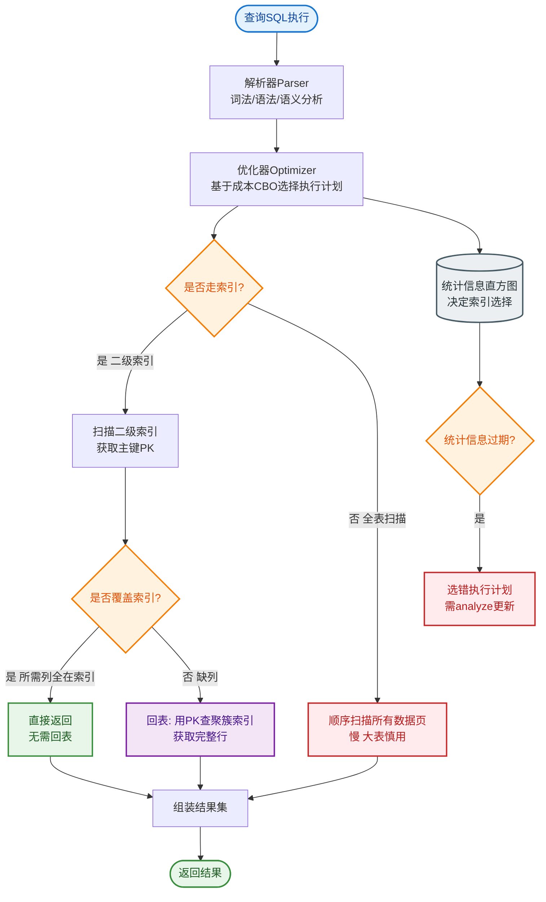

# MySQL 8.0 引入的“直方图”统计信息对索引选择有什么帮助？在什么情况下，优化器可能即便有索引也会选择全表扫描？

直方图提供了关于列中数据分布的详细信息（如频率、不同值的数量），而不像索引那样只存储排序后的键值。MySQL 8.0 支持两种直方图：**等宽直方图**（Singleton，每个值单独统计）和**等高直方图**（Equi-Height，将值分桶，每桶大约行数相同）。这优化了基数估计，特别是在非索引列或索引区分度不高时。

当执行 WHERE 条件涉及非索引列，或者索引的选择性极低（如性别字段，重复率极高）时，优化器可以利用直方图估算返回的行数。如果优化器估算出通过索引回表（随机 I/O）读取数据的成本高于直接全表扫描（顺序 I/O），它就会放弃索引。

**成本模型关键点**：
优化器主要依据 `io_block_read_cost`（I/O 成本）和 `cpu_cost`（CPU 成本）计算。对于 InnoDB 引擎，关键在于聚集索引的**离散度**（Clustering Factor）。如果索引顺序与数据物理顺序不一致，回表会产生大量随机 I/O。通常，当查询条件命中了表中超过 20%-30% 的数据（这个阈值取决于 `server_cost` 表中的参数配置及数据分布）时，由于大量的随机 I/O，全表扫描往往效率更高。此外，如果数据页不在内存中，全表扫描的顺序 I/O 预读机制优势更为明显。

```text
  优化器决策流程
  ┌───────────────┐
  │ 接收 SQL 查询  │
  └───────┬───────┘
          │
          ▼
  ┌─────────────────────────────┐
  │ 1. 查找可用索引              │
  │ 2. 使用索引/直方图估算基数   │
  │    (预估返回行数 rows)       │
  └───────┬─────────────────────┘
          │
          ▼
  ┌─────────────────────────────┐
  │ 成本计算                     │
  ├─────────────────────────────┤
  │ 全表扫描成本:                │
  │   扫描页数 * IO_COST         │
  │                             │
  │ 索引回表成本:                │
  │   索引扫描 + (rows * 回表IO) │
  └───────┬─────────────────────┘
          │
          ▼
  ┌─────────────────────┐
  │ 哪种成本低选哪种     │
  └─────────────────────┘
```

**实战案例**：在订单表中查询 `status='PAID'`，虽然有索引，但该状态占据了总数据的 60%。由于回表带来的随机 I/O 成本过高，优化器选择全表扫描。后来发现该表数据碎片化严重（物理顺序与索引顺序不一致），执行 `OPTIMIZE TABLE` 重组物理存储后，索引的 Clustering Factor 变好，优化器重新评估成本后改为了索引扫描。此外，对于未加索引的 `created_at` 范围查询，手动更新直方图后，原本错误的 Rows 预估值从 1 万修正为 100 万，从而避免了错误的执行计划。

**对比表格**：
| 特性 | 索引 | 直方图 |
| :--- | :--- | :--- |
| **存储内容** | 完整的键值+指针 | 数据分布的统计信息 (分桶/频率) |
| **实时性** | 实时更新 (随DML变动) | 非实时，需手动 `ANALYZE TABLE` 触发 |
| **主要用途** | 加速数据查找 | 辅助优化器做成本估算 |
| **占用空间** | 较高 (通常几MB到几GB) | 较低 (通常几KB到几MB) |
| **支持查询** | 精确匹配、范围、排序 | 仅用于基数估计，不支持直接查找 |

**代码示例 (SQL)**：
```sql
-- 1. 为非索引列创建直方图 (自动选择桶数)
ANALYZE TABLE orders UPDATE HISTOGRAM ON customer_id, created_at;

-- 2. 查看直方图统计信息
SELECT 
    SCHEMA_NAME, 
    TABLE_NAME, 
    COLUMN_NAME, 
    HISTOGRAM_TYPE, -- Singleton (等宽) or Equi-Height (等高)
    BUCKETS -- 桶数量
FROM information_schema.COLUMN_STATISTICS 
WHERE TABLE_NAME = 'orders';

-- 3. 删除直方图
ANALYZE TABLE orders DROP HISTOGRAM ON customer_id;
```


## 核心流程图


## 记忆要点

- 直方图记录数据分布统计，而索引只存排序键值，前者专辅助基数估算
- 当非索引列或索引选择性极低时，直方图能修正预估行数防执行计划跑偏
- 因回表是随机IO而全表是顺序IO，当预估命中数据超20%优化器宁选全表扫
- 索引离散度(CF)差会导致回表成本极高，OPTIMIZE TABLE能改善物理排序

## 结构化回答

**30 秒电梯演讲：** 直方图精准估算基数，权衡回表随机IO与全表顺序IO的成本。打个比方，像查字典，索引就是目录，直方图告诉你某字母大概有几页。如果要查的内容占了字典的三分之一，逐页翻（全表扫描）比反复在目录和正文间跳来跳去（回表）更快。

**展开框架：**
1. **直方图记录数据分布统计** — 而索引只存排序键值，前者专辅助基数估算
2. **当非索引列或索引选择性极低时** — 直方图能修正预估行数防执行计划跑偏
3. **因回表是随机IO而全表是顺序IO** — 当预估命中数据超20%优化器宁选全表扫

**收尾：** 这三点都能配合实战聊。您想深入聊原理、对比还是避坑？

## 视频脚本

> 预计时长：2 分钟 | 由浅入深

| 时间 | 画面/字幕 | 口播台词 | 讲解要点 |
|------|----------|----------|----------|
| 0:00 | 标题卡：MySQL 8.0 引入的“直方图”… | "MySQL 8.0 引入的“直方图”统计信息对索引选择有什么帮助？在什么情况下，优化器可能即便有索引也会选择全表扫描？一句话——像查字典，索引就是目录，直方图告诉你某字母大概有几页。如果要查的内容占了字典的三分之一，逐页翻（全表扫描）比反复在目录和正文间跳来跳去（回表）更快。" | 开场钩子 |
| 0:40 | 概念动画/示意图 | "直方图精准估算基数，权衡回表随机IO与全表顺序IO的成本——像查字典，索引就是目录，直方图告诉你某字母大概有几页。如果要查的内容占了字典的三分之一，逐页翻（全表扫描）比反复在目录和正文间跳来跳去（回表）更快" | 核心定义 |
| 1:20 | 直方图记录数据分布统计示意 | "而索引只存排序键值，前者专辅助基数估算" | 要点1 |
| 2:00 | 总结卡 | "记住这几条，面试不慌。下期讲进阶追问。" | 收尾 |
