# LVS DR模式的工作原理是什么？

### LVS DR 模式工作原理
DR（Direct Routing）模式通过改写数据包的 MAC 地址实现转发。

**工作流程**：
1. 客户端将请求发往前端的负载均衡器，请求报文源地址是 CIP，目标地址为 VIP。
2. 负载均衡器收到报文后，发现请求的是在规则里面存在的地址，那么它将客户端请求报文的源 MAC 地址改为自己 DIP 的 MAC 地址，目标 MAC 改为了 Real Server（RS）的 MAC 地址，并将此包发送给 RS。
3. RS 发现请求报文中的目的 MAC 是自己，就会接收该报文。处理完请求后，将响应报文通过 lo 接口送给 eth0 网卡直接发送给客户端（不经过 LB）。

**总结与特点**：
1. 通过在调度器 LB 上修改数据包的目的 MAC 地址实现转发。注意源地址仍然是 CIP，目的地址仍然是 VIP。
2. 请求的报文经过调度器，而 RS 响应处理后的报文无需经过调度器 LB，因此并发访问量大时使用效率很高（和 NAT 模式比）。
3. 因为 DR 模式是通过 MAC 地址改写机制实现转发，因此所有 RS 节点和调度器 LB 只能在一个局域网里面。
4. RS 主机需要绑定 VIP 地址在 LO 接口（掩码 32 位）上，并且需要配置 ARP 抑制（防止响应 VIP 的 ARP 请求）。
5. RS 节点的默认网关不需要配置成 LB，而是直接配置为上级路由的网关，能让 RS 直接出网。

**实战案例**：
在双十一大促的高并发场景下，曾遇到因未正确配置 RS 的 `arp_ignore` 和 `arp_announce` 参数，导致 RS 抢占了 VIP 的 MAC 地址响应，引发网络“ARP 震荡”，造成整个集群服务不可用，排查后通过内核参数压制解决。

**代码示例（RS 端配置脚本）**：
```bash
# 绑定VIP到lo接口，并设置ARP抑制
VIP=192.168.1.100
/sbin/ifconfig lo:0 $VIP broadcast $VIP netmask 255.255.255.255 up
# 关键：抑制RS响应VIP的ARP请求，防止IP冲突
echo "1" > /proc/sys/net/ipv4/conf/lo/arp_ignore
echo "2" > /proc/sys/net/ipv4/conf/lo/arp_announce
echo "1" > /proc/sys/net/ipv4/conf/all/arp_ignore
echo "2" > /proc/sys/net/ipv4/conf/all/arp_announce
```

**LVS DR vs NAT 模式对比**：

| 特性 | LVS DR 模式 | LVS NAT 模式 |
| :--- | :--- | :--- |
| **转发方式** | 修改 MAC 地址 | 修改 IP 地址（SNAT/DNAT） |
| **网络拓扑** | LB 与 RS 必须在同一网段（二层） | RS 可以是私有网络，通过 LB 网关出入 |
| **流量路径** | 请求经过 LB，响应不经过 LB | 请求和响应都经过 LB（流量翻倍） |
| **性能瓶颈** | LB 仅处理请求，吞吐量高 | LB 处理双向流量，易成为瓶颈 |
| **RS 网关** | 指向上游路由器（非 LB） | 必须指向 LB 的 DIP |
| **支持端口映射** | 不支持（端口必须一致） | 支持（如 VIP:80 -> RIP:8080） |

## 技术原理

LVS DR 模式的核心是**让负载均衡器只参与"请求转发"，不参与"响应回程"**，从而把 LB 从双向流量的瓶颈中解放出来。这是通过二层（数据链路层）MAC 地址改写实现的：

- **为什么只改 MAC 不改 IP**：MAC 地址是二层概念，只在同一局域网内有效；IP 是三层概念，跨网段。DR 模式改 MAC 后，IP 报文头（CIP→VIP）完全不变，RS 收到包时看到的目的 IP 仍是 VIP。因为 RS 在 lo 接口也配了 VIP，内核会接收这个包并交给应用处理。响应时 RS 直接用 VIP 作为源 IP 回包（因为 lo 上有 VIP），通过自己的默认网关发给客户端，完全不经过 LB。这就是"请求过 LB，响应不过 LB"的物理基础。
- **ARP 抑制的必要性**：VIP 同时配在 LB 和所有 RS 上（RS 配在 lo），局域网内会有多台机器响应 VIP 的 ARP 请求，导致交换机 MAC 表震荡（ARP 风暴）。必须让 RS 不响应 VIP 的 ARP——`arp_ignore=1` 让内核只响应"目标 IP 在接收网卡上"的 ARP（lo 上的 VIP 不算），`arp_announce=2` 让 RS 发送 ARP 时总是用真实 IP 而非 VIP。这两个参数是 DR 模式稳定运行的生命线。
- **同网段限制的根因**：MAC 地址只在同一个广播域内有效，跨路由器时 MAC 会被重写。所以 DR 模式要求 LB 和 RS 在同一个二层网络（同交换机或同 VLAN）。这是 DR 比 NAT 模式拓扑灵活性差的根本原因，但也是性能高的原因（无 IP NAT 开销）。
- **不支持端口映射的根因**：DR 模式不改 IP 头，也不改 TCP/UDP 头，所以 VIP:80 必须映射到 RS:80，不能像 NAT 那样做 VIP:80→RS:8080。需要端口映射时只能用 NAT 或 FullNAT 模式。

## 代码示例

```bash
# 1. RS（Real Server）端配置：绑定 VIP 到 lo 接口 + ARP 抑制
VIP=192.168.1.100

# 绑定 VIP 到 lo:0，32 位掩码（只路由到本机，不广播）
/sbin/ifconfig lo:0 $VIP broadcast $VIP netmask 255.255.255.255 up
# 或用 ip 命令（推荐，更现代）
ip addr add $VIP/32 dev lo

# ARP 抑制（DR 模式的生命线，漏配会导致 ARP 风暴）
echo "1" > /proc/sys/net/ipv4/conf/lo/arp_ignore
echo "2" > /proc/sys/net/ipv4/conf/lo/arp_announce
echo "1" > /proc/sys/net/ipv4/conf/all/arp_ignore
echo "2" > /proc/sys/net/ipv4/conf/all/arp_announce

# RS 默认网关指向上游路由器（不是 LB！）
# 这样响应包直接出网，不经 LB
route add default gw 192.168.1.1
```

```bash
# 2. LB（Director）端配置：用 ipvsadm 配置 DR 规则
VIP=192.168.1.100
RS1=192.168.1.11
RS2=192.168.1.12

# 配置虚拟服务，调度算法用 wlc（加权最少连接）
ipvsadm -A -t $VIP:80 -s wlc
# 添加 RS，用 -g 表示 DR 模式（gatewaying）
ipvsadm -a -t $VIP:80 -r $RS1:80 -g -w 1
ipvsadm -a -t $VIP:80 -r $RS2:80 -g -w 1

# 查看 LVS 规则和连接状态
ipvsadm -Ln          # 列出规则
ipvsadm -Ln --rate   # 实时流量速率
ipvsadm -L -c        # 当前活动连接
```

```bash
# 3. ARP 抑制参数说明（踩坑核心）
# arp_ignore=1：只响应"目标 IP 配在接收该 ARP 的网卡上"的请求
#   lo 上的 VIP 不算（ARP 从 eth0 进来），所以 RS 不响应 VIP 的 ARP
# arp_announce=2：发送 ARP 请求时，总是用出接口的真实 IP，避免用 VIP
#   防止 RS 主动宣告 VIP，污染交换机 MAC 表

# 永久生效（写入 sysctl.conf）
cat >> /etc/sysctl.conf << EOF
net.ipv4.conf.lo.arp_ignore = 1
net.ipv4.conf.lo.arp_announce = 2
net.ipv4.conf.all.arp_ignore = 1
net.ipv4.conf.all.arp_announce = 2
EOF
sysctl -p
```

## 对比选型

| 维度 | LVS DR | LVS NAT | LVS FullNAT | LVS TUN |
| :--- | :--- | :--- | :--- | :--- |
| **转发方式** | 改 MAC（二层） | 改 IP/DNAT（三层） | 改源+目的 IP | IP 隧道封装 |
| **响应路径** | RS 直接回客户端（不经 LB） | 经 LB 回客户端 | 经 LB 回客户端 | RS 直接回客户端 |
| **网络要求** | LB 与 RS 同网段 | RS 可私有网段 | RS 可跨网段 | RS 可跨网段 |
| **LB 瓶颈** | 低（仅处理请求） | 高（双向流量） | 高（双向流量） | 低 |
| **端口映射** | 不支持 | 支持 | 支持 | 不支持 |
| **RS 配置** | lo 绑 VIP + ARP 抑制 | 网关指向 LB | 无需特殊配置 | 支持隧道 |
| **适用场景** | 同机房高并发 | 跨网段中小流量 | 大规模跨网段 | 跨地域负载 |

## 常见坑

- **ARP 抑制漏配是头号杀手**：实战中双十一 ARP 震荡导致整个集群不可用。`arp_ignore` 和 `arp_announce` 必须在 `all` 和 `lo` 接口都配置，且要持久化到 sysctl.conf（重启不丢）。
- **lo 接口必须用 32 位掩码**：如果用 24 位掩码，lo 会宣告整个网段，导致路由混乱。`netmask 255.255.255.255` 是硬性要求。
- **RS 默认网关不能指向 LB**：DR 模式下 RS 直接出网，网关指向上游路由器。误指 LB 会让响应包绕回 LB，反而成了 NAT 模式且 LB 会丢弃（因为连接跟踪对不上）。
- **跨网段无法用 DR**：RS 在不同机房或不同 VLAN 时 MAC 不可达，DR 直接失效。此时只能选 NAT（同机房跨网段）或 TUN/FullNAT（跨机房）。
- **健康检查要配在 LB 侧**：RS 宕机但 ARP 表还在，LB 会继续转发到死掉的 RS。必须配 `ipvsadm` 的健康检查或外挂 keepalived，自动剔除故障 RS。
- **session 保持要小心**：DR 模式默认无连接跟踪优化，长连接会话保持建议用源 IP 哈希（`-s sh`）而非持久化模板，避免 LB 连接表爆满。


## 核心流程图

```mermaid
flowchart TD
    REQ([客户端请求]) --> LB[负载均衡器]

    LB --> STRATEGY{调度策略}
    STRATEGY -->|轮询| RR[Round Robin<br/>依次分配]
    STRATEGY -->|加权| WRR[Weighted RR<br/>按机器性能配比]
    STRATEGY -->|随机| RND[Random<br/>概率均衡]
    STRATEGY -->|最少连接| LC[Least Connections<br/>实时负载感知]
    STRATEGY -->|IP Hash| IPH[IP Hash<br/>会话保持]
    STRATEGY -->|一致性 Hash| CH[Consistent Hash<br/>虚拟节点最小迁移]

    RR --> NODES[后端节点池]
    WRR --> NODES
    RND --> NODES
    LC --> NODES
    IPH --> NODES
    CH --> NODES

    NODES --> HEALTH{健康检查}
    HEALTH -->|健康| ROUTE[转发请求]
    HEALTH -->|异常| EVICT[剔除节点<br/>故障转移]
    EVICT --> LB

    ROUTE --> TIER{层级}
    TIER -->|L4 传输层| L4LVS[LVS/硬件<br/>IP+端口 改包<br/>DR/NAT/TUN/FNAT]
    TIER -->|L7 应用层| L7NG[Nginx/HAProxy<br/>HTTP 头/Cookie/URL<br/>路由+鉴权+限流]

    L4LVS --> UP([上游服务])
    L7NG --> UP

    style REQ fill:#4CAF50,color:#fff
    style UP fill:#2196F3,color:#fff
    style CH fill:#FF9800,color:#fff
    style L4LVS fill:#9C27B0,color:#fff
    style L7NG fill:#009688,color:#fff
    style EVICT fill:#F44336,color:#fff
```



## 记忆要点

- 核心原理：仅改写二层数据包的 MAC 地址，IP 报文头保持原样（CIP 与 VIP 不变）
- 流量路径：因为响应包由 RS 直接通过网关发给客户端，所以 LB 不会成为性能瓶颈
- 网络要求：因为依赖二层 MAC 转发，所以 LB 与 RS 必须处于同一个物理局域网内
- 关键配置：RS 需在 lo 接口绑定 VIP（32位掩码），且必须配置 ARP 抑制防冲突

## 结构化回答


**30 秒电梯演讲：** 老板（LB）只把任务转给对应员工（RS），员工干完直接汇报客户。

**展开框架：**
1. **MAC** — 仅修改MAC地址，IP地址不变。
2. **LB** — 请求经过LB，响应不经过LB。
3. **RS** — RS必须配置VIP并抑制ARP。

**收尾：** 这是我实战中的理解，您想深入哪一段？


## 视频脚本

> 预计时长：2 分钟 | 由浅入深

| 时间 | 画面/字幕 | 口播台词 | 讲解要点 |
|------|----------|----------|----------|
| 0:00 | 标题卡：LVS DR模式的工作原理 | "LVS DR模式的工作原理，一分钟讲透。" | 开场钩子 |
| 0:35 | 生活类比动画 | "打个比方——老板(LB)只把任务转给对应员工(RS)，员工干完直接汇报客户。" | 核心类比 |
| 1:10 | 概念定义动画 | "一句话：通过修改MAC地址转发请求，响应直接返回，提升性能。" | 核心定义 |
| 1:50 | 仅修改MAC地址 图解 | "仅修改MAC地址，IP地址不变。" | 仅修改MAC地址 |
