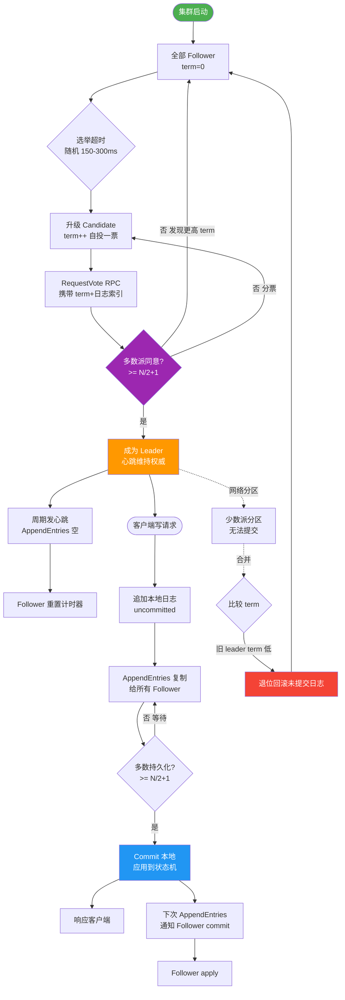

# Raft算法中Term（任期）的作用是什么？

### Raft 算法中 Term（任期）的作用
在 Raft 中，时间被划分为一个个长度不同的 **Term（任期）**。Term 是一个连续递增的全局编号（如 Term 1, Term 2...），类似于西方民主选举中的“届数”。

#### Term 的核心作用
1.  **逻辑时钟**：
    Term 充当了整个集群的逻辑时钟。Raft 不依赖物理时钟，而是通过 Term 的比较来判别信息的“新旧”。Term 越大，代表该信息越新。

2.  **保证 Leader 唯一性**：
    *   Raft 保证在一个 Term 内，最多只能产生一个 Leader。
    *   如果某个节点在 Term T 当选为 Leader，它会获得 Term T 的“投票权”。
    *   如果发生网络分区，多个节点可能自认为当选（但 Term 不同），Term 较大的 Leader 生效，Term 较小的 Leader 会自动降级。

3.  **解决脑裂与冲突**：
    *   **RPC 请求处理规则**：当节点收到包含 Term T 的 RPC 请求（`RequestVote` 或 `AppendEntries`）时：
        *   如果本地 `currentTerm` < T：更新本地 Term 为 T，并转为 Follower 状态。
        *   如果本地 `currentTerm` > T：拒绝该请求。
        *   如果本地 `currentTerm` == T：正常处理（除了已投票的情况）。
    *   这确保了旧的 Leader（Term 较小）无法对集群的新状态产生任何影响，从而保证了系统的一致性。

#### Term 状态流转示意图
```text
       Term 1                Term 2                Term 3
    [Leader A]           (Leader A Crash)      [Leader B]
         |                       |                     |
    正常服务                   |                 选举成功
         |                   重新选举                    |
         v                       v                     v
   (稳定状态)              (Candidate 产生)      (新的稳定状态)
```

#### 实战案例
在 Etcd 或 TiKV 的实际运维中，由于网络抖动导致节点之间心跳超时，集群可能会频繁切换 Term。如果检测到 `currentTerm` 在短时间内急剧增长，通常意味着存在“选举抖动”或网络分区，需要介入检查网络延迟或节点负载。

#### 关键代码片段 (Go语言风格)
```go
type Raft struct {
    currentTerm uint64
    state       State // Follower, Candidate, Leader
}

// 处理 RPC 请求时的 Term 检查
func (r *Raft) handleRPC(term uint64) {
    if term > r.currentTerm {
        r.currentTerm = term
        r.state = Follower // 发现更高 Term，立即降级
        r.persist()        // 持久化 Term
    }
}
```

#### Term 与日志完整性对比
| 特性 | Term | Log Index |
| :--- | :--- | :--- |
| **作用** | 逻辑时钟，判断时代 | 判断日志位置，稀疏性 |
| **单调性** | 严格递增 | 每个任期内递增，整体非严格递增 |
| **比较优先级** | Term 是第一比较维度 | Term 相同时，Index 决定新旧 |

## 常见考点
1.  **为什么说 Term 是 Raft 的逻辑时钟？**（答：用于比较不同节点间的信息新旧，无需依赖物理时间）
2.  **当 Follower 收到 Term 比自己大的 RPC 时会怎么做？**（答：更新自己的 Term 并转为 Follower）
3.  **Term 和 Index 共同决定了什么？**（答：决定了日志的完整性，Index 相同 Term 更大的日志更新）


## 核心流程图



## 记忆要点

- 角色定义：Term 是连续递增的整数，充当 Raft 集群的「逻辑时钟」
- 唯一保证：因为集群规则限定，所以同一个 Term 内最多只能产生一个 Leader
- 防脑裂机制：若节点发现更大的 Term，必须立即更新 Term 并降级为 Follower，拒绝旧 Term 请求
- 新旧比较：比较两份日志新旧时，第一维度永远是看 Term，Term 相同再看 Index

## 结构化回答


**30 秒电梯演讲：** Term就像“届数”，新任的领导（大届数）命令优先于旧领导（小届数）。

**展开框架：**
1. **Term** — Term是全局递增的编号。
2. **Leader** — 用于检测过时的Leader或请求。
3. **Leader** — 保证每个任期最多有一个Leader。

**收尾：** 这是我实战中的理解，您想深入哪一段？


## 视频脚本

> 预计时长：2 分钟 | 由浅入深

| 时间 | 画面/字幕 | 口播台词 | 讲解要点 |
|------|----------|----------|----------|
| 0:00 | 标题卡：Raft算法中Term（任期）的作用 | "Raft算法中Term（任期）的作用，一分钟讲透。" | 开场钩子 |
| 0:35 | 生活类比动画 | "打个比方——Term就像“届数”，新任的领导(大届数)命令优先于旧领导(小届数)。" | 核心类比 |
| 1:10 | 概念定义动画 | "一句话：Term是Raft的逻辑时钟，用于判断信息新旧和防止脑裂。" | 核心定义 |
| 1:50 | Term 图解 | "Term是全局递增的编号。" | Term |
