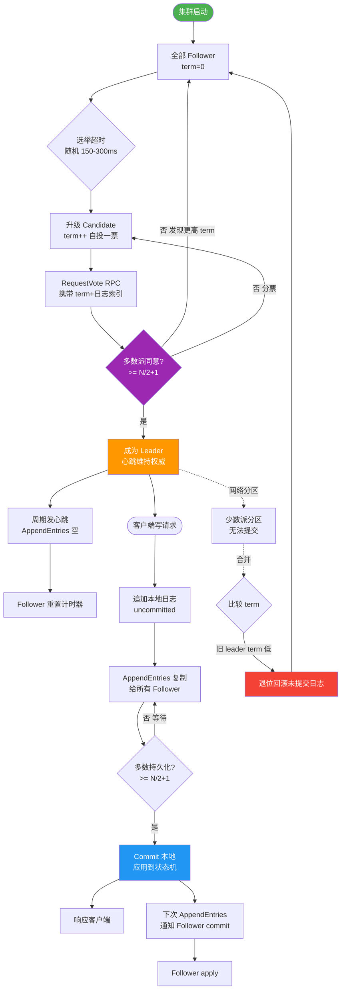

# 什么是ZAB协议？

ZAB 协议（ZooKeeper Atomic Broadcast，ZooKeeper 原子消息广播协议）是为 ZooKeeper 设计的保证分布式一致性的崩溃恢复协议。它旨在解决分布式系统中的数据一致性问题，确保在部分节点崩溃或网络分区的情况下，服务依然能够保持数据的一致性和高可用性。

### 核心概念：Zxid
Zxid 是一个 64 位的事务 ID，用于标识每一次状态变更，是 ZooKeeper 中事务排序的全局唯一标识。
- **高 32 位（epoch）**：代表 Leader 周期（年代），又称“纪元”。每次选出新 Leader，epoch 加 1。这类似于年号，防止旧 Leader “复辟”处理过时的请求。
- **低 32 位（计数器）**：代表 Leader 周期内的事务序号，每处理一个写请求加 1。

### ZAB 协议的两种模式
1. **崩溃恢复（选举）模式**
   - **触发条件**：服务启动、Leader 崩溃或 Leader 失去半数 Follower 支持。
   - **目的**：快速选举出新的 Leader，并让 Follower 与 Leader 数据同步，确保数据一致。
   - **结束标志**：当 Leader 被选出且大多数节点完成了数据同步后，集群进入广播模式。

2. **消息广播（同步）模式**
   - **场景**：集群正常工作时的模式。
   - **流程**：
     1. Leader 接收客户端写请求。
     2. Leader 为请求生成 Zxid，并作为 Proposal（提议）广播给所有 Follower。
     3. Follower 收到 Proposal 后写入本地事务日志，并回复 Ack。
     4. Leader 收到**过半** Follower 的 Ack 后，广播 Commit 消息（自身并通知 Follower 提交）。
     5. Follower 收到 Commit 后，将该请求应用到内存数据库，返回客户端成功。

### ZAB 协议的四个阶段（简化版流程）
1. **Leader election（选举阶段）**：节点投票选举出准 Leader。
2. **Discovery（发现阶段）**：准 Leader 收集 Follower 的历史事务数据，确定最新的 Zxid，确立同步起点。
3. **Synchronization（同步阶段）**：Leader 将缺失的事务同步给 Follower（使用 DIFF, TRUNC, SNAP 等策略），确保多数派数据一致。
4. **Broadcast（广播阶段）**：正式进入消息广播模式，处理客户端请求。

#### 实战案例
ZooKeeper 集群在经历频繁的 Full GC（垃圾回收）停顿时，Leader 节点可能因超时被剔除。当旧 Leader 恢复并重新加入集群时，由于它的 Epoch 低于当前新 Leader，它会发现自己“过时”了，从而强制截断本地未提交的事务日志并从新 Leader 同步最新数据，防止了旧数据覆盖新数据，保证了元数据存储的准确性。

#### 关键代码片段 (ZAB 协议状态流转)
```java
// ZAB 协议中 Leader 处理 Follower 连接的伪代码
public void follow(Leader leader) {
    long lastZxid = getLastLoggedZxid();
    // 发送数据包包含 epoch 和 count
    leader.ping(lastZxid);
}

// Leader 决定同步策略
public void handleFollower(Follower f, long lastZxid) {
    if (lastZxid == leader.getLastZxid()) {
        // 直接广播，已同步
        f.broadcast();
    } else if (isHistoryExist(lastZxid)) {
        // 差异同步 (DIFF)
        f.sendDiff(lastZxid);
    } else {
        // 截断并快照同步 (TRUNC + SNAP)
        f.sendSnapshot();
    }
}
```

#### ZAB 与 Raft 简要对比
| 特性 | ZAB 协议 | Raft 协议 |
| :--- | :--- | :--- |
| **设计侧重** | 高性能的原子广播，支持协调服务特性 | 一致性原理的可理解性 |
| **恢复阶段** | 发现 + 同步 + 广播 (复杂精细) | 选举 + 日志匹配 (简洁) |
| **日志提交** | 两阶段：Proposal + Commit | AppendEntries RPC 中携带提交信息 |
| **一致性保证** | 保证所有已提交事务不丢失 | 保证已提交日志不丢失，未提交可覆盖 |

### 消息广播流程图
```text
客户端          Leader              Follower 1          Follower 2
  │               │                    │                    │
  │── 写请求 ───>│                    │                    │
  │               │                    │                    │
  │               │── Proposal(Zxid) ─┼──>│                  │
  │               │                    │                    │
  │               │                    │── Ack(Zxid) ──────>│
  │               │<─── Ack(Zxid) ─────┼─                   │
  │               │                    │                    │
  │   (收到过半Ack)                    │                    │
  │               │                    │                    │
  │               │── Commit ──────┼──>│                  │
  │               │                    │── Commit ──────>│
  │               │


## 核心流程图



## 记忆要点

- 核心定义：ZAB 是专为 ZooKeeper 设计的原子广播与崩溃恢复一致性协议
- 唯一标识：Zxid 由高 32 位 epoch（防旧Leader复辟）与低 32 位 counter（事务递增）组成
- 两大模式：集群正常时走「消息广播」，Leader 挂掉时进「崩溃恢复」
- 广播流程：核心是两阶段提交，即 Leader 发起 Proposal -> 过半 ACK -> 广播 Commit

## 结构化回答


**30 秒电梯演讲：** 就像皇帝（Leader）发圣旨（广播），换朝代时大家认新皇帝并统一史书（同步）。

**展开框架：**
1. **Zxid包含epoch和计数器** — Zxid包含epoch和计数器，保证全局有序
2. **崩溃恢复模式用于** — 崩溃恢复模式用于选主和同步数据
3. **消息广播模式类似** — 消息广播模式类似两阶段提交

**收尾：** 这是我实战中的理解，您想深入哪一段？


## 视频脚本

> 预计时长：2 分钟 | 由浅入深

| 时间 | 画面/字幕 | 口播台词 | 讲解要点 |
|------|----------|----------|----------|
| 0:00 | 标题卡：ZAB协议 | "ZAB协议，一分钟讲透。" | 开场钩子 |
| 0:35 | 生活类比动画 | "打个比方——就像皇帝(Leader)发圣旨(广播)，换朝代时大家认新皇帝并统一史书(同步)。" | 核心类比 |
| 1:10 | 概念定义动画 | "一句话：通过原子广播和选举机制，保证分布式数据在崩溃前后的一致性。" | 核心定义 |
| 1:50 | Zxid 图解 | "Zxid包含epoch和计数器，保证全局有序。" | Zxid |
