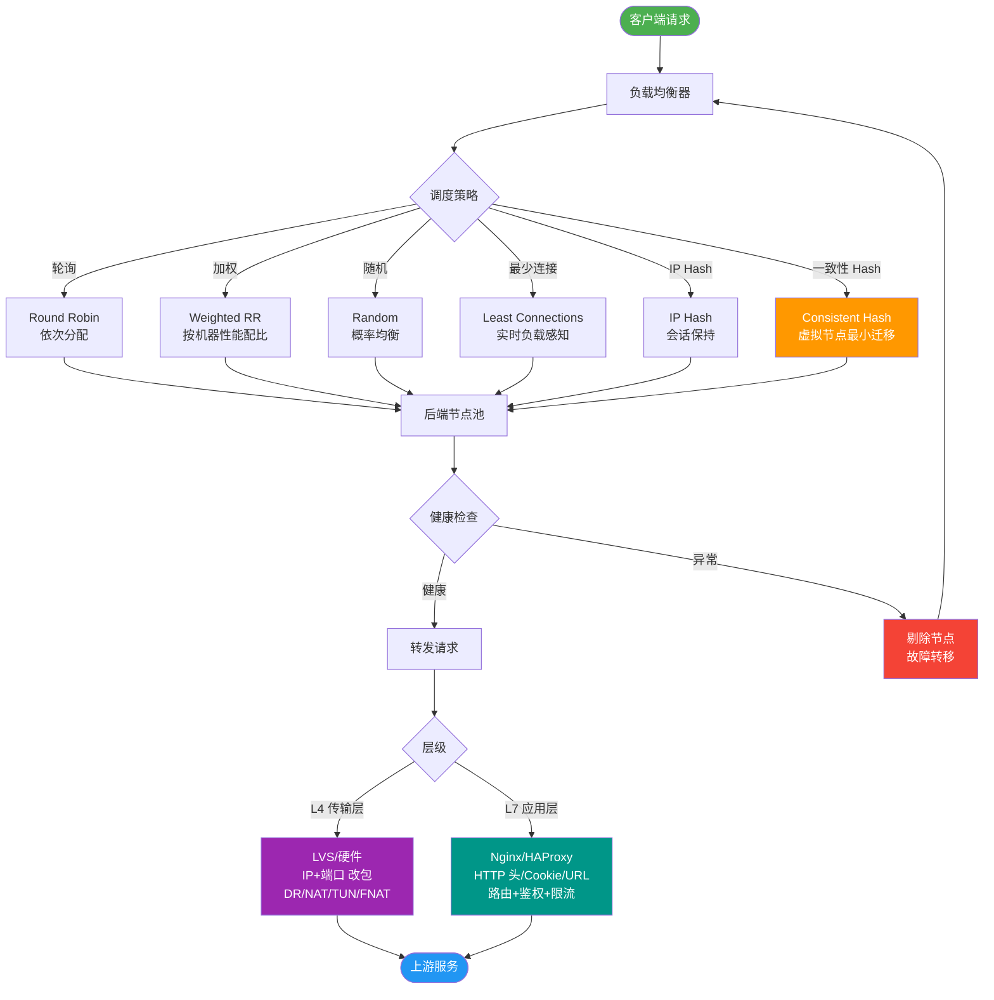
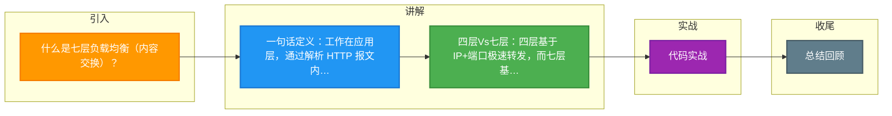

# 什么是七层负载均衡（内容交换）？

### 七层负载均衡（内容交换）

七层负载均衡工作在 OSI 模型的应用层（Layer 7），主要通过解析报文中真正有意义的应用层内容（如 HTTP URL、Header、Cookie 信息），结合预设的负载均衡算法，决定最终选择的后端服务器。

### 实战案例
在做多端适配（H5 vs App）时，利用七层负载均衡根据 User-Agent 头将流量分发到不同代码版本的服务器，无需部署两套独立域名，从而简化发布流程。

### 关键代码示例 (Nginx)
```nginx
upstream api_servers {
    server 192.168.1.10:8080;
    server 192.168.1.11:8080;
}

server {
    listen 80;
    # 根据 URL 路径路由
    location /api/ {
        proxy_pass http://api_servers;
    }
    # 根据 Cookie 灰度发布
    location / {
        if ($cookie_version = "v2") {
            proxy_pass http://new_version_servers;
        }
        proxy_pass http://stable_servers;
    }
}
```

### 与四层负载均衡的区别
| 特性 | 四层负载均衡 | 七层负载均衡 |
| :--- | :--- | :--- |
| **工作层次** | 传输层 (TCP/UDP) | 应用层 (HTTP/HTTPS) |
| **依据** | IP + 端口 | URL、Cookie、Header 内容 |
| **处理方式** | 修改目标 IP 转发 | 代理请求，可能重写内容 |
| **性能** | 极高（仅调度包） | 较高（需解析报文，消耗 CPU） |
| **典型软件** | LVS, HAProxy (四层模式) | Nginx, HAProxy (七层模式), Apache |

### 工作原理
1. 客户端发送 HTTP 请求到达负载均衡器。
2. 负载均衡器终止 TCP 连接（或建立新的 TCP 连接），解析 HTTP 报文。
3. 根据报文内容（例如 `/static` 图片请求转发给静态服务器，`/api` 请求转发给应用服务器）选择后端服务器。
4. 负载均衡器作为代理，向后端服务器发起请求，并将响应返回给客户端。

### 常见软件
- **Nginx**：高性能，支持正则表达式路由，常用作七层反向代理。
- **HAProxy**：功能强大，支持七层路由和 ACL 规则。
- **Apache**：模块丰富，历史悠久的七层代理。


## 核心流程图



## 记忆要点

- 一句话定义：工作在应用层，通过解析 HTTP 报文内容（如 URL/Header）进行流量分发
- 四层Vs七层：四层基于 IP+端口极速转发，而七层基于内容代理转发消耗 CPU 算力
- 业务价值：因为能深度识别内容，所以支持按路径路由和灰度发布等精细化业务控制
- 代表软件：四层典型是 LVS，而七层典型是 Nginx 或 HAProxy

## 结构化回答


**30 秒电梯演讲：** 像快递分拣员，根据包裹上的具体地址（URL）把货送到对应的货架（服务器）。

**展开框架：**
1. **OSI** — 工作在OSI七层（应用层）
2. **HTTP** — 能根据HTTP内容（URL、Header）路由
3. **通常作为反向代理使** — 通常作为反向代理使用

**收尾：** 这是我实战中的理解，您想深入哪一段？


## 视频脚本

> 预计时长：2 分钟 | 由浅入深

| 时间 | 画面/字幕 | 口播台词 | 讲解要点 |
|------|----------|----------|----------|
| 0:00 | 标题卡：七层负载均衡（内容交换） | "七层负载均衡（内容交换），一分钟讲透。" | 开场钩子 |
| 0:35 | 生活类比动画 | "打个比方——像快递分拣员，根据包裹上的具体地址(URL)把货送到对应的货架(服务器)。" | 核心类比 |
| 1:10 | 概念定义动画 | "一句话：基于应用层内容(如URL)智能分发流量到不同后端。" | 核心定义 |
| 1:50 | 工作在OSI七层(应 图解 | "工作在OSI七层(应用层)。" | 工作在OSI七层(应 |

### 视频流程图



