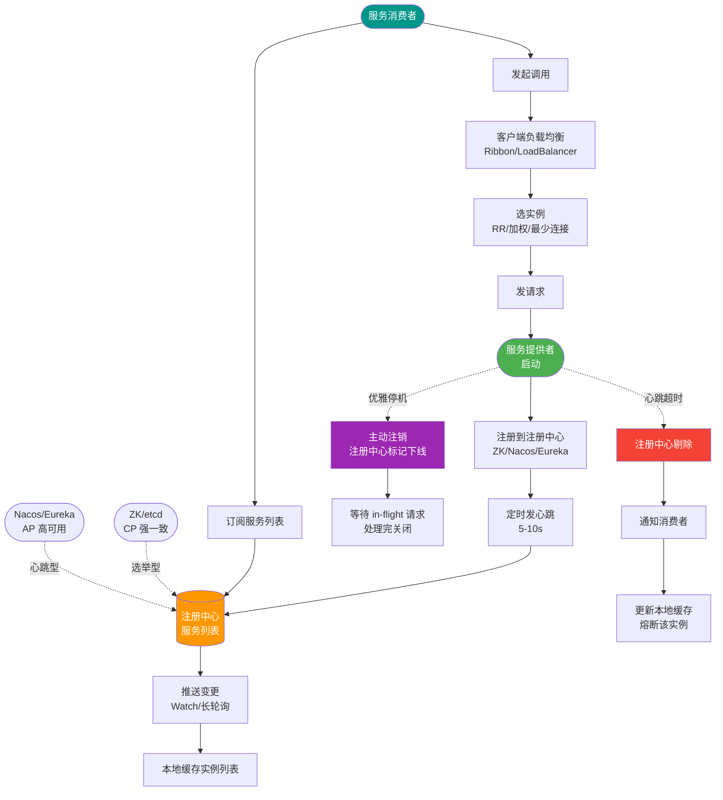
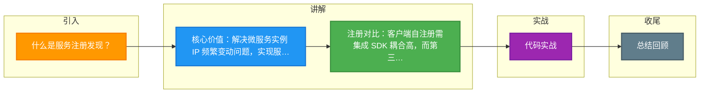

# 什么是服务注册发现？

服务注册与发现是微服务架构中实现服务解耦的核心机制，解决了服务实例动态变化导致的服务调用地址维护困难问题。

### 实战案例
在 Kubernetes 集群中，服务 Pod 频繁重启导致 IP 变动，若硬编码 IP 会导致调用失败。利用 Service 的自动发现机制，Service Controller 会实时更新 Endpoints，确保流量永远指向存活的 Pod，实现了无感知扩缩容。

### 关键代码示例 (Spring Cloud Eureka Client)
```java
@SpringBootApplication
@EnableEurekaClient // 开启客户端自动注册与发现
public class UserServiceApplication {
    public static void main(String[] args) {
        SpringApplication.run(UserServiceApplication.class, args);
    }
}

// 消费端调用，使用服务名而非 IP
@RestController
public class ConsumerController {
    @LoadBalanced // 负载均衡注解，结合 Ribbon 实现客户端发现
    @Autowired
    private RestTemplate restTemplate;
    
    public String callUser() {
        // "user-service" 是注册到 Eureka 的服务名
        return restTemplate.getForObject("http://user-service/user", String.class);
    }
}
```

### 服务注册
服务启动时，将自己的网络地址（IP、端口）、服务名、版本号等信息注册到一个登记簿（注册中心）。通常还会发送心跳维持“健康”状态。

### 服务发现
服务消费者（客户端）向登记簿查询，获取服务提供者的实时地址列表，并结合负载均衡策略选择一个实例进行调用。

### 注册方式对比
| 特性 | 客户端注册 | 第三方注册 |
| :--- | :--- | :--- |
| **原理** | 服务实例自己负责注册/心跳 | 独立控制器监控实例并代为注册 |
| **耦合度** | 高（需集成 SDK） | 低（服务无感知） |
| **语言支持** | 较差（每语言需一套 SDK） | 好（通用，如 Sidecar） |
| **代表** | Spring Cloud Eureka | Kubernetes Service, AWS ELB |

### 发现方式对比
| 特性 | 客户端发现 | 服务端发现 |
| :--- | :--- | :--- |
| **网络开销** | 低（直连） | 高（多一跳 LB） |
| **客户端复杂度** | 高（需内置 LB 算法） | 低（只需知道 LB 地址） |
| **代表** | Spring Cloud, Dubbo | Nginx + Consul, K8s Service |

### 注册方式
1. **客户端注册**
   - **原理**：服务实例自己负责向注册中心注册和注销，并维持心跳。
   - **优点**：架构简单，直连调用，无额外代理损耗。
   - **缺点**：与服务耦合，多语言实现麻烦（不同语言需重写SDK）。
   - **例子**：Spring Cloud Eureka（客户端模式），Nacos（支持该模式）。

2. **第三方注册**
   - **原理**：由一个独立的服务（通常 Sidecar 或控制器）负责监控服务实例状态，并代为注册/注销。
   - **优点**：服务本身无需感知注册逻辑，解耦彻底，适合异构语言。
   - **缺点**：依赖第三方组件的高可用，增加了架构复杂度。
   - **例子**：Kubernetes Service（通过 API Server 和 Endpoint Controller 实现），Netflix Prana。

### 发现方式
1. **客户端发现**
   - **流程**：客户端查询注册中心，获取地址列表，在本地做负载均衡后发起请求。
   - **优点**：直连服务，性能好，逻辑灵活，无单点故障（注册中心挂了，本地有缓存仍可用）。
   - **缺点**：客户端需集成发现逻辑，多语言维护成本高。
   - **例子**：Spring Cloud (Eureka Client + Ribbon)。

2. **服务端发现**
   - **流程**：客户端请求负载均衡器（LB），LB 查询注册中心并转发请求。
   - **优点**：客户端逻辑简单（只需知道 LB 地址），甚至可以使用 DNS 轮询。
   - **缺点**：多一跳网络开销，且必须保证 LB 高可用。
   - **例子**：Nginx + Consul Template，Kubernetes Service + kube-proxy。

### 架构对比图
```text
客户端发现模式：
┌──────┐       ┌───────────┐       ┌──────────┐
│Client│──────>│Registry   │<──────│Provider 1│
└──────┘(查询)  │(Eureka)   │ (心跳) └──────────┘
      │         └───────────┘       ┌──────────┐
      │(本地路由)                  │Provider 2│
      └───────────────────────────>└──────────┘

服务端发现模式：
┌──────┐       ┌───────────┐       ┌──────────┐
│Client│──────>│  LB / GW  │──────>│Provider 1│
└──────┘       │(Nginx/K8s)│       └──────────┘
               │    │      │       ┌──────────┐
               └────┼──────┴──────>│Provider 2│
                    │ (查询路由)   └──────────┘
                    v
              ┌───────────┐
              │Registry   │
              └───────────┘
```

## 常见考点
1. **注册中心选型对比**：Eureka（AP，保证可用性，保护模式） vs Consul/Zookeeper (CP，保证一致性) vs Nacos (同时支持 AP/CP 切换)。
2. **健康检查机制**：服务挂了如何感知？（主动心跳 vs 被动 TCP 探测）。如果网络抖动导致心跳超时，如何避免误剔除？（容错阈值、指数退避）。
3. **雪崩效应与缓存**：如果注册中心宕机，客户端还能调用吗？（答：可以，客户端通常会缓存服务列表，但无法感知新服务下线）。


## 核心流程图



## 记忆要点

- 核心价值：解决微服务实例 IP 频繁变动问题，实现服务调用的动态解耦
- 注册对比：客户端自注册需集成 SDK 耦合高，而第三方注册（如 K8s）对业务零侵入
- 发现对比：客户端发现直连性能高但逻辑重，而服务端发现（如经过 Nginx）多一跳但极简
- 代表组件：Spring Cloud Eureka 属客户端模式，而 K8s Service 属服务端模式

## 结构化回答


**30 秒电梯演讲：** 像查黄页，商家开店先登记（注册），顾客想吃饭查黄页找到电话打过去（发现）。

**展开框架：**
1. **IP** — 解决服务动态IP寻址问题
2. **分为客户端发** — 分为客户端发现和服务端发现
3. **ZooKeeper** — 注册中心如ZooKeeper、Consul、Eureka

**收尾：** 这是我实战中的理解，您想深入哪一段？


## 视频脚本

> 预计时长：2 分钟 | 由浅入深

| 时间 | 画面/字幕 | 口播台词 | 讲解要点 |
|------|----------|----------|----------|
| 0:00 | 标题卡：服务注册发现 | "服务注册发现，一分钟讲透。" | 开场钩子 |
| 0:35 | 生活类比动画 | "打个比方——像查黄页，商家开店先登记(注册)，顾客想吃饭查黄页找到电话打过去(发现)。" | 核心类比 |
| 1:10 | 概念定义动画 | "一句话：服务在动态注册表中登记，消费者按需查找并调用。" | 核心定义 |
| 1:50 | 服务动态IP寻址问题 图解 | "解决服务动态IP寻址问题。" | 服务动态IP寻址问题 |

### 视频流程图



