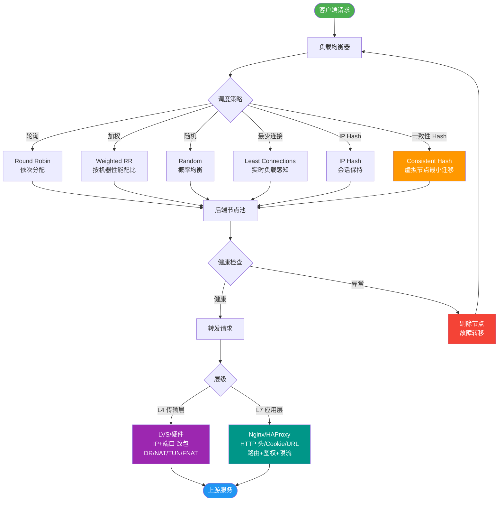

# 微服务中API网关的作用是什么？

API 网关是微服务架构的入口，类似面向对象设计模式中的 Facade（外观）模式。它作为系统的统一流量入口，处理所有非业务逻辑的横向关注点。

### 实战案例
某电商活动期间，恶意刷单接口导致后端服务濒临崩溃。通过在网关层配置针对 `/order/create` 接口的 IP 限流（单 IP 5次/秒）和参数校验，直接在入口挡住了 90% 的恶意流量，保障了核心服务的稳定性。

### 关键代码示例 (Spring Cloud Gateway)
```java
@Configuration
public class GatewayConfig {
    @Bean
    public RouteLocator customRouteLocator(RouteLocatorBuilder builder) {
        return builder.routes()
            .route("path_route", r -> r.path("/api/public/**")
                // 路由到公共服务，并去除路径前缀
                .filters(f -> f.stripPrefix(1))
                .uri("lb://public-service"))
            .build();
    }
}
```

### 核心作用
1. **统一入口**：所有客户端请求都经过网关，隐藏内部微服务的拆分细节、重定向和 IP 地址。
2. **请求路由**：根据 URL、Header、Query Param 等规则将请求精准转发到具体的后端微服务实例。
3. **聚合响应**：客户端的一个页面可能需要调用多个微服务（如用户信息+订单信息+商品信息），网关可以在内部分别调用后，将多个结果聚合后返回，减少客户端的 HTTP 开销和网络延迟。

### 常见功能
- **协议转换**：例如将外部 HTTP(S) 请求转换为内部 gRPC、Dubbo、WebSocket 甚至 Thrift 协议。
- **数据转换**：如旧版 XML 格式与新版 JSON 格式互转，或者抹除敏感字段。
- **安全认证与鉴权**：统一进行身份验证（如 OAuth2.0, JWT, API Key），校验通过后将用户信息透传给后端，避免内部服务重复实现认证逻辑。
- **限流熔断**：集成 Sentinel 或 Hystrix，针对特定 API 进行限流（防止刷接口）或熔断（防止后端故障拖垮网关）。
- **灰度发布**：根据 Header 或用户 ID 将一小部分流量路由到新版本服务。
- **监控与日志**：统一的请求日志记录、Access Log 采集、调用链追踪（Trace ID 透传），便于审计和排错。

### 典型组件对比
| 组件 | 基础架构 | 性能 | 特点 |
| :--- | :--- | :--- | :--- |
| **Spring Cloud Gateway** | WebFlux (Netty) | 高 | 响应式编程，适合 Java 生态，易扩展 |
| **Kong / APISIX** | Nginx/OpenResty + Lua | 极高 | 动态配置强，插件丰富，适合高并发管控 |
| **Zuul 1.x** | Servlet (阻塞 IO) | 低 | 已淘汰，不推荐 |

### 网关架构图
```text
客户端 (Web/Mobile)
       │
       v
┌───────────────────────────────────┐
│         API 网关层                 │
│  (鉴权/限流/路由/协议转换/聚合)    │
└───────────┬───────────────────────┘
            │
     ┌──────┴──────┬──────────┬──────────┐
     v             v          v          v
┌────────┐   ┌────────┐  ┌────────┐  ┌────────┐
│用户服务│   │订单服务│  │库存服务│  │支付服务│
└────────┘   └────────┘  └────────┘  └────────┘
```

## 常见考点
1. **网关的性能瓶颈**：网关作为单点入口，如何保证高性能？（答：采用异步非阻塞模型如 Netty/WebFlux，集群部署，水平扩展）。
2. **聚合服务的优缺点**：在网关聚合虽然减少了客户端请求，但会增加网关的复杂度和响应延迟（需等待最慢的服务返回）。通常建议在后端服务层聚合（BFF层），而非网关层做复杂业务聚合。
3. **如何保证高可用**：网关挂了整个系统瘫痪，如何解决？（答：网关本身无状态，前面挂 LVS/Nginx 做四层负载均衡，实现热备）。


## 核心流程图



## 记忆要点

- 核心定义：微服务统一流量入口，类似 Facade 模式，处理所有非业务横向关注点。
- 主要职责：统一路由分发、响应聚合，以减少客户端 HTTP 请求开销。
- 非业务功能：鉴权、限流熔断、协议转换与灰度发布等统一前置处理。
- 高可用保障：网关自身须无状态，前置 LVS/Nginx 做负载并集群部署。
- 性能避坑：复杂业务聚合会拖慢响应，建议下沉至后端 BFF 层处理。

## 结构化回答


**30 秒电梯演讲：** 像公司前台，外来人员（请求）先来前台登记，前台指引去哪个部门（服务），不合规的直接拦下。

**展开框架：**
1. **作为系统的唯** — 作为系统的唯一统一入口
2. **负责请求转发** — 负责请求转发、聚合和协议转换
3. **集中处理认证** — 集中处理认证、限流、监控

**收尾：** 这是我实战中的理解，您想深入哪一段？


## 视频脚本

> 预计时长：2 分钟 | 由浅入深

| 时间 | 画面/字幕 | 口播台词 | 讲解要点 |
|------|----------|----------|----------|
| 0:00 | 标题卡：微服务中API网关的作用 | "微服务中API网关的作用，一分钟讲透。" | 开场钩子 |
| 0:35 | 生活类比动画 | "打个比方——像公司前台，外来人员(请求)先来前台登记，前台指引去哪个部门(服务)，不合规的直接拦下。" | 核心类比 |
| 1:10 | 概念定义动画 | "一句话：系统的统一门卫，负责路由、安检和杂务处理。" | 核心定义 |
| 1:50 | 作为系统 图解 | "作为系统的唯一统一入口。" | 作为系统 |
