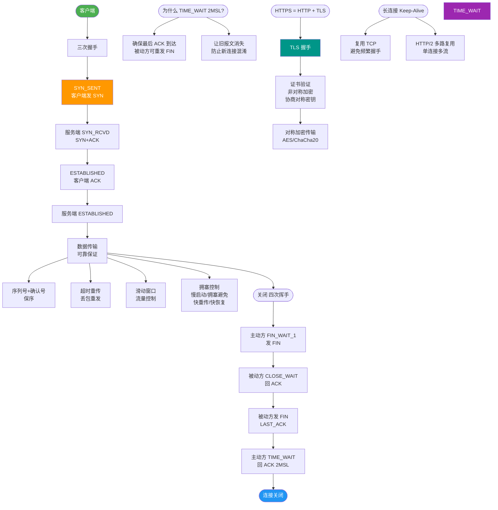

# DNS的工作原理和查询过程是怎样的？

# DNS工作原理与查询过程

## DNS是什么
DNS（Domain Name System）是一种用于将域名（例如 `www.baidu.com`）转换为IP地址（例如 `220.181.111.188`）的分布式数据库系统。在互联网上，计算机使用IP地址相互识别和通信，但IP地址由一串数字组成，难以记忆。DNS允许用户使用易于记忆的域名代替复杂的IP地址。

### 为什么采用分布式设计？
如果DNS采用集中式设计，会面临以下严重问题：

1.  **单点故障**：如果中心服务器崩溃，整个互联网的域名解析将随之瘫痪。
2.  **通信容量**：中心服务器必须处理全球所有的DNS查询（可能是亿级），单一节点无法承受如此巨大的流量。
3.  **远距离延迟**：中心服务器不可能邻近所有用户。例如，位于美国的服务器很难快速响应澳大利亚的查询，请求势必经过低速和拥堵的链路，造成严重时延。
4.  **维护成本**：维护庞大的集中式数据库极其困难，且需要频繁更新。

## 域名的层级结构
DNS中的域名使用句点分隔（如 `www.server.com`），句点代表了不同层级之间的界限。域名层级从右向左依次降低：

*   **根域**： unnamed（通常表示为空 `.` ）
*   **顶级域**：如 `.com`, `.cn`, `.org`, `.net`
*   **二级域**：如 `baidu.com`, `google.com`
*   **子域**：如 `www.baidu.com`, `map.baidu.com`

### 实战案例
配置 CDN 加速时，常见的坑是 DNS 缓存时间（TTL）设置过长。当源站 IP 变更或需要切换故障节点时，由于运营商 Local DNS 缓存了旧 IP（如 TTL 设置为 1小时），导致部分用户在 1 小时内依然访问到故障节点。最佳实践是将关键记录的 TTL 逐步调低（如先调至 60s），待切换完成后再调高以减少查询压力。

## DNS解析全过程
当用户在浏览器中输入一个网址时，典型的DNS解析流程如下：

1.  **浏览器缓存检查**：浏览器首先检查自己的缓存中是否有该域名对应的IP地址。如果有且未过期，解析结束。
2.  **系统缓存检查**：如果浏览器缓存未命中，会检查操作系统（如Hosts文件）的本地缓存。
3.  **本地DNS服务器查询**：如果本地缓存也没有，计算机向本地DNS服务器（通常由ISP提供，如电信、移动的DNS）发起查询请求。
    *   如果本地DNS服务器缓存中有该记录，则直接返回IP地址。
    *   如果没有，它将代表客户端进行递归查询。
4.  **根域名服务器查询**：本地DNS服务器向根域名服务器发起查询。根服务器不直接解析具体域名，但它能告诉本地DNS服务器去查询哪个顶级域服务器（例如 `.com` 服务器）。
5.  **顶级域名服务器查询**：本地DNS服务器向指定的TLD服务器发起查询。TLD服务器也不解析具体域名，但它能告知本地DNS服务器负责该域名的权威DNS服务器地址。
6.  **权威DNS服务器查询**：本地DNS服务器向权威DNS服务器发起查询。权威服务器存储了特定域名的具体映射记录。它将查询到的IP地址返回给本地DNS服务器。
7.  **返回结果并缓存**：本地DNS服务器将IP地址返回给客户端（浏览器），同时将该结果缓存在本地，以便下次快速响应。
8.  **发起连接**：浏览器获得IP地址后，向目标服务器建立TCP连接，开始加载网页内容。

## DNS查询方式对比
| 方式 | 定义 | 谁承担解析压力 | 典型场景 |
| :--- | :--- | :--- | :--- |
| **递归查询** | 服务器必须返回最终结果，若不知道则替客户端去查 | 被查询的服务器（如 Local DNS） | 客户端 -> 本地 DNS |
| **迭代查询** | 服务器返回“下一步该去哪查”的指引，不代劳 | 客户端（或发起请求的 DNS） | 本地 DNS -> 根/顶级域 |

## DNS查询流程架构图
```text
                                                      ┌─────────────┐
                           1.查询 www.example.com    │   客户端    │
                           ───────────────────────▶  │ (浏览器/OS)  │
                                                      └──────┬──────┘
                                                             │
                                                             │ 2.递归查询 (如果本地无缓存)
                                                             ▼
                                                      ┌─────────────┐
                           3.迭代查询开始              │ 本地DNS服务器 │
                           ◀──


## 核心流程图



## 记忆要点

- 核心定义：将难记的域名转换成机器通信 IP 地址的分布式数据库。
- 层级结构：自右向左依次降低，依次为根域、顶级域、二级域及子域。
- 查询方式：客户端与本地 DNS 间递归（代劳），本地与各级 DNS 间迭代（指路）。
- 解析顺序：优先查浏览器与系统缓存，未命中后请求本地 DNS 服务器。
- TTL 避坑：因为缓存的 TTL 机制，CDN 故障切换需提前调低 TTL 防止旧缓存。

## 结构化回答

**30 秒电梯演讲：** 将人类易记的域名翻译为机器可用的IP地址的分布式层级目录服务。打比方——像查电话簿，不知道号码时，先查总机(根)，再查分机号(TLD)，最后找到具体的人(权威)。落到工程上，采用分布式层级结构避免单点故障和传输延迟。

**展开框架：**
1. **分布式层级结构避免单** — 采用分布式层级结构避免单点故障和传输延迟。
2. **解析流程依次为** — 浏览器缓存 -> 本地Hosts -> 本地DNS -> 根/TLD/权威DNS
3. **本地DNS对客户端** — 本地DNS对客户端使用递归查询(给最终结果)，对上级服务器使用迭代查询(要线索)。

**收尾：** 以上三点都能配合实战聊。我可以展开任一要点，您想先深入哪一块？

## 视频脚本

> 预计时长：3 分钟 | 由浅入深

| 时间 | 画面/字幕 | 口播台词 | 讲解要点 |
|------|----------|----------|----------|
| 0:00 | 标题卡：DNS的工作原理和查询过程是怎样的 | "DNS的工作原理和查询过程是怎样的，这题我会分三步讲。" | 开场钩子 |
| 0:41 | 概念定义动画 | "一句话：将人类易记的域名翻译为机器可用的IP地址的分布式层级目录服务。" | 核心定义 |
| 1:22 | 生活类比动画 | "打个比方——像查电话簿，不知道号码时，先查总机(根)，再查分机号(TLD)，最后找到具体的人(权威)。" | 核心类比 |
| 2:03 | 分布式层级结构避免单 图解 | "采用分布式层级结构避免单点故障和传输延迟。" | 分布式层级结构避免单 |
| 2:50 | 解析流程依次为 图解 | "浏览器缓存 -> 本地Hosts -> 本地DNS -> 根/TLD/权威DNS。" | 解析流程依次为 |
