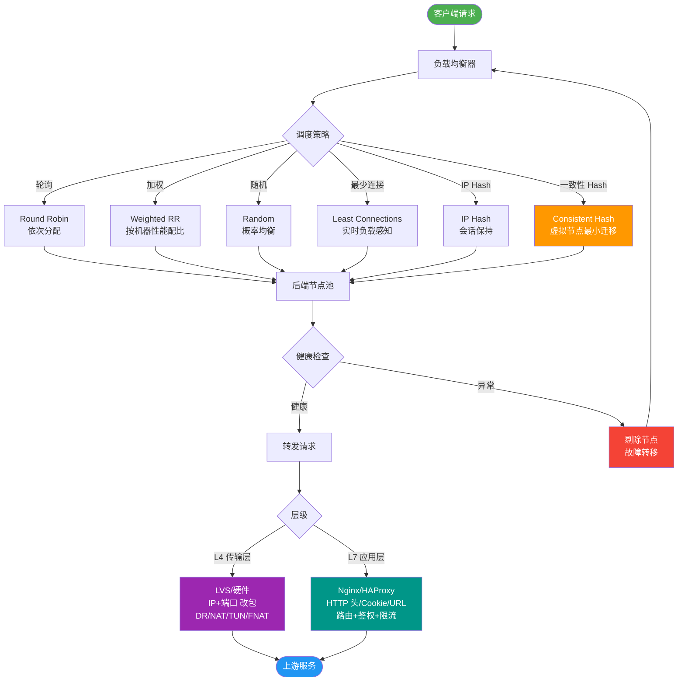
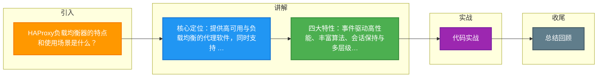

# HAProxy负载均衡器的特点和使用场景是什么？

HAProxy 是一款提供高可用性、负载均衡以及基于 TCP（四层）和 HTTP（七层）应用的代理软件。

### 主要特点
1. **高性能**：基于单进程事件驱动模型（类似 Nginx），能够处理数以万计的并发连接，内存消耗低。
2. **丰富的负载均衡算法**：支持 Round Robin（轮询）、Least Connections（最少连接）、Source（源地址哈希）等多种算法。
3. **会话保持**：支持基于插入 Cookie、前缀 Cookie 等方式的会话保持。
4. **健康检查**：自动检测后端服务器状态，摘除故障节点。
5. **监控统计**：提供详细的运行时统计页面，便于运维监控。

### 常见使用场景
1. **Web 负载均衡**：作为 Web 服务器的反向代理，支持虚拟主机和 ACL 规则。
2. **数据库负载均衡**：常用于 MySQL 或 PostgreSQL 读操作的负载均衡，利用四层模式提高转发效率。
3. **高可用集群**：配合 Keepalived 实现 HAProxy 自身的高可用（双机热备）。

### HAProxy 架构流程简图
```text
      客户端请求
          │
          ▼
┌───────────────────────┐
│      HAProxy          │
│  (ACL 规则 / 调度算法) │───────▶ 拒绝/重定向/直接响应
└───────────┬───────────┘
            │
            ├─────────────┬──────────────┐
            ▼             ▼              ▼
      ┌─────────┐   ┌─────────┐    ┌─────────┐
      │ Backend │   │ Backend │    │ Backend │
      │   RS1   │   │   RS2   │    │   RS3   │
      └─────────┘   └─────────┘    └─────────┘
```

### 实战案例
在生产环境中，曾遇到过因后端某台服务器响应变慢导致队列堆积，HAProxy 通过 `timeout queue` 设置优雅地拒绝了新连接而非导致雪崩，同时利用 `slowstart` 参数配合健康检查，实现了故障节点恢复后的流量预热（冷启动），避免恢复瞬间被打挂。

### 代码示例 (haproxy.cfg 关键配置)
```haproxy
frontend www_front
    bind *:80
    # 拒塞控制：队列超过1000或等待时间超1秒则拒绝
    timeout queue 1s
    maxqueue 1000
    default_backend www_back

backend www_back
    # 使用最少连接算法，并开启慢启动（30秒内权重线性增加）
    balance leastconn
    server s1 10.0.0.1:80 check weight 10 slowstart 30s
    server s2 10.0.0.2:80 check weight 10 slowstart 30s
```

### LVS/HAProxy/Nginx 对比
| 特性 | LVS | HAProxy | Nginx |
| :--- | :--- | :--- | :--- |
| 工作层级 | 4层（传输层） | 4层 / 7层 | 4层（Stream） / 7层（HTTP） |
| 性能 | 极高（内核态） | 高（用户态） | 高（事件驱动） |
| 功能侧重 | 纯转发，无应用层逻辑 | 高级ACL、会话保持、监控 | Web服务、反向代理、静态缓存 |
| 健康检查 | 基础（端口/简单协议） | 极其丰富（脚本、Layer 7） | 基础（被动/主动检查） |

### 常见考点
1. **四种常见算法区别**：特别是 `roundrobin`（动态权重，支持运行时调整）与 `static-rr`（静态权重）的区别，以及 `source` 算法解决会话保持的原理。
2. **进程模型**：为什么 HAProxy 通常是单进程多线程模式，以及如何利用多核 CPU（通过 nbproc 和 bind-process）。
3. **健康检查机制**： Layer 4（仅检查端口连通性）与 Layer 7（发送 HTTP 请求检查状态码）检查的区别与配置。
4. **性能调优**：`maxconn`、`nbproc` 以及系统层面的 `ulimit` 设置对并发能力的影响。


## 核心流程图



## 记忆要点

- 核心定位：提供高可用与负载均衡的代理软件，同时支持 TCP(4层)和 HTTP(7层)。
- 四大特性：事件驱动高性能、丰富算法、会话保持与多层级健康检查。
- 高可用方案：自身配合 Keepalived 可实现双机热备防止单点故障。
- 场景对比：LVS 属内核态纯转发，HAProxy 侧重用户态高级 ACL 与会话保持。
- 高可用避坑：利用 slowstart（慢启动）防止节点恢复瞬间被大流量打挂。

## 结构化回答


**30 秒电梯演讲：** 智能交通指挥员，既懂按车牌（IP）分流，也懂按目的地（URL）指路，还能发现坏车（故障节点）。

**展开框架：**
1. **TCP** — 支持四层（TCP）和七层（HTTP）代理
2. **单进程事件驱动** — 单进程事件驱动，性能极高
3. **支持多种负载** — 支持多种负载均衡算法和健康检查

**收尾：** 这是我实战中的理解，您想深入哪一段？


## 视频脚本

> 预计时长：3 分钟 | 由浅入深

| 时间 | 画面/字幕 | 口播台词 | 讲解要点 |
|------|----------|----------|----------|
| 0:00 | 标题卡：HAProxy负载均衡器的特点和使用场景 | "HAProxy负载均衡器的特点和使用场景，这题我会分三步讲。" | 开场钩子 |
| 0:41 | 概念定义动画 | "一句话：高性能的四层/七层负载均衡器，擅长流量分发和健康检查。" | 核心定义 |
| 1:22 | 生活类比动画 | "打个比方——智能交通指挥员，既懂按车牌(IP)分流，也懂按目的地(URL)指路，还能发现坏车(故障节点)。" | 核心类比 |
| 2:03 | 四层(TCP)和七层 图解 | "支持四层(TCP)和七层(HTTP)代理。" | 四层(TCP)和七层 |
| 2:50 | 单进程事件驱动 图解 | "单进程事件驱动，性能极高。" | 单进程事件驱动 |

### 视频流程图



