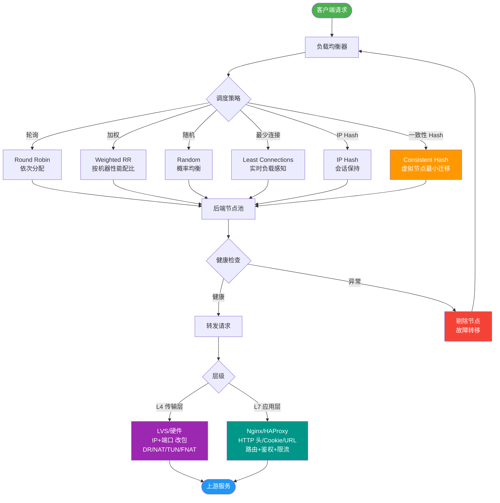

# LVS TUN模式的工作原理是什么？

LVS TUN 模式（IP 封装、跨网段）

### 工作原理详解
TUN（IP Tunneling）模式通过在原 IP 报文外再封装一层 IP 首部，实现跨网段转发。Real Server（RS）必须支持 IP 隧道协议（如 IPIP）。

1.  **请求发送**：客户端将请求发往前端的负载均衡器，请求报文源地址是 CIP（客户端IP），目标地址为 VIP（虚拟IP）。
2.  **封装转发**：负载均衡器（Director）收到报文后，根据调度算法选择一台 RS。它在客户端请求报文的首部再封装一层 IP 报文（IP-in-IP），外层源地址改为 DIP（负载均衡器IP），目标地址改为 RIP（真实服务器IP），并将此包发送给 RS。
3.  **解封装处理**：RS 收到请求报文后，发现外层目标 IP 是自己的 RIP，于是拆开第一层封装。发现里面还有一层 IP 首部，且目标地址是自己 lo 接口上的 VIP，于是处理该请求报文。
4.  **直接响应**：RS 处理完成后，将响应报文通过 lo 接口（绑定 VIP）经由物理网卡（eth0）直接发送给客户端。响应报文源 IP 为 VIP，目标 IP 为 CIP，不经过负载均衡器。

### TUN 模式流量流向图
```text
客户端 (CIP)                           负载均衡器 (DIP)                        真实服务器 (RIP)
   │                                      │                                       │
   │  1. 请求 [CIP -> VIP]                │                                       │
   ├─────────────────────────────────────▶│                                       │
   │                                      │  2. 封装 [DIP -> RIP]                 │
   │                                      │   Data: [CIP -> VIP]                  │
   │                                      ├──────────────────────────────────────▶│
   │                                      │                                       │ 3. 解封装
   │                                      │                                       │   处理 [CIP -> VIP]
   │                                      │                                       │
   │  4. 响应 [VIP -> CIP]                │                                       │
   │◀─────────────────────────────────────────────────────────────────────────────┤
   │                                      │                                       │
```

### 实战案例
在跨地域数据中心灾备场景中，我们曾利用 LVS TUN 模式将流量通过 IP 隧道转发到同城另一个机房的备份服务器。**踩坑经验**：如果 RS 上的 MTU 值设置得比链路实际支持的 MTU 大（因为 IP 封装增加了报头长度），会导致大包分片失败或被丢弃，表现为访问部分页面超时，需在 RS 上调整 MTU 或设置 Path MTU Discovery。

### 代码示例 (RS 端 IP 隧道配置)
```bash
# 1. 加载 ipip 模块
modprobe ipip

# 2. 创建隧道设备 tunl0
ip tunnel add tunl0 mode ipip remote $DIP local $RIP

# 3. 启用设备并配置 VIP
ip link set tunl0 up
ip addr add $VIP/32 dev tunl0

# 4. 关键：关闭反向路径过滤（防止丢弃回包）
echo 0 > /proc/sys/net/ipv4/conf/tunl0/rp_filter
echo 0 > /proc/sys/net/ipv4/conf/all/rp_filter
```

### LVS 三种模式对比
| 特性 | NAT 模式 | TUN 模式 | DR 模式 |
| :--- | :--- | :--- | :--- |
| 网络拓扑 | 支持私有网络，可跨网段 | 支持跨网段、广域网 | 必须在同一物理网段 |
| RS 网关 | 指向 Director | 指向路由器（不经过 Director） | 指向路由器（不经过 Director） |
| RS 限制 | 无需特殊配置 | 需支持 IP 隧道 | 需抑制 ARP，VIP 绑定 lo |
| 性能瓶颈 | Director 入出流量均经过 | Director 仅入口流量 | Director 仅入口流量 |
| IP 封装 | 修改 IP 地址 | IP-in-IP 封装 | 修改 MAC 地址 |

### 关键配置细节
*   **VIP 配置**：必须在 RS 的回环接口 `lo` 上绑定 VIP（或隧道接口），且需要配置 `arp_ignore` 和 `arp_announce` 参数，抑制 RS 响应针对 VIP 的 ARP 请求，防止 IP 冲突。
*   **隧道限制**：RS 必须支持 IP 隧道协议；大部分公网网络可能会丢弃 IP-in-IP 协议包，因此 TUN 模式通常用于内网跨网段或专有网络环境。

### 常见考点
1. **NAT、DR、TUN 三种模式对比**：特别关注 TUN 模式与 DR 模式的区别（DR 改 MAC，TUN 加 IP 头；DR 要求同网段，TUN 可跨网段）。
2. **IP 隧道的开销**：额外的 IP 封装会增加 MTU 长度，导致报文分片，可能影响性能。
3. **RS 的配置细节**：如何处理 RS 上的路由表和 ARP 问题。


## 核心流程图



## 记忆要点

- 核心原理：通过 IP-in-IP 隧道技术再封装外层 IP 头，实现跨网段调度。
- 流量走向：请求经调度器封装转发，真实服务器（RS）处理后直接响应客户端。
- 配置要求：RS 必须支持 IP 隧道协议，且需在 lo 接口绑定 VIP。
- 模式对比：TUN 支持跨网段且响应不经调度器，而 DR 模式限制在同一物理网段。
- 实战避坑：因为多了一层 IP 头封装，所以必须在 RS 上注意调整 MTU 长度防丢包。

## 结构化回答


**30 秒电梯演讲：** 信封上套一个大信封寄给收件人，收件人拆开大信封处理原信，直接回信不用经过寄信人。

**展开框架：**
1. **IP** — 在原IP报文外再封装一层IP头
2. **支持跨网段/** — 支持跨网段/跨机房部署
3. **RealServer** — RealServer响应直接返回给客户端

**收尾：** 这是我实战中的理解，您想深入哪一段？


## 视频脚本

> 预计时长：3 分钟 | 由浅入深

| 时间 | 画面/字幕 | 口播台词 | 讲解要点 |
|------|----------|----------|----------|
| 0:00 | 标题卡：LVS TUN模式的工作原理 | "LVS TUN模式的工作原理，这题我会分三步讲。" | 开场钩子 |
| 0:41 | 概念定义动画 | "一句话：通过IP隧道封装，将请求跨网段转发给后端，直接响应。" | 核心定义 |
| 1:22 | 生活类比动画 | "打个比方——信封上套一个大信封寄给收件人，收件人拆开大信封处理原信，直接回信不用经过寄信人。" | 核心类比 |
| 2:03 | 在原IP报文外再封装 图解 | "在原IP报文外再封装一层IP头。" | 在原IP报文外再封装 |
| 2:50 | 跨网段/跨机房部署 图解 | "支持跨网段/跨机房部署。" | 跨网段/跨机房部署 |
