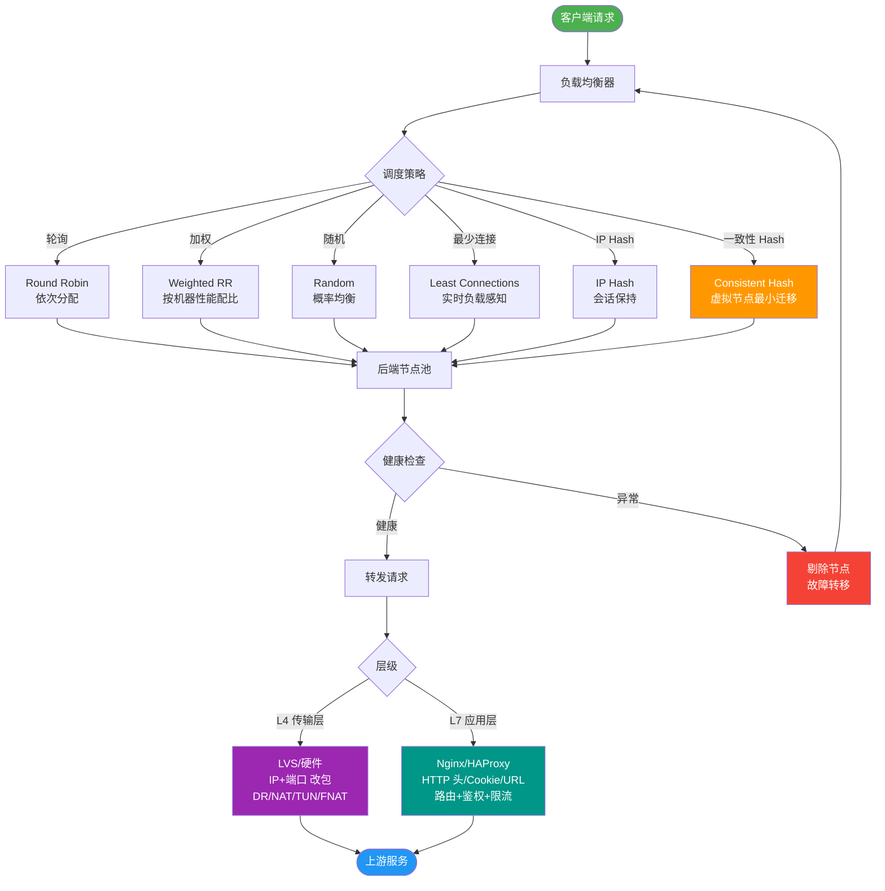

# LVS负载均衡的原理和工作模式有哪些？

LVS（Linux Virtual Server）是 Linux 内核实现的四层负载均衡技术，基于 IPVS 模块工作。

### 工作原理
1. 当用户请求到达 VIP（虚拟 IP）时，LVS 调度器（Director）接收请求。
2. 调度器根据预设的调度算法（如轮询、最少连接），从 Real Server（RS）列表中选出一台服务器。
3. 根据不同的工作模式，调度器将数据包转发给 RS，RS 处理后将响应返回给客户端。

### 三种主要工作模式

#### 1. NAT 模式
- **原理**：调度器将请求报文的目标 IP 修改为 RS 的 IP，端口也可修改。RS 响应时，源 IP 被修改回 VIP。
- **流量走向**：请求和响应都必须经过调度器。
- **特点**：RS 可以是私有 IP，无需公网 IP；但调度器成为瓶颈。

#### 2. DR 模式
- **原理**：调度器仅修改数据包的 MAC 地址，将请求转发给 RS。RS 处理后直接响应给客户端（源 IP 为 VIP）。
- **流量走向**：请求经过调度器，响应不经过调度器。
- **特点**：性能最高；要求调度器和 RS 在同一个物理网段；RS 需要在 lo 接口绑定 VIP 并抑制 ARP。

#### 3. TUN 模式
- **原理**：调度器在原请求报文外再封装一层 IP 头（IP-in-IP），通过隧道转发给 RS。RS 解封装后直接响应客户端。
- **流量走向**：请求经过隧道，响应直接返回客户端。
- **特点**：支持跨网段/跨机房；RS 必须支持 IP 隧道协议；开销略大。

### 补充：Full-NAT 模式
- **原理**：同时修改请求报文的源 IP（改为 DIP）和目标 IP（改为 RIP）。RS 响应给调度器，调度器再转换回 VIP/CIP 返回客户端。
- **特点**：解决了 LVS 和 RS 跨 VLAN 的问题，且 RS 不需要配置 VIP；但性能比 DR/TUN 差，调度器仍有压力。

### LVS 调度器架构图
```text
                   请求
                     │
                     ▼
         ┌───────────────────────┐
         │     Client (CIP)      │
         └───────────┬───────────┘
                     │
                     │ Dest: VIP
                     ▼
┌───────────────────────────────────────────────────────────────┐
│                      LVS 调度器 (VIP/DIP)                       │
│  ┌─────────────┐                                               │
│  │ IPVS Core   │  调度算法 (RR/LC/...)                         │
│  └──────┬──────┘                                               │
└─────────┼─────────────────────────────┬─────────────────────────┘
          │ (模式差异)                   │
    NAT   │        DR/TUN/FullNAT   FullNAT
   (改IP) │         (改MAC/封装)      (双向改IP)
          ▼                            ▼
┌─────────────────────┐     ┌──────────────────────┐
│     Real Server     │     │      Real Server     │
│   (RIP, Private)    │     │ (RIP, Private, Lo:VIP)│
└─────────────────────┘     └──────────────────────┘
          ▲                            ▲
          │ Response via Director
```

### 实战案例
在双十一大促场景中，曾遇到因 RS 突发故障（FullNAT 模式）导致 Keepalived 高可用切换后，LVS 调度器上存在大量脏连接未清理。后来开启了 `tcp_tw_reuse` 和 `ipvs` 的 `sync daemon`（同步连接状态到备机），并在 RS 端配合 `net.ipv4.tcp_tw_recycle` 调整，有效规避了切换时的丢包问题。

### 四种模式对比
| 特性 | NAT 模式 | DR 模式 | TUN 模式 | Full-NAT 模式 |
| :--- | :--- | :--- | :--- | :--- |
| **工作层级** | 第4层 | 第2层 (MAC) | 第3层 (IP隧道) | 第4层 |
| **调度器压力** | 高 (流量双向经过) | 低 (仅入口流量) | 中 (封装开销) | 高 (流量双向经过) |
| **网络要求** | RS 可无公网 IP | 同一物理网段 (二层) | 支持跨网段/广域网 | 支持跨网段/跨 VLAN |
| **RS 配置** | 默认网关指向 DIP | Lo 绑定 VIP，抑制 ARP | 支持隧道协议 | 默认网关指向 DIP (无需 VIP) |
| **适用场景** | 小规模/测试 | 高性能/内网服务 | 跨机房/异地容灾 | IDC 内跨 VLAN 混部 |

### 关键配置代码
```bash
# RS 端配置 (DR 模式实战脚本)
# 1. 在 lo 接口绑定 VIP
/sbin/ifconfig lo:0 $VIP broadcast $VIP netmask 255.255.255.255 up
# 2. 抑制 ARP 响应 (关键！防止 RS 抢占 VIP)
echo "1" > /proc/sys/net/ipv4/conf/lo/arp_ignore
echo "2" > /proc/sys/net/ipv4/conf/lo/arp_announce
echo "1" > /proc/sys/net/ipv4/conf/all/arp_ignore
echo "2" > /proc/sys/net/ipv4/conf/all/arp_announce
```


## 核心流程图



## 记忆要点

- 核心定位：LVS 是基于 Linux 内核 IPVS 模块的四层负载均衡技术。
- DR 模式：仅改 MAC 地址，性能最高但限同一物理网段，响应直达客户端。
- NAT 模式：双向修改目标与源 IP，流量必过调度器致其易成性能瓶颈。
- TUN 模式：通过 IP 隧道封装转发，支持跨网段部署且响应直达客户端。
- Full-NAT：双向修改源与目的 IP，解决跨 VLAN 部署但调度器双向承压。

## 结构化回答


**30 秒电梯演讲：** 像电话总机，负责接听电话（VIP）并转接给具体的客服（RS），根据模式不同，转接方式可能不同。

**展开框架：**
1. **工作在OSI四层** — 基于IPVS内核模块
2. **NAT模式改IP** — 性能差；DR模式改MAC，性能最好
3. **TUN模式利用隧道** — TUN模式利用隧道，支持跨网段

**收尾：** 这是我实战中的理解，您想深入哪一段？


## 视频脚本

> 预计时长：3 分钟 | 由浅入深

| 时间 | 画面/字幕 | 口播台词 | 讲解要点 |
|------|----------|----------|----------|
| 0:00 | 标题卡：LVS负载均衡的原理和工作模式有哪些 | "LVS负载均衡的原理和工作模式有哪些，这题我会分三步讲。" | 开场钩子 |
| 0:41 | 概念定义动画 | "一句话：基于Linux内核的高性能四层负载均衡，支持NAT、DR、TUN三种模式。" | 核心定义 |
| 1:22 | 生活类比动画 | "打个比方——像电话总机，负责接听电话(VIP)并转接给具体的客服(RS)，根据模式不同，转接方式可能不同。" | 核心类比 |
| 2:03 | 工作在OSI四层 图解 | "工作在OSI四层，基于IPVS内核模块。" | 工作在OSI四层 |
| 2:50 | NAT模式改IP 图解 | "NAT模式改IP，性能差；DR模式改MAC，性能最好。" | NAT模式改IP |

### 视频流程图


