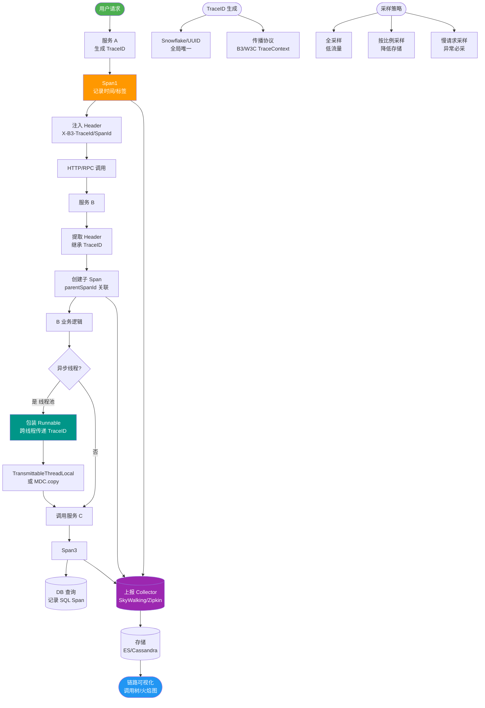

# Spring Cloud Sleuth如何实现分布式链路追踪？

Spring Cloud Sleuth 是 Spring Cloud 生态中的分布式链路追踪组件，主要用于追踪微服务调用链路。

### 核心概念与数据模型
Sleuth 借鉴了 Dapper（Google）的论文模型，其核心概念如下：
1. **Trace（链路）**：标识一次完整的请求调用链，在整个链路中全局唯一，由 64 位 ID 表示。
2. **Span（跨度）**：标识每一个具体的工作单元（如一次 HTTP 请求、一次数据库查询），Span 有明确的起点和终点。每个 Span 都有唯一的 64 位 ID。
3. **Parent ID**：标识当前 Span 的父 Span ID，通过它将所有 Span 串联成一棵树。

### 关键注解与事件
Sleuth 使用 Annotation 来记录事件的时间点，用于计算网络延迟和排查性能瓶颈：
- **cs (Client Sent)**：客户端发送请求，记录请求开始时间。
- **sr (Server Received)**：服务端接收请求，记录服务端处理开始时间（网络延迟 = sr - cs）。
- **ss (Server Sent)**：服务端发送响应，记录服务端处理结束时间（服务端处理耗时 = ss - sr）。
- **cr (Client Received)**：客户端接收响应，记录请求结束时间（客户端总耗时 = cr - cs）。

### 工作原理与架构流
Spring Cloud Sleuth 利用 Spring 的拦截器机制（如 `HandlerInterceptor`、`Feign` 的 `RequestInterceptor` 等）在请求的入口和出口进行切面处理。

**数据流转架构图：**
```text
┌─────────────┐      (A) HTTP Request (Headers: X-B3-TraceId, X-B3-SpanId)      ┌─────────────┐
│   Service A │ ───────────────────────────────────────────────────────────────> │   Service B │
│  (Client)   │                                                                     │  (Server)   │
└─────────────┘                                                                     └─────────────┘
       │ 1. 生成 TraceId/SpanId (Root)                                                       │
       │ 2. 创建 Span (cs)                                                                  │ 3. 拦截器解析 Header
       │                                                                                    │ 4. 创建子 Span (ParentId=SpanId_A)
       │                                                                                    │ 5. 记录 sr
       │ <───────────────────────────────────────────────────────────────────────────────── │
       │ 6. 记录 cr (结束 Span)                                                              │ 6. 记录 ss (结束 Span)
       │ 7. 异步上报给 Zipkin                                                                │ 7. 异步上报给 Zipkin
```

**详细流程：**
1. **入口拦截**：当请求进入第一个微服务时，Sleuth 判断当前上下文中是否存在 Trace ID，若无，则生成 Trace ID 和初始 Span ID，并放入 `ThreadLocal` 上下文。
2. **上下文传播**：
   - **HTTP/Feign**：通过拦截器将 TraceId、SpanId、ParentId 注入到 HTTP Header（如 `X-B3-TraceId`）中。
   - **消息队列（Kafka/RabbitMQ）**：将 Trace 信息注入到消息头中，保证异步消费时的链路连续性。
   - **线程池**：使用 `LazyTraceExecutor` 装饰线程池，将父线程的 Trace 上下文传递给子线程。
3. **出口拦截**：请求发送前创建 Client Span，标注 `cs`；收到响应后标注 `cr`。
4. **数据上报**：Span 数据默认在内存缓冲，通过 `Reporter` 异步发送给 Zipkin 或 Kafka。

### 实战案例
在排查“订单接口偶发超时”问题时，虽然服务 A 调用服务 B 的平均耗时正常，但 P99 指标很高。通过 Sleuth 链路追踪发现，某个被频繁调用的“配置中心服务”出现慢查询，导致阻塞了服务 B 的 Hystrix 线程池。定位问题后，对配置中心接口增加缓存，P99 耗时从 2s 降至 50ms。

### 上下文传播方式对比
| 传播方式 | 实现原理 | 适用场景 | 潜在问题 |
| :--- | :--- | :--- | :--- |
| **HTTP Header** | Filter/Interceptor 拦截注入 | 同步调用 | Header 太多导致网关负载增加 |
| **MQ 消息头** | 消息生产者写入 Header | 异步解耦 | 消费端需手动提取或配置拦截器 |
| **ThreadLocal** | 线程本地存储 | 同步代码块 | 线程池切换时上下文丢失 (需装饰 Executor) |

### 关键代码示例
```java
// 自定义异步线程池上下文传递实战
@Bean
public Executor asyncExecutor() {
    ThreadPoolTaskExecutor executor = new ThreadPoolTaskExecutor();
    executor.setCorePoolSize(10);
    executor.setThreadNamePrefix("async-trace-");
    // 关键：使用 Sleuth 包装的 Executor，自动传递 TraceId
    executor.setTaskDecorator(r -> new LazyTraceRunnable(this.tracer, r));
    executor.initialize();
    return executor;
}
```


## 核心流程图



## 记忆要点

- 核心模型：一次完整调用由全局唯一 TraceId 和具体工作单元 SpanId 组成。
- 树状层级：因为子 Span 携带了 ParentId，所以能串联成完整的调用树。
- 核心机制：利用各拦截器在请求头注入 X-B3-TraceId 实现上下文跨服务传播。
- 四大注解：cs(发) sr(收) 计算网络延迟，ss(处理完) cr(全结束) 记算耗时。
- 异步避坑：跨线程池传递需用 LazyTraceExecutor 装饰，防丢失链路。

## 结构化回答


**30 秒电梯演讲：** 快递包裹上的运单号（TraceID），每到一站盖个章（SpanID），全程可追踪。

**展开框架：**
1. **TraceID** — 利用TraceID关联整个调用链
2. **SpanID** — SpanID标识具体的处理单元
3. **HTTP** — 通过HTTP Header透传追踪信息

**收尾：** 这是我实战中的理解，您想深入哪一段？


## 视频脚本

> 预计时长：3 分钟 | 由浅入深

| 时间 | 画面/字幕 | 口播台词 | 讲解要点 |
|------|----------|----------|----------|
| 0:00 | 标题卡：Spring Cloud Sleuth如 | "Spring Cloud Sleuth如，这题我会分三步讲。" | 开场钩子 |
| 0:41 | 概念定义动画 | "一句话：为每个请求打上唯一ID，串联所有微服务日志以追踪调用链路。" | 核心定义 |
| 1:22 | 生活类比动画 | "打个比方——快递包裹上的运单号(TraceID)，每到一站盖个章(SpanID)，全程可追踪。" | 核心类比 |
| 2:03 | TraceID关联整 图解 | "利用TraceID关联整个调用链。" | TraceID关联整 |
| 2:50 | SpanID标识具体 图解 | "SpanID标识具体的处理单元。" | SpanID标识具体 |
