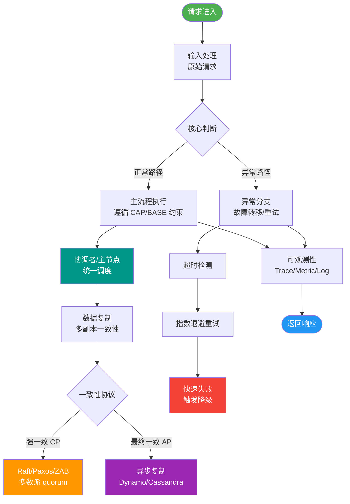

# ZooKeeper中Observer角色的作用是什么？

ZooKeeper 中的 Observer 是一种特殊的 ZooKeeper 节点角色，设计初衷是为了解决扩展性和跨机房部署的问题。

### 作用详解
1. **扩展读性能（不参与投票）：**
   - Observer 接收并处理客户端读请求，直接返回内存数据。
   - **关键点**：Observer **不参与 Leader 选举** 和 **事务请求的投票（Proposal Ack）**。
   - **收益**：增加 Observer 不会增加 ZAB 协议中“过半写入”的 ACK 等待时间，因此不会降低集群的写性能（而增加 Follower 会导致 Leader 等待更多 ACK，从而增加写延迟）。

2. **跨数据中心部署：**
   - Observer 可部署在异地机房，处理本地读请求，极大减少跨机房读请求的网络延迟。
   - 由于 Observer 不投票，即使跨机房网络延迟高，也不会阻塞 Leader 的提交流程，不影响主集群的写一致性。

3. **不影响写可用性：**
   - 写请求的达成条件是“获得过半 Follower 的确认”。Observer 的数量不影响这个数学公式，因此加再多的 Observer 也不会增加写请求的确认负担。

### 实战案例
某电商大促期间，为了分摊主集群读压力，我们在异地机房部署了 3 个 Observer 节点承担 80% 的配置读取流量，成功避免了主集群因网络抖动导致的 Leader 选举频繁切换。

### 关键配置
在 `zoo.cfg` 配置文件中：
```properties
# 1. 当前节点角色标识（可选，视版本而定）
peerType=observer

# 2. 集群节点配置，注意末尾的 :observer 标记
# server.1=192.168.1.1:2888:3888
# server.2=192.168.1.2:2888:3888
server.3=192.168.1.3:2888:3888:observer
```

### 与 Follower 的核心区别
| 维度 | Follower | Observer |
| :--- | :--- | :--- |
| **处理读请求** | 是 | 是 |
| **处理写请求投票** | 是（ACK） | 否（仅转发） |
| **参与 Leader 选举** | 是 | 否 |
| **状态同步** | 正常同步 | 正常同步 |
| **影响写性能** | 是（节点越多，写越慢） | 否（无影响） |
| **适用场景** | 核心集群，保障高可用 | 读扩展、跨机房异地多活 |

### 架构示意图
```text
   [Leader] (数据中心 A)
      /     \
[Follower] [Follower] (数据中心 A)
   |          |
   | (FIFO 同步) |
   v          v
[Observer] [Observer] (数据中心 B - 异地)
   ^
   |
[客户端 B] (本地读，低延迟)
```

### 配置与原理
在 `zoo.cfg` 中配置：
1. `peerType=observer` (标识当前节点为 Observer)
2. `server.x=host:port:port:observer` (在集群配置中标记)

**工作流程**：Leader 接收写请求 -> 广播 Proposal -> Follower 返回 ACK（Leader 收到过半 ACK 即 Commit）-> Observer 接收 Commit 消息并更新内存。

## 常见考点
1. **Observer 不投票，为什么还要同步数据？**：Observer 需要保持与 Leader 数据一致才能提供正确的读服务，因此它依然会通过 Follower 或 Leader 的事务日志来同步数据状态，只是不参与投票确认过程。
2. **Leader 挂了，Observer 会怎么做？**：Observer 不参与选举，因此它会暂停服务，等待 Follower 集群选举出新的 Leader 后，重新连接并同步数据，期间对外表现为不可用或读过期数据（取决于具体版本配置）。
3. **Observer 如何连接集群？**：在配置 Observer 时，通常可以指定其跟随的 Follower 列表（`server.x=...:observer` 配置中隐含），Observer 会连接到这些节点进行数据同步。


## 核心流程图



## 记忆要点

- 核心作用：只处理读请求以扩展集群性能，跨机房部署降低异地访问延迟。
- 核心特性：Observer 不参与 Leader 选举且不参与事务写投票（ACK）。
- 性能收益：因为不参与写 ACK，所以增加节点不会降低集群写性能。
- 对比 Follower：Follower 既处理读也参与投票写，而 Observer 仅无权读。
- 配置标记：在 zoo.cfg 的节点配置末尾增加 :observer 关键字启用。

## 结构化回答


**30 秒电梯演讲：** 股东大会的列席观众：能看（读）能发表意见，但表决（写）不计入票数。

**展开框架：**
1. **不参与Leade** — 不参与Leader选举和事务请求投票
2. **接收并处理客户端读请求** — 分流Follower压力
3. **部署在异地机房可** — 部署在异地机房可优化跨机房读延迟

**收尾：** 这是我实战中的理解，您想深入哪一段？


## 视频脚本

> 预计时长：3 分钟 | 由浅入深

| 时间 | 画面/字幕 | 口播台词 | 讲解要点 |
|------|----------|----------|----------|
| 0:00 | 标题卡：ZooKeeper中Observer角色 | "ZooKeeper中Observer角色，这题我会分三步讲。" | 开场钩子 |
| 0:41 | 概念定义动画 | "一句话：只干活不投票的特殊节点，用于扩展读性能。" | 核心定义 |
| 1:22 | 生活类比动画 | "打个比方——股东大会的列席观众：能看(读)能发表意见，但表决(写)不计入票数。" | 核心类比 |
| 2:03 | 不参与Leader选 图解 | "不参与Leader选举和事务请求投票。" | 不参与Leader选 |
| 2:50 | 接收 图解 | "接收并处理客户端读请求，分流Follower压力。" | 接收 |
