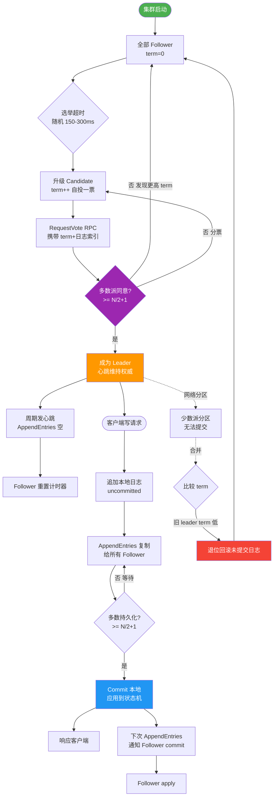
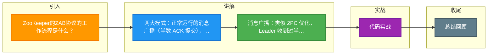

# ZooKeeper的ZAB协议的工作流程是什么？

ZAB 协议（ZooKeeper Atomic Broadcast，ZooKeeper 原子广播）是 ZooKeeper 专门设计的保证数据一致性的核心协议。它包含两种基本模式：**崩溃恢复** 和 **消息广播**。其核心目标是保证事务的**有序性**（全局有序）和**一致性**。

### 1. 消息广播—— 正常运行状态
这是集群有 Leader 且正常运行时的模式，类似于两阶段提交（2PC）的优化版。

**流程步骤：**
1. **提案接收**：Leader 接收客户端事务请求，生成对应的 Proposal（提议）。
2. **分配 ID**：Leader 为 Proposal 分配全局递增的 **Zxid**（64 位，高 32 位纪元 epoch，低 32 位计数器），保证顺序。
3. **发送提案**：Leader 将 Proposal 发送给所有 Follower。
4. **本地写入**：Follower 收到 Proposal 后，将其写入本地事务日志，并向 Leader 返回 ACK。
5. **广播提交**：Leader 收到**超过半数** Follower 的 ACK 后，广播 Commit 消息。
6. **应用变更**：Leader 和 Follower 收到 Commit 消息后，将事务应用到内存状态树中，并返回成功给客户端。

### 实战案例
在排查 ZK 集群“告警数据积压”时，发现由于 Leader 磁盘 I/O 打满，Follower 写入事务日志过慢导致 ACK 超时，Leader 无法达到过半提交阈值，最终触发重新选举。优化磁盘 IOPS 后，由于 Zxid 严格递增的特性，积压的事务在选举结束后按顺序迅速完成同步。

### 2. 崩溃恢复—— 异常或启动状态
当 Leader 崩溃、网络中断导致 Leader 失联或集群启动时进入该模式，目的是选举新 Leader 并使数据与 Leader 达到一致。

**阶段一：Leader 选举**
- 基于 Fast Leader Election 算法（使用投票箱机制）。
- 核心依据：**Zxid 越大，数据越新**，优先成为 Leader。Epoch（纪元）值大的优先。
- 目标：选出数据最新（Zxid 最大）的节点作为新 Leader。

**阶段二：数据同步**
新 Leader 选出后，需要确保所有 Follower 的数据状态与 Leader 一致。Leader 会根据 Follower 的 lastZxid 状态决定同步策略：

1. **直接差异化同步**：
   - Follower 的数据在 Leader 的提议缓存队列中未过期。
   - Leader 将 Follower 缺失的 Proposal 重新发送。

2. **先回滚再同步**：
   - Follower 包含了 Leader 所没有的事务（即 Follower 的 Zxid epoch 虽小，但该 epoch 内的数据多于 Leader，可能是旧 Leader 未提交完的数据）。
   - Follower 先回滚这些多余事务，然后再进行差异化同步。

3. **全量同步**：
   - Follower 数据太旧或丢失严重，Leader 发送 SNAP 快照文件进行全量重置。

### 状态流转图
```text
      (初始/启动)
          │
          v
  [ELECTION] <───────────────────────┐
  (选举状态)                          │ (Leader 宕机/崩溃)
          │                           │
          │ (选出 Leader，进行数据同步)  │
          v                           │
 [DISCOVERY] (可选，发现状态)        │
          │                           │
          │ (同步完成)                │
          v                           │
  [BROADCAST] ───────────────────────┘
  (广播/正常工作状态)
```

### 与 Paxos 的关系
ZAB 并非完全照搬 Paxos，而是针对 ZooKeeper 的**主备架构**（Primary-Backup）和**顺序更新**需求进行了优化，类似于简化版的 Multi-Paxos，但增加了恢复阶段的数据同步保证。

## 常见考点
1. **Zxid 的结构及其作用？**：Zxid 是 64 位长整型，高 32 位是 `epoch`（每次 Leader 变更加 1），代表朝代；低 32 位是计数器。它既是事务 ID，也是时钟，用于判断数据新旧和排序。
2. **为什么 ZooKeeper 集群节点数通常是奇数？**：


## 核心流程图



## 记忆要点

- 两大模式：正常运行的消息广播（半数 ACK 提交），异常时的崩溃恢复。
- 消息广播：类似 2PC 优化，Leader 收到过半 Follower 的 ACK 后即 Commit。
- 核心标识：Zxid 高 32 位是 epoch（纪元），低 32 位是计数器，用于判断数据新旧。
- 选举逻辑：崩溃恢复时，因为要保证数据不丢，所以 Zxid 越大越优先当选 Leader。
- 节点部署：因为只需过半 ACK 即可提交，所以奇数节点能用更少成本获得相同容灾率。

## 结构化回答


**30 秒电梯演讲：** 像报社总编（Leader）发稿，记者（Follower）确认后刊登，总编换人时先同步之前的稿件。

**展开框架：**
1. **正常时走消息** — 正常时走消息广播流程（两阶段提交）
2. **异常时走崩溃** — 异常时走崩溃恢复流程（选主+同步）
3. **Zxid** — 利用Zxid保证全局有序

**收尾：** 这是我实战中的理解，您想深入哪一段？


## 视频脚本

> 预计时长：3 分钟 | 由浅入深

| 时间 | 画面/字幕 | 口播台词 | 讲解要点 |
|------|----------|----------|----------|
| 0:00 | 标题卡：ZooKeeper的ZAB协议的工作流程 | "ZooKeeper的ZAB协议的工作流程，这题我会分三步讲。" | 开场钩子 |
| 0:41 | 概念定义动画 | "一句话：通过主从复制和选主机制，保证所有节点数据变更的顺序一致。" | 核心定义 |
| 1:22 | 生活类比动画 | "打个比方——像报社总编(Leader)发稿，记者(Follower)确认后刊登，总编换人时先同步之前的稿件。" | 核心类比 |
| 2:03 | 正常时走消息广播流程 图解 | "正常时走消息广播流程(两阶段提交)。" | 正常时走消息广播流程 |
| 2:50 | 异常时走崩溃恢复流程 图解 | "异常时走崩溃恢复流程(选主+同步)。" | 异常时走崩溃恢复流程 |

### 视频流程图



