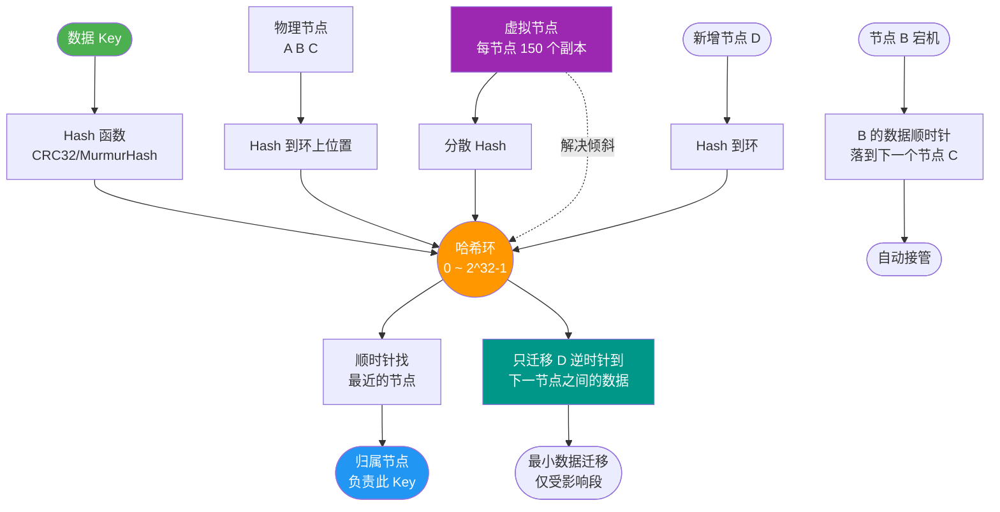
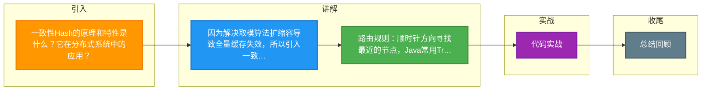

# 一致性Hash的原理和特性是什么？它在分布式系统中的应用？

一致性 Hash 是一种分布式算法，常用于负载均衡（如 Memcached、Redis Cluster、Dubbo 负载均衡策略），解决了传统取模算法在增删节点时导致大量缓存失效的问题。

### 核心原理
1. **构建 Hash 环**：将 Hash 空间（通常是 $0 \to 2^{32}-1$）想象成一个首尾相接的圆环。
2. **节点映射**：将服务器节点（IP/端口）通过 Hash 算法（如 `md5` 或 `crc32`）映射到环上。
3. **对象映射**：将数据 Key 通过 Hash 算法映射到环上。
4. **路由规则**：从数据 Key 的位置开始，沿顺时针方向寻找遇到的第一个服务器节点，即为该 Key 的存储节点。

### 实战案例
在某次缓存扩容操作中，由于直接使用了简单的 Hash 取模 `hash(key) % N`，当节点数从 3 增加到 4 时，约 75% 的缓存命中率瞬间归零，导致数据库流量激增甚至崩溃。后续引入带虚拟节点的 Consistent Hash 算法后，扩容时仅影响了约 10% 的流量，系统平滑过渡。

### 一致性 Hash 示意图
```text
      Hash 环空间 (0 - 2^32-1)
   
     ...----(Key1)-----> [Node A] 
    /                       \
   |                        v
[Node C]               (Key3)
   ^                        |
    \                       v
     [Node B] <-----(Key2)--
```

### 关键特性
- **平衡性**：通过引入**虚拟节点**，让数据尽可能均匀分布到所有节点。
- **单调性**：当新增或移除节点时，只影响顺时针方向相邻节点的数据（受影响的数据量约 $1/N$，N 为节点数），不会导致全量数据重新映射。
- **分散性**：在分布式环境中，尽量避免数据集中在某些节点。

### 虚拟节点—— 解决数据倾斜
**原理**：为了解决节点少时数据分布不均（数据倾斜）问题，将一个真实节点映射为多个虚拟节点（如 `Node A#1`, `Node A#2`, ... `Node A#100`），计算 Hash 时使用字符串后缀来区分。

**效果**：物理节点越少，对应的虚拟节点应越多（通常 150-200 个）。这样环上的节点密度变大，数据 Key 更容易均匀分布，减少“雪崩”风险。

```text
真实节点 A -> [Virtual A#1] ... [Virtual A#2] ... [Virtual A#N]
真实节点 B -> [Virtual B#1] ... [Virtual B#2] ... [Virtual B#N]
```

### 在分布式系统中的应用场景
1. **分布式缓存**：Memcached 客户端，Redis Cluster（略有不同，使用 Hash Slot，但思想类似）。
2. **RPC 负载均衡**：Dubbo 的 ConsistentHashLoadBalance，保证相同参数的请求总是落到同一台提供者（有状态服务）。
3. **分库分表**：某些分库分表中间件使用一致性 Hash 决定数据落在哪个库/表。

### Java 代码示例（简化版）
```java
// 使用 TreeMap 模拟 Hash 环，利用 ceilingKey 寻找顺时针节点
TreeMap<Integer, String> virtualNodes = new TreeMap<>();

void addNode(String realNode, int virtualNum) {
    for (int i = 0; i < virtualNum; i++) {
        int hash = getHash(realNode + "#" + i);
        virtualNodes.put(hash, realNode);
    }
}

String getNode(String key) {
    int hash = getHash(key);
    // 寻找顺时针方向第一个大于等于 hash 的节点（TailMap + First Key）
    Map.Entry<Integer, String> entry = virtualNodes.ceilingEntry(hash);
    if (entry == null) { 
        entry = virtualNodes.firstEntry(); // 环的尾部回到头部
    }
    return entry.getValue();
}
```

## 常见考点
1. **节点减少时，数据如何迁移？**：当 `Node A` 下线时，原本落在 `Node A` 上的数据会顺时针迁移到 `Node B`（`Node A` 的后继节点）。只需迁移这部分数据，无需全量迁移。
2. **如果不使用虚拟节点会怎样？**：在节点数量很少时，物理节点在 Hash 环上分布极不均匀，导致大量请求命中同一个节点，产生“热点”问题，无法发挥集群优势。
3. **Hash 环的“倾斜”问题是什么？**：即使有虚拟节点，如果某个真实节点的性能较差或者 Hash 算法分布不均，仍可能导致该节点承担过多流量。解决方法是动态调整虚拟节点权重（高性能节点分配更多虚拟节点）。


## 核心流程图



## 记忆要点

- 因为解决取模算法扩缩容导致全量缓存失效，所以引入一致性Hash环
- 路由规则：顺时针方向寻找最近的节点，Java常用TreeMap的ceilingEntry实现
- 核心解决数据倾斜：引入虚拟节点（通常150-200个），让物理节点均匀打散在环上
- 对比单调性：增删节点时，仅影响顺时针相邻的小部分数据（约1/N），无需全量迁移

## 结构化回答


**30 秒电梯演讲：** 圆桌会议，每个人（节点）占一个位置，问题（数据）交给右手边最近的人处理。来人新人只需负责一小段。

**展开框架：**
1. **Hash** — 构建首尾相接的Hash环
2. **顺时针查找最** — 顺时针查找最近的服务节点
3. **引入虚拟节点** — 引入虚拟节点解决数据倾斜

**收尾：** 这是我实战中的理解，您想深入哪一段？


## 视频脚本

> 预计时长：3 分钟 | 由浅入深

| 时间 | 画面/字幕 | 口播台词 | 讲解要点 |
|------|----------|----------|----------|
| 0:00 | 标题卡：一致性Hash的原理和特性 | "一致性Hash的原理和特性，这题我会分三步讲。" | 开场钩子 |
| 0:41 | 概念定义动画 | "一句话：将节点和数据映射到Hash环上，顺时针查找归属节点，减少节点变动影响。" | 核心定义 |
| 1:22 | 生活类比动画 | "打个比方——圆桌会议，每个人(节点)占一个位置，问题(数据)交给右手边最近的人处理。来人新人只需负责一小段。" | 核心类比 |
| 2:03 | 构建首尾相接 图解 | "构建首尾相接的Hash环。" | 构建首尾相接 |
| 2:50 | 顺时针查找最近 图解 | "顺时针查找最近的服务节点。" | 顺时针查找最近 |

### 视频流程图



