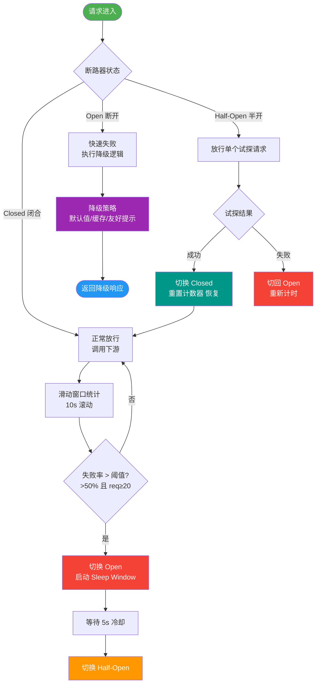
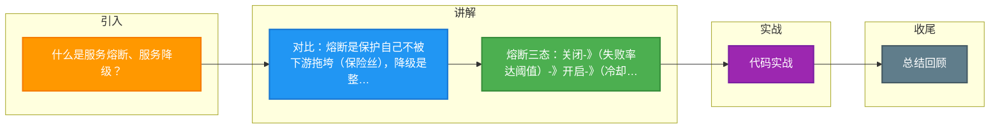

# 什么是服务熔断、服务降级？

在微服务架构中，为了防止服务雪崩效应，通常会引入服务熔断和服务降级机制。

### 服务雪崩
在分布式系统中，由于某个服务故障或响应过慢，导致调用它的服务线程阻塞。随着并发增加，线程池耗尽，最终导致整个服务集群不可用，这种层层蔓延的现象称为雪崩效应。

### 服务熔断
- **定义**：类似于电路中的保险丝。当检测到下游服务出现异常（错误率超过阈值或响应时间过长）时，暂时切断对该服务的调用，直接返回错误或默认值。
- **目的**：快速失败，保护系统资源不被耗尽，给下游服务恢复的时间。
- **恢复**：经过一段时间（冷却时间）后，允许少量请求通过（半开状态），如果成功则恢复正常，失败则继续熔断。

### 服务降级
- **定义**：当系统压力过大或非核心服务故障时，暂时牺牲非核心功能（如推荐、评论），保证核心业务（如下单、支付）可用。
- **方式**：
  - 自动降级：触发限流或熔断时自动执行。
  - 手动降级：运维人员在大促期间主动关闭非核心接口。

### 区别
- **熔断**：是对**被调用方**的保护（防止拖垮自己）。
- **降级**：是对**整体系统**的权衡（弃车保帅）。
- 通常熔断是实现降级的一种技术手段。

### 熔断器状态流转图
```text
      关闭
   ┌─────────┐
   │  正常   │  失败率达到阈值
   └────┬────┘───────────────────┐
        │                        │
        │ 持续失败                │
        ▼                        │
   ┌─────────┐  半开试探成功      │ 半开试探失败
   │  开启   │◄───────────────┐   │
   │ (熔断)  │                │   │
   └────┬────┘                │   │
        │ 超时/冷却时间结束     │   │
        └─────────────────────┼───┘
                                ▼
                           ┌─────────┐
                           │  半开   │◄──┐
                           └─────────┘   │ 允许少量请求通过测试
```

### 实战案例：第三方接口超时导致线程池耗尽
在某电商大促中，商品详情页依赖的“评论服务”调用的第三方物流接口出现超时。由于未配置熔断，Tomcat线程池迅速被阻塞等待，导致“商品详情”主接口不可用，引发雪崩。事后引入Resilience4j，配置5秒超时熔断，超时直接返回默认空评论列表，保住了主流程。

### 代码示例：Resilience4j 熔断配置 (Java)
```java
CircuitBreakerConfig config = CircuitBreakerConfig.custom()
    // 失败率超过50%触发熔断
    .failureRateThreshold(50)
    // 熔断持续时间10秒
    .waitDurationInOpenState(Duration.ofSeconds(10))
    // 半开状态允许3个试探请求
    .permittedNumberOfCallsInHalfOpenState(3)
    .slidingWindowSize(10)
    .build();
CircuitBreakerRegistry registry = CircuitBreakerRegistry.of(config);
CircuitBreaker cb = registry.circuitBreaker("commentService");

// 使用装饰器模式
Supplier<String> supplier = CircuitBreaker.decorateSupplier(cb, () -> commentService.getComments());
```

### 对比表格
| 维度 | 服务熔断 | 服务降级 |
| :--- | :--- | :--- |
| **核心对象** | 针对下游服务故障或延迟 | 针对系统整体负载或非核心业务 |
| **触发条件** | 异常比例、慢调用比例超阈值 | 限流触发、人工开关、自动开关 |
| **表现** | 抛出异常或走 Fallback | 返回默认值、静态页面或简化逻辑 |
| **依赖关系** | 熔断通常是降级的触发原因 | 降级是熔断后的处理结果之一 |

### 常见考点
1. **半开状态的作用是什么？**（提示：为了防止服务刚恢复瞬间的高流量再次压垮服务，采用少量请求探路）。
2. **熔断和降级的触发条件分别是什么？**（提示：熔断主要看下游异常率或响应时，降级主要看系统整体负载或业务开关）。
3. **Hystrix 和 Sentinel 的区别？**（提示：Hystrix 已停止维护，Sentinel 是阿里开源，控制台更强大，限流流控规则更丰富）。


## 核心流程图



## 记忆要点

- 对比：熔断是保护自己不被下游拖垮（保险丝），降级是整体权衡弃车保帅（保核心）
- 熔断三态：关闭->(失败率达阈值)->开启->(冷却超时)->半开(试探少量请求)->关闭/开启
- 因为故障会引发线程池耗尽层层蔓延，所以需要熔断降级来防止服务雪崩

## 结构化回答


**30 秒电梯演讲：** 保险丝过热自动断电（熔断），停电时只保冰箱不停电，其他电器关掉（降级）。

**展开框架：**
1. **防止服务雪崩** — 防止服务雪崩，保护系统资源
2. **熔断是暂时切断故** — 熔断是暂时切断故障服务调用
3. **降级是牺牲非核心** — 降级是牺牲非核心功能保核心

**收尾：** 这是我实战中的理解，您想深入哪一段？


## 视频脚本

> 预计时长：3 分钟 | 由浅入深

| 时间 | 画面/字幕 | 口播台词 | 讲解要点 |
|------|----------|----------|----------|
| 0:00 | 标题卡：服务熔断、服务降级 | "服务熔断、服务降级，这题我会分三步讲。" | 开场钩子 |
| 0:41 | 概念定义动画 | "一句话：熔断是自动开关防崩溃，降级是保核心弃非核心的应急策略。" | 核心定义 |
| 1:22 | 生活类比动画 | "打个比方——保险丝过热自动断电(熔断)，停电时只保冰箱不停电，其他电器关掉(降级)。" | 核心类比 |
| 2:03 | 服务雪崩 图解 | "防止服务雪崩，保护系统资源。" | 服务雪崩 |
| 2:50 | 熔断 图解 | "熔断是暂时切断故障服务调用。" | 熔断 |

### 视频流程图



