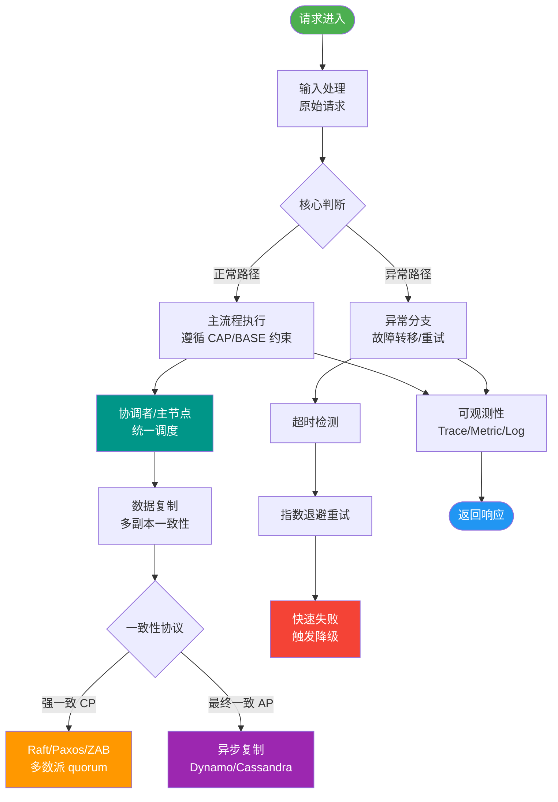
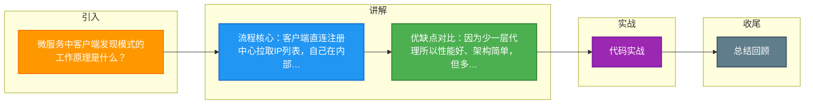

# 微服务中客户端发现模式的工作原理是什么？

客户端发现是指客户端负责查询可用服务地址，以及负载均衡的工作。这种方式最方便直接，而且也方便做负载均衡。再者一旦发现某个服务不可用立即换另外一个，非常直接。缺点也在于多语言时的重复工作，每个语言实现相同的逻辑。

### 工作原理与架构
在客户端发现模式中，客户端应用程序通过查询**服务注册中心**（Service Registry，如 Eureka、Consul、Zookeeper）来获取服务实例的网络位置列表。客户端通常使用**负载均衡算法**（如轮询、随机等）从列表中选择一个实例发起请求。

### 架构流程图
```text
┌───────────────┐      1. Register/Deregister     ┌──────────────────┐
│  Service A    │ ──────────────────────────────► │   Service        │
│  (Provider)   │                                 │   Registry       │
└───────────────┘ ◄────────────────────────────── │ (Eureka/Consul)  │
                                                └────────┬─────────┘
┌───────────────┐      2. Request Instances             │
│  Service B    │ ──────────────────────────────────────┘
│  (Consumer)   │ ◄──── 3. Return List of IPs
└───────┬───────┘
        │
        │ 4. Load Balancing & Direct Call
        ▼
┌───────────────┐
│  Service A    │
│  (Provider)   │
└───────────────┘
```

### 优缺点补充
**优点**：
- **架构简单**：除了服务注册中心，无需引入额外的代理基础设施（如 API 网关或负载均衡器）。
- **性能较好**：客户端直接调用服务端，少了一次网络跳转。
- **自主性强**：客户端可以根据特定场景（如区域性亲和）定制路由逻辑。

**缺点**：
- **耦合性高**：客户端与服务注册中心强耦合，需要实现特定的服务发现和负载均衡客户端。
- **维护成本**：如果是多语言技术栈，每种语言都要实现一套服务发现和负载均衡客户端（如 Java 用 Ribbon，Go 用类似库）。

### 实战案例：Eureka Server 宕机后的缓存保护
在生产环境中，曾遇到过 Eureka 集群因网络分区短暂不可用。由于客户端配置了 `registryFetchIntervalSeconds`（默认30s）且本地有缓存，客户端服务在缓存过期前依然能正常调用下游。同时，由于开启了 Eureka 的自我保护机制，未因心跳丢失而注销大量实例，避免了网络恢复后的大规模流量冲击。

### 代码示例：Spring Cloud (Eureka + Ribbon) 客户端调用 (Java)
```javan// 1. 启动类注解启用发现
@EnableDiscoveryClient
@SpringBootApplication
public class ConsumerApplication {
    public static void main(String[] args) {
        SpringApplication.run(ConsumerApplication.class, args);
    }

    // 2. 注入 LoadBalancerClient 进行客户端负载均衡
    @Bean
    public RestTemplate restTemplate() {
        return new RestTemplate();
    }
}

// 3. 使用服务名调用 (底层自动从 Eureka 拉取列表并负载均衡)
@Autowired
private RestTemplate restTemplate;

public String invokeService() {
    // URL 中使用服务名称 'USER-SERVICE'
    return restTemplate.getForObject("http://USER-SERVICE/user/info", String.class);
}
```

### 对比表格
| 特性 | 客户端发现模式 | 服务端发现模式 |
| :--- | :--- | :--- |
| **代表技术** | Eureka, Consul, Zookeeper | Nginx, Kubernetes Service, AWS ELB |
| ** LB 位置** | 客户端进程内部 | 独立的负载均衡器/代理 |
| **网络跳转** | 直连服务端 (1跳) | 经由代理转发 (2跳) |
| **多语言支持** | 差 (需各语言实现 SDK) | 好 (只需支持标准协议) |
| **运维复杂度** | 低 (无额外组件) | 中高 (需维护 LB 集群) |

### 常见考点
1. **客户端发现和服务端发现的区别？**（提示：服务端发现如 Nginx/K8s Service，客户端只访问代理，由代理做 LB；客户端发现由客户端自己做 LB）。
2. **如果服务注册中心挂了怎么办？**（提示：客户端通常会缓存服务实例列表，具有容错能力）。
3. **CAP 理论在服务注册中心选型中的体现？**（提示：Eureka 保证 AP（可用性），Consul/Zookeeper 保证 CP（一致性））。


## 核心流程图



## 记忆要点

- 流程核心：客户端直连注册中心拉取IP列表，自己在内部完成负载均衡并直连。
- 优缺点对比：因为少一层代理所以性能好、架构简单，但多语言需各自实现SDK。
- 高频对比：客户端发现直连服务端（1跳），而服务端发现经由LB代理（2跳）。
- 容灾机制：因注册中心宕机有风险，所以客户端需开启本地缓存（如默认30s）兜底。

## 结构化回答


**30 秒电梯演讲：** 网购时自己查快递网点信息，然后自己选最近的一个去寄。

**展开框架：**
1. **客户端负责向** — 客户端负责向注册中心查询服务地址列表
2. **客户端负责负** — 客户端负责负载均衡逻辑（如轮询）
3. **客户端自行处** — 客户端自行处理服务故障重试

**收尾：** 这是我实战中的理解，您想深入哪一段？


## 视频脚本

> 预计时长：3 分钟 | 由浅入深

| 时间 | 画面/字幕 | 口播台词 | 讲解要点 |
|------|----------|----------|----------|
| 0:00 | 标题卡：微服务中客户端发现模式的工作原理 | "微服务中客户端发现模式的工作原理，这题我会分三步讲。" | 开场钩子 |
| 0:41 | 概念定义动画 | "一句话：客户端自己查询服务注册表并选择服务实例发起调用。" | 核心定义 |
| 1:22 | 生活类比动画 | "打个比方——网购时自己查快递网点信息，然后自己选最近的一个去寄。" | 核心类比 |
| 2:03 | 客户端负责向注册中心 图解 | "客户端负责向注册中心查询服务地址列表。" | 客户端负责向注册中心 |
| 2:50 | 客户端负责负载均衡逻 图解 | "客户端负责负载均衡逻辑(如轮询)。" | 客户端负责负载均衡逻 |

### 视频流程图



