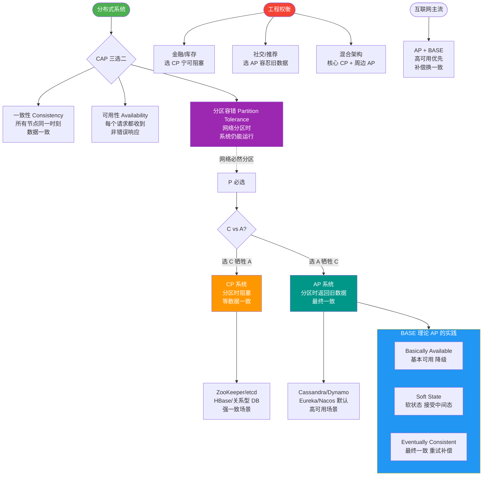

# BASE理论是什么？

BASE是对CAP中AP的延伸，是大型互联网实践的总结：

- **Basically Available（基本可用）**：允许损失部分可用性（如响应时间增加、非核心功能降级）。
- **Soft State（软状态）**：允许系统存在中间状态（如订单状态短暂不一致）。
- **Eventually Consistent（最终一致性）**：系统保证最终达到一致状态，但不需要实时一致。

### 详细原理
BASE 理论是对 CAP 中 AP 方案的补充，它主张通过牺牲强一致性来获得高可用性，并在一段时间后达到数据的一致性。这与传统的 ACID（原子性、一致性、隔离性、持久性）刚性事务形成鲜明对比。

#### 基本可用
指系统在出现故障时，允许损失部分可用性，但这不等价于系统不可用。例如：
- **响应时间上的损失**：正常情况下搜索引擎 0.5 秒返回结果，故障时可能 1-2 秒。
- **功能上的损失**：双十一大促时，为了避免流量洪峰冲垮系统，可能会关闭“评论”、“推荐”等非核心服务，只保留“下单”、“支付”核心功能。

#### 软状态
指允许系统中的数据存在中间状态，并认为该中间状态的存在不会影响系统的整体可用性。这里的“软”是指状态可以在不同时间节点不同。例如在电商支付流程中，订单状态由“待支付”变为“支付中”再到“已支付”，中间的“支付中”就是一个软状态。

#### 最终一致性
强调的是系统中的所有数据副本，在经过一段时间的同步后，最终能够达到一个一致的状态。不需要实时的强一致性，只要最终数据是对的即可。

### 最终一致性的变体
1.  **因果一致性**：如果进程 A 通知进程 B 它已更新了数据，那么 B 的后续访问都能读到更新后的值，反之则不能保证。
2.  **读己之所写**：用户永远能读到自己刚刚提交的数据，这是用户体验的底线。
3.  **会话一致性**：在同一个会话期间，保证读己之所写。
4.  **单调读**：如果一个用户已经读到过某个数据的某个版本，那么后续任何操作都不会读到比这个版本更旧的值。

### 实战案例：电商订单与库存的最终一致
在“秒杀”场景下，为了极致性能，我们采用了 BASE 理论。用户下单成功时，订单服务直接响应“抢购成功”（基本可用），同时扣减 Redis 库存。此时数据库中的库存记录可能还未扣减（软状态）。系统通过异步消息队列 slowly 同步扣减 DB 库存。如果在同步期间用户去查询订单详情，可能看到短暂的“库存扣减中”状态，但几秒后数据必然一致（最终一致性）。这保证了大促时不因为 DB 锁竞争而宕机。

### 代码示例：简单的“读己之所写”实现思路 (伪代码)
```javan@Service
public class OrderService {
    // 使用 ThreadLocal 或 Session 保存用户最近的操作时间戳/版本
    private ThreadLocal<Long> lastWriteTimestamp = new ThreadLocal<>();

    public void updateOrder(Order order) {
        db.update(order);
        // 记录当前线程的写入时间
        lastWriteTimestamp.set(System.currentTimeMillis());
    }

    public Order getOrder(Long orderId) {
        Order order = db.select(orderId);
        Long lastWrite = lastWriteTimestamp.get();
        
        // 如果当前线程刚写完，强制走主库或等待同步完成
        if (lastWrite != null && order.getUpdateTime() < lastWrite) {
            order = masterDb.select(orderId); // 降级走主库查询
        }
        return order;
    }
}
```

### 对比表格：ACID vs BASE
| 维度 | ACID (刚性事务) | BASE (柔性事务) |
| :--- | :--- | :--- |
| **一致性** | 强一致性 | 最终一致性 |
| **可用性** | 牺牲可用性保一致性 (CP) | 牺牲强一致性保可用性 (AP) |
| **状态** | 只有成功/失败，无中间态 | 允许“中间状态”或“软状态” |
| **实现** | 数据库原生支持 (如 MySQL InnoDB) | 应用层实现 (如 TCC, 消息队列) |
| **适用场景** | 传统金融、内部管理系统 | 互联网高并发、社交媒体、电商 |

### 常见考点
1. **ACID 和 BASE 的核心区别？**（提示：ACID 追求强一致性，事务结束时数据必须一致；BASE 追求最终一致性，允许中间状态）。
2. **BASE 理论解决了什么问题？**（提示：解决了大型分布式系统在高并发、高可用场景下无法满足 ACID 的困境，提供了理论依据）。
3. **请举例说明最终一致性的应用场景？**（提示：抖音点赞数更新、电商订单状态同步、DNS 解析）。


## 核心流程图



## 记忆要点

- 理论定位：是对CAP中AP的延伸，解决互联网高并发下强一致性难题。
- 核心口诀：基本可用、软状态、最终一致性。
- 对比记忆：ACID追求强一致与无中间态，而BASE允许中间状态牺牲强一致。
- 实战联想：秒杀异步扣库，因允许中间状态（软），所以保障高可用，最终数据一致。

## 结构化回答

**30 秒电梯演讲：** 牺牲强一致性，换取高可用和最终一致性的分布式设计理念。打比方——发朋友圈：发出后朋友们可能看到的时间不同，但最终大家看到的内容一样。落到工程上，允许响应变慢或功能降级。

**展开框架：**
1. **Basically** — 允许响应变慢或功能降级
2. **Soft State** — 允许数据在同步过程中存在中间状态
3. **Eventually** — 保证经过一段时间后数据一致

**收尾：** 以上三点都能配合实战聊。我可以展开任一要点，您想先深入哪一块？

## 视频脚本

> 预计时长：2 分钟 | 由浅入深

| 时间 | 画面/字幕 | 口播台词 | 讲解要点 |
|------|----------|----------|----------|
| 0:00 | 标题卡：BASE理论 | "BASE理论，一分钟讲透。" | 开场钩子 |
| 0:35 | 生活类比动画 | "打个比方——发朋友圈：发出后朋友们可能看到的时间不同，但最终大家看到的内容一样。" | 核心类比 |
| 1:10 | 概念定义动画 | "一句话：牺牲强一致性，换取高可用和最终一致性的分布式设计理念。" | 核心定义 |
| 1:50 | Basically 图解 | "允许响应变慢或功能降级。" | Basically |

---

## 延伸：BASE理论的特点

> 合并自 `dst-014`（相似度 79%）

### BASE理论的特点

BASE理论全称：
- **Basically Available** (基本可用)
- **Soft state** (软状态)
- **Eventually consistent** (最终一致性)

**核心思想**：
BASE理论提出通过牺牲强一致性来获得可用性，并允许数据在一段时间内是不一致的，但最终达到一致状态。

BASE理论面向的是大型高可用可扩展的分布式系统，和传统数据库的ACID特性（强一致性）是相反的。但在实际分布式场景中，不同业务对一致性要求不同，因此ACID和BASE往往会结合使用。

**补充细节**：
1. **基本可用**：指分布式系统在出现不可预知故障的时候，允许损失部分可用性（例如，响应时间变长，或服务降级，非核心功能不可用），但保证核心功能可用。
2. **软状态**：指系统中的数据允许存在中间状态，并认为该中间状态的存在不会影响系统的整体可用性，即允许系统在不同节点的数据副本之间进行数据同步的过程存在延迟。
3. **最终一致性**：强调的是系统中所有的数据副本，在经过一段时间的同步后，最终能够达到一个一致的状态。不需要实时保证数据强一致。

### 常见的一致性模型（补充）

虽然BASE强调最终一致性，但在通往最终一致的过程中，系统可能会表现出以下几种一致性级别：

1. **读己之所写**：
   进程A更新一项数据后，它自己总是能访问到自己更新过的最新值。

2. **会话一致性**：
   将数据一致性框定在会话当中，在一个会话中实现“读己之所写”。即执行更新后，客户端在同一个会话中始终能读到该项数据的最新值。

3. **单调读一致性**：
   如果一个进程从系统中读取出一个数据项的某个值后，那么系统对于该进程后续的任何数据访问都不应该返回更旧的值。

4. **单调写一致性**：
   一个系统需要保证来自同一个进程的写操作被顺序执行。

#### 实战案例：电商大促降级
在双11大促中，当流量超过系统预估峰值时，我们通过网关层强制关闭“商品评价”、“历史订单查询”等非核心服务（满足基本可用），并引导用户至静态降级页面，确保“下单”和“支付”核心链路不受流量洪峰冲击。

#### 代码示例：服务降级
```java
// Sentinel/Hystrix 降级规则示例
@SentinelResource(value = "getOrderDetail", fallback = "handleFallback") 
public OrderDetail getOrderDetail(Long orderId) {
    // 正常业务逻辑：查库、计算
    return orderService.queryDetail(orderId);
}

// 降级逻辑：返回基本可用信息（如缓存中的旧数据）
public OrderDetail handleFallback(Long orderId, Throwable ex) {
    return orderCacheService.getCachedStub(orderId); 
}
```

## 常见考点
1. **追问**：能否举个具体的例子说明“基本可用”？
   *   **提示**：比如双11大促，电商系统可能会关闭“评论”、“推荐”等非核心功能，只保证“下单”、“支付”核心链路正常；或者部分用户请求被引导到降级页面。
2. **追问**：软状态和缓存有什么区别？
   *   **提示**：软状态更侧重于分布式同步过程中的中间态描述，强调的是系统允许这种状态存在；而缓存是一种提升性能的技术手段，缓存数据也可能不是最新的，但更多是为了减少计算压力。

## 记忆要点

- 三要素：基本可用（BA）、软状态（S）、最终一致性（E）。
- BA实战：双11大促时，关闭评论等非核心功能或降级导流，死保下单和支付核心链路。
- S与缓存区别：软状态是分布式同步过程的中间态，缓存仅为减少计算的性能手段。
- 一致性变体：读己之所写、会话一致性、单调读/写，均为走向最终一致的过渡保证。

## 结构化回答


**30 秒电梯演讲：** 像浏览电商网站，刚下单库存可能还没扣减（软状态），但最终数据会对齐，系统始终可用。

**展开框架：**
1. **核心是基本可用和** — 核心是基本可用和最终一致性。
2. **允许系统存在中间** — 允许系统存在中间状态（软状态）。
3. **与ACID强刚性相对** — 适合高并发分布式系统。

**收尾：** 这是我实战中的理解，您想深入哪一段？


## 视频脚本

> 预计时长：2 分钟 | 由浅入深

| 时间 | 画面/字幕 | 口播台词 | 讲解要点 |
|------|----------|----------|----------|
| 0:00 | 标题卡：BASE理论的特点 | "BASE理论的特点，一分钟讲透。" | 开场钩子 |
| 0:35 | 生活类比动画 | "打个比方——像浏览电商网站，刚下单库存可能还没扣减(软状态)，但最终数据会对齐，系统始终可用。" | 核心类比 |
| 1:10 | 概念定义动画 | "一句话：基本可用、软状态、最终一致，牺牲强一致性换取高可用。" | 核心定义 |
| 1:50 | 基本可用和最终一致性 图解 | "核心是基本可用和最终一致性。" | 基本可用和最终一致性 |

---

## 延伸：BASE定理

> 合并自 `dst-013`（相似度 66%）

### CAP与ACID中A和C的区别

**A的区别**：
- **ACID中的A (Atomicity，原子性)**：指事务被视为一个不可分割的最小工作单元，事务中的所有操作要么全部提交成功，要么全部失败回滚。
- **CAP中的A (Availability，可用性)**：指集群中一部分节点故障后，集群整体是否还能响应客户端的读写请求。

**C的区别**：
- **ACID一致性**：指数据库事务执行前后，数据库必须从一个一致性状态转换到另一个一致性状态，重点在于数据库完整性约束（如唯一索引、外键约束）。
- **CAP一致性**：指分布式多服务器之间复制数据，令这些服务器拥有同样的数据（强一致性）。由于网速限制，集群通过阻止客户端查看未同步数据来维持逻辑视图。

**总结**：
ACID里的A和C是针对单机数据库事务的属性，而CAP的A和C是针对分布式系统设计的权衡指标，背景不同，无从直接可比。

### BASE定理

CAP是分布式系统设计理论，BASE是CAP理论中AP方案的延伸。BASE的核心思想是：牺牲强一致性（C），换取可用性（A）和分区容错性（P），通过“最终一致性”来保证数据在一段时间后达到一致状态。

**详细解读**：
BASE理论通过牺牲强一致性来获得高可用性，允许系统存在中间状态（软状态）。这在海量数据和高并发场景下是必要的，因为保证强一致性会严重影响系统的性能和可用性。

## 常见考点
1. **追问**：CAP理论中的P（分区容错性）为什么必须保证？
   *   **提示**：在分布式系统中，网络是不可靠的，节点之间通信可能随时失败（丢包、延迟）。为了保证P，我们只能在A和C之间进行权衡。
2. **追问**：BASE理论适用于哪些具体场景？
   *   **提示**：适用于对一致性要求不高，但要求高可用性的场景，如社交媒体点赞、商品浏览量统计、电商订单状态流转（最终支付成功即可）。

### 深化内容

#### 实战案例
在电商大促期间，为了应对高并发，我们将“订单状态更新”从同步强一致性（等待数据库落库并同步到从库）改为 BASE 模式的异步处理。用户下单后立即返回“处理中”（Soft State），随后通过 MQ 消费最终更新为“成功”。这使得下单接口吞吐量提升了 5 倍，虽然用户刷新订单可能会短暂看到状态未变，但极大地保证了系统的高可用。

#### 代码示例
实现 BASE 理论中的“最终一致性” —— 使用消息队列进行异步更新：

```javan// 主流程：基本可用（BA），快速响应
public void placeOrder(Order order) {
    // 1. 快速写入数据库（此时可能是预占状态）
    order.setStatus("PROCESSING"); // 软状态
    orderRepository.save(order);
    
    // 2. 发送消息到 MQ，不等待后续处理完成
    mqProducer.send("order_topic", order);
}

// 消费者：最终一致性
@MQListener("order_topic")
public void handleOrder(Order order) {
    // 执行耗时的操作：库存扣减、优惠券核销
    inventoryService.deduct(order);
    couponService.use(order);
    
    // 最终更新状态
    order.setStatus("COMPLETED");
    orderRepository.save(order);
}
```

#### 对比表格

| 理论 | 核心目标 | 一致性要求 | 可用性要求 | 适用场景 |
| :--- | :--- | :--- | :--- | :--- |
| **ACID** | 数据绝对正确 | 强一致（单节点） | 允许暂时停止 | 传统银行转账、库存核心写库 |
| **CAP** | 分布式系统权衡 | 强一致 (CP) / 无 (AP) | 高可用 (AP) / 无 (CP) | 分布式数据库集群、分布式锁 |
| **BASE** | 高可用下的最终一致 | 最终一致 | 基本可用 | 社交网络、电商订单详情、日志 |

## 记忆要点

- BASE是AP的延伸，核心是牺牲强一致（C），换取系统高可用（A）。
- 基本可用（BA）：故障时允许损失部分非核心功能（如降级、响应变慢）。
- 软状态（S）：允许系统存在数据同步的中间状态，不认为这是错误。
- 最终一致性（E）：不追求实时强一致，经过一段同步时间后数据最终对齐。

## 结构化回答

**30 秒电梯演讲：** BASE是CAP中AP方案的延伸，通过牺牲强一致性换取高可用，保证最终一致。打比方——像微信发消息，发送时显示“发送中”(允许暂不一致)，但保证最终对方一定能收到(最终一致)。落到工程上，BASE由Basically Available、Soft state、Eventually consis...

**展开框架：**
1. **BASE由** — BASE由Basically Available、Soft state、Eventually consistent组成。
2. **源于大规模互联网系统实践** — 源于大规模互联网系统实践，是对CAP理论的补充。
3. **容忍数据在短时间内不一致** — 容忍数据在短时间内不一致，但必须达到最终一致性。

**收尾：** 以上三点都能配合实战聊。我可以展开任一要点，您想先深入哪一块？

## 视频脚本

> 预计时长：2 分钟 | 由浅入深

| 时间 | 画面/字幕 | 口播台词 | 讲解要点 |
|------|----------|----------|----------|
| 0:00 | 标题卡：BASE定理 | "BASE定理，一分钟讲透。" | 开场钩子 |
| 0:35 | 生活类比动画 | "打个比方——像微信发消息，发送时显示“发送中”(允许暂不一致)，但保证最终对方一定能收到(最终一致)。" | 核心类比 |
| 1:10 | 概念定义动画 | "一句话：BASE是CAP中AP方案的延伸，通过牺牲强一致性换取高可用，保证最终一致。" | 核心定义 |
| 1:50 | BASE由 图解 | "BASE由Basically Available、Soft state、Eventually consistent组成。" | BASE由 |

---

## 延伸：BASE理论与CAP的关系

> 合并自 `dst-015`（相似度 74%）

### BASE理论与CAP的关系

BASE理论是对CAP中一致性和可用性权衡的结果，其来源于对大规模互联网系统分布式实践的总结， 是基于CAP定理逐步演化而来的。BASE理论的核心思想是：即使无法做到强一致性，但每个应用都可以根据自身业务特点，采用适当的方式来使系统达到最终一致性。
BASE理论其实就是对CAP理论的延伸和补充，主要是对AP的补充。牺牲数据的强一致性，来保证数据的可用性，虽然存在中间状态，但数据最终一致。

### ACID 和 BASE 的区别与联系

ACID 是传统数据库常用的设计理念，追求强一致性模型。BASE 支持的是大型分布式系统，提出通过牺牲强一致性获得高可用性。
ACID 和 BASE 代表了两种截然相反的设计哲学，在分布式系统设计的场景中，系统组件对一致性要求是不同的，因此 ACID 和 BASE 又会结合使用。

### 分布式事务分类：柔性事务和刚性事务

分布式场景下，多个服务同时对服务一个流程，比如电商下单场景，需要支付服务进行支付、库存服务扣减库存、订单服务生成订单、物流服务更新物流信息等。如果某一个服务执行失败，或者网络不通引起的请求丢失，那么整个系统可能出现数据不一致的原因。
上述场景就是分布式一致性问题，追根到底，分布式一致性的根本原因在于数据的分布式操作，引起的本地事务无法保障数据的原子性引起。

**补充细节与分类**：
为了解决上述问题，分布式事务通常分为两类：
1. **刚性事务**：
   - **特点**：追求强一致性，遵循ACID原则。
   - **实现**：通常通过 **2PC (两阶段提交)**、**3PC (三阶段提交)** 或 **XA 协议** 实现。
   - **缺点**：性能较差，锁定资源时间长，不适合高并发场景。
2. **柔性事务**：
   - **特点**：遵循BASE理论，允许一段时间内的数据不一致，最终达到一致。
   - **实现**：**TCC (Try-Confirm-Cancel)**、**Saga 模式**、**本地消息表**（基于 MQ 的最终一致性）。
   - **适用**：高并发、长链路业务、对实时一致性要求不高的场景。

#### 实战案例：支付回调的最终一致性
在支付系统中，用户在支付宝付款成功后，支付宝回调我们的接口可能因网络超时而失败。若采用刚性事务，会导致支付状态未知。实战中我们采用基于 MQ 的柔性事务：回调服务收到支付成功消息后写入 MQ，订单服务消费 MQ 消息更新订单状态，并利用消息重试机制保证“最终一致性”，即使中间网络抖动，数据最终也会对齐。

#### 代码示例：本地消息表
```javan@Transactional
public void processOrder(Order order) {
    // 1. 执行本地业务操作
    orderMapper.insert(order);
    // 2. 将待发送消息写入本地同一数据库的 message 表
    localMessageMapper.insert(
        new LocalMessage(order.getId(), "TOPIC_ORDER_PAYMENT", JSON.toJSONString(order))
    );
    // 3. 定时任务扫描 message 表发送 MQ，确保成功后删除或标记状态
}
```

#### 对比表格：刚性事务 vs 柔性事务

| 特性 | 刚性事务 (2PC/XA) | 柔性事务 (TCC/Saga/MQ) |
| :--- | :--- | :--- |
| **一致性** | 强一致性 | 最终一致性 |
| **可用性** | 低 (协调者故障会导致阻塞) | 高 (允许部分失败，异步重试) |
| **性能** | 低 (长时间锁资源) | 高 (资源锁定时间短) |
| **实现复杂度** | 低 (数据库/中间件原生支持) | 高 (需编写补偿逻辑、幂等校验) |
| **适用场景** | 传统内部系统，短事务 | 互联网高并发，长链路业务 |

## 常见考点
1. **追问**：TCC 和 Saga 模式有什么区别？
   *   **提示**：TCC 需要每个业务接口都实现 Try、Confirm、Cancel 三个接口，代码侵入性强，但性能好；Saga 是将长事务拆分为多个本地短事务，正向执行失败则逆向补偿，业务逻辑相对简单，但可能存在“脏读”风险。
2. **追问**：刚性事务为什么性能差？
   *   **提示**：因为需要协调者和所有参与者保持同步锁，在 Prepare 阶段所有资源都被锁定，直到所有节点都准备就绪才能提交，任何一个节点超时都会导致整个事务阻塞或回滚。

## 记忆要点

- 关系本质：BASE是CAP中AP方案的实战补充，通过最终一致妥协无法兼顾的强C。
- 刚性事务：遵循ACID强一致，如2PC/XA，资源锁定久性能差，适合传统短事务。
- 柔性事务：遵循BASE理论，如TCC/Saga/MQ，无长锁高可用，适合互联网长链路。
- 柔性方案：业务写库同时写本地消息表，异步投递MQ消费重试，保证最终一致性。

## 结构化回答


**30 秒电梯演讲：** CAP是宪法，BASE是执行细则，专门针对AP场景如何落地“最终一致”。

**展开框架：**
1. **BASE源于对C** — AP理论的权衡与演化
2. **核心是牺牲强一致** — 性换取高可用（AP方向）
3. **强调通过业务特点** — 选择方式达到最终一致

**收尾：** 这是我实战中的理解，您想深入哪一段？


## 视频脚本

> 预计时长：2 分钟 | 由浅入深

| 时间 | 画面/字幕 | 口播台词 | 讲解要点 |
|------|----------|----------|----------|
| 0:00 | 标题卡：BASE理论与CAP的关系 | "BASE理论与CAP的关系，一分钟讲透。" | 开场钩子 |
| 0:35 | 生活类比动画 | "打个比方——CAP是宪法，BASE是执行细则，专门针对AP场景如何落地“最终一致”。" | 核心类比 |
| 1:10 | 概念定义动画 | "一句话：BASE是对CAP中AP方案的延伸，通过最终一致性弥补强一致性的缺失。" | 核心定义 |
| 1:50 | BASE源于对C 图解 | "BASE源于对CAP理论的权衡与演化。" | BASE源于对C |
