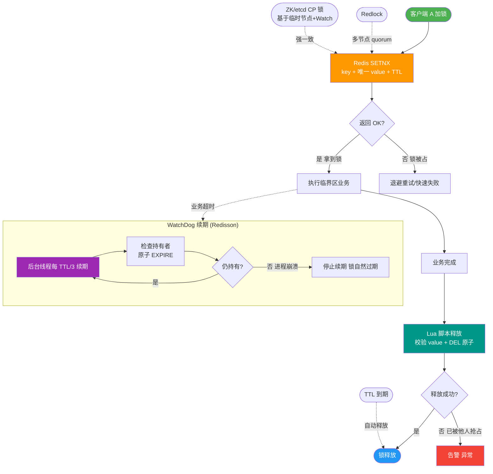

# 分布式锁有哪些实现方案？

三种主流方案：

1. **Redis分布式锁**：
- **核心指令**：`SET key value NX PX 30000`（NX保证互斥，PX设置过期防止死锁，原子操作）。
- **释放锁**：必须使用Lua脚本（`get`判断相等 + `del`删除），保证原子性，避免误删别人的锁。
- **看门狗机制**：Redisson通过后台线程检查，如果业务未执行完，自动重置过期时间（续期），解决锁过期但业务未完成的问题。
- **集群问题**：Redis主从异步复制可能导致主节点挂锁时从节点未同步，切换后丢锁。
- **Redlock算法**：向N个（通常5个）独立Redis节点申请锁，超过半数成功才算加锁成功，解决主从切换安全隐患。

2. **ZooKeeper分布式锁**：
- **实现原理**：利用临时顺序节点。客户端创建节点如 `/lock/seq-000001`。
- **获取锁**：判断自己是否是最小序号节点，若是则获得锁。
- **阻塞等待**：若不是，则 Watch 监听前一个节点的删除事件，避免羊群效应。
- **释放锁**：会话结束或任务完成删除节点，ZooKeeper自动触发后继节点的Watch。
- **优点**：CP模型，强一致性，公平锁，不会出现死锁。

3. **数据库分布式锁**：
- **悲观锁**：`select ... for update`，利用行锁，性能较差，容易死锁。
- **乐观锁**：基于version版本号更新 `update table set version=version+1 where id=? and version=old_version`。
- **唯一索引**：插入唯一索引数据，冲突则失败，简单但性能瓶颈在DBIO。

**架构对比图**：
```text
Redis (AP)                     ZooKeeper (CP)                 DB (CP/XP)
+-----------+                 +----------------+              +----------+
| Client A  |                 | Client A       |              | Client A |
+-----+-----+                 +--------+-------+              +-----+----+
      |                               |                            |
      | SET lock_key NX               | create /lock/seq-1         | INSERT..
      |                               | (Ephemeral+Sequential)      |
      | (Success)                     | (Is Min?) Yes               | (Unique PK)
      |                               |                            |
      v                               v                            v
+-----------+                 +----------------+              +----------+
| Redis     |                 | ZK Cluster     |              | Database |
+-----------+                 +----------------+              +----------+
```

### 实战案例：Redis 主从切换导致的超卖事故
某抢购活动使用 Redis 单实例锁防止超卖。突然 Redis 主节点宕机，从节点升级为主节点，但原来主节点上的锁数据还未同步。此时新的请求在新的主节点上成功加锁，导致两个请求同时持有锁，库存被扣除两次。事后升级架构采用 Redisson 的 Redlock 算法（或引入 ZooKeeper 锁）来规避此风险。

### 代码示例：Redisson (Redis) 看门狗自动续期 (Java)
```javan// 获取 RLock 对象
RLock lock = redisson.getLock("myLock");
try {
    // 1. 尝试加锁，支持 leaseTime 不设置时启动看门狗
    // 看门狗默认锁时间 30s，每 10s 检查续期到 30s
    if (lock.tryLock(0, -1, TimeUnit.SECONDS)) { 
        // 业务逻辑执行，即使超过30秒也不会因锁过期而被释放
        doBusiness();
    }
} finally {
    // 2. 检查是否是当前线程持有锁，然后释放
    if (lock.isHeldByCurrentThread()) {
        lock.unlock();
    }
}
```

### 对比表格
| 维度 | Redis (Redisson) | ZooKeeper | 数据库 (唯一索引) |
| :--- | :--- | :--- | :--- |
| **性能** | 最高 (内存操作) | 较低 (写需同步所有节点) | 最低 (磁盘IO) |
| **可靠性** | AP (主从切换可能丢锁) | CP (强一致) | CP (依赖事务) |
| **实现复杂度** | 中 (Redlock较复杂) | 高 (需处理Watch/连接) | 低 (简单SQL) |
| **特性** | 支持看门狗自动续期 | 公平锁、不可重入需自行实现 | 容易实现死锁检测 |
| **适用场景** | 高并发、允许极小概率错误 | 严苛的一致性要求、Leader选举 | 资源少、已有DB集群 |

**推荐**：一般性能场景推荐Redisson（Redis方案）；强一致性要求高且流量不大的场景选ZooKeeper。

## 常见考点
1. **Redisson看门狗原理**：默认锁过期30秒，每10秒检查一次，如果持有锁的线程还存在，重置为30秒。续期时间必须小于默认过期时间。
2. **Redis主从切换问题**：为什么Redlock能解决？它要求大多数节点加锁成功，即使主从切换，只要原来的主还没恢复，新主也加不上锁（大部分节点已持有锁）。
3. **ZooKeeper的羊群效应**：如果不监听前一个节点，而是监听锁节点本身，所有等待的节点都会被唤醒，造成风暴。


## 核心流程图



## 记忆要点

- 三大方案：Redis(AP重性能)、ZooKeeper(CP重强一致)、数据库(简单易实现)。
- Redis实现：必须SET NX PX保证原子互斥，释放需Lua防误删。
- 进阶机制：Redisson看门狗解决过期续期；Redlock算法解决主从切换丢锁。
- ZK原理：临时顺序节点+监听前一节点，天然防死锁与羊群效应。

## 结构化回答


**30 秒电梯演讲：** 厕所只有一个坑位，谁拿到钥匙谁进，其他人排队。

**展开框架：**
1. **Redis** — Redis最快但主从切换可能丢锁
2. **ZK** — ZK最可靠但性能稍差
3. **DB** — DB最简单但性能瓶颈大

**收尾：** 这是我实战中的理解，您想深入哪一段？


## 视频脚本

> 预计时长：3 分钟 | 由浅入深

| 时间 | 画面/字幕 | 口播台词 | 讲解要点 |
|------|----------|----------|----------|
| 0:00 | 标题卡：分布式锁有哪些实现方案 | "分布式锁有哪些实现方案，这题我会分三步讲。" | 开场钩子 |
| 0:41 | 概念定义动画 | "一句话：通过互斥机制保证多进程互斥访问共享资源。" | 核心定义 |
| 1:22 | 生活类比动画 | "打个比方——厕所只有一个坑位，谁拿到钥匙谁进，其他人排队。" | 核心类比 |
| 2:03 | Redis最快但 图解 | "Redis最快但主从切换可能丢锁。" | Redis最快但 |
| 2:50 | ZK最 图解 | "ZK最可靠但性能稍差。" | ZK最 |

### 视频流程图


