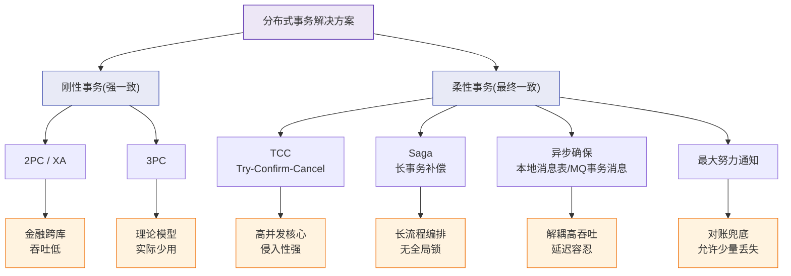

# 分布式事务有哪些解决方案？

1. **2PC（Two-Phase Commit，两阶段提交）**：
- **流程**：协调者发起 Prepare（所有参与者预提交并锁资源）→ 所有参与都OK → 发起 Commit（提交）/ 任一失败 → Rollback。
- **问题**：
  - **同步阻塞**：所有参与者锁定资源直到事务结束，并发度极低。
  - **单点故障**：协调者挂了，参与者一直阻塞。
  - **数据不一致**：协调者发送Commit时宕机，部分参与者收到提交了，部分没收到。

2. **3PC（Three-Phase Commit）**：
- **流程**：CanCommit（询问）→ PreCommit（预锁资源）→ DoCommit（提交）。
- **改进**：引入超时机制（参与者超时自动提交或回滚），减少了阻塞范围。
- **问题**：依然存在数据不一致风险（如PreCommit阶段协调者宕机，参与者选择不一致）。

3. **TCC（Try-Confirm-Cancel）**：
- **Try**：资源预留（如冻结余额，非扣除）。
- **Confirm**：确认提交（实际扣除，使用预留资源）。
- **Cancel**：取消回滚（释放预留资源）。
- **特点**：最终一致性，无锁，性能好。但**侵入性极强**，需为每个操作写三个接口，代码量大，需处理空回滚、悬挂等事务状态。

4. **Saga**：
- **原理**：将长事务拆为多个本地短事务，每个正向事务对应一个补偿事务。
- **执行**：正向事务顺序执行；若某步失败，反向执行前面已成功事务的补偿操作。
- **特点**：适用于长流程，无锁。但不保证隔离性（可能导致脏读）。

5. **本地消息表**：
- **流程**：业务操作与写入消息表在同一个本地DB事务中 → 定时任务轮询消息表发消息给MQ → 下游消费消息并处理 → 通知上游更新状态（或下游ACK）。
- **特点**：保证最终一致性，可靠性高（DB落地）。缺点是耦合了DB和业务代码。

6. **Seata 框架**：
- **AT模式**：改良版2PC。一阶段本地提交，记录Undo Log（镜像）；二阶段全局回滚时利用Undo Log反向生成SQL回滚。对业务零侵入。
- **TCC模式**：封装了TCC流程，支持自定义原理解析。

**本地消息表流程图**：
```text
业务服务A                       MQ                       业务服务B
   |                           |                           |
   |--- 1.本地事务更新DB  ---->|                           |
   |    + 写入消息表(Pending)  |                           |
   |                           |                           |
   |<--- 2.定时任务扫描 --------|                           |
   |                           |                           |
   |--- 3.发送消息 ------------>|                           |
   |                           |--- 4.投递消息 ------------>|
   |                           |                           |
   |                           |                           |--- 5.本地事务执行
   |                           |                           |
   |                           |<-- 6.发送ACK -------------|
   |                           |                           |
   |--- 7.更新消息状态 -------->|                           |
```

**实战案例**：
在支付回调场景下，曾因MQ重复投递导致下游服务重复执行。解决方案是在下游消费端利用数据库唯一索引（如订单号）做幂等校验，而非仅依赖消息去重。

**代码示例（TCC空回滚防护）**：
```java
// Try阶段：记录事务记录，状态为TRYING
@Transactional
public boolean try(TransactionContext ctx, String accountNo, double amount) {
    // 插入事务记录，防止空回滚
    bizTransactionDao.save(accountNo, amount, "TRYING", ctx.getXid());
    return accountDao.freezeBalance(accountNo, amount);
}

// Cancel阶段：检查是否存在TRYING记录
public boolean cancel(TransactionContext ctx, String accountNo) {
    if (bizTransactionDao.findByXid(ctx.getXid()) == null) {
        return true; // 空回滚，直接成功
    }
    return accountDao.unfreezeBalance(accountNo, amount);
}
```

**方案对比**：
| 方案 | 一致性 | 并发性能 | 侵入性 | 适用场景 |
| :--- | :--- | :--- | :--- | :--- |
| **2PC/3PC** | 强一致 | 低 | 低（依赖DB/中间件） | 传统数据库分布式事务 |
| **TCC** | 最终一致 | 高 | 高（3个接口） | 核心资金链路、库存扣减 |
| **Saga** | 最终一致 | 高 | 中（正向+补偿） | 长流程、旅游预订 |
| **本地消息表** | 最终一致 | 中 | 中（耦合DB） | 跨系统异步通知（如支付->发货） |
| **Seata AT** | 最终一致 | 中 | 低（注解） | 普通业务分布式事务 |

**推荐**：
- 简单可靠且能接受延迟：本地消息表。
- 追求高性能且高并发：Seata AT模式（需注意锁竞争）。
- 强一致性敏感场景（如金融）：TCC

### 分布式事务解决方案全景图




## 记忆要点

- 方案演进：2PC强一致但阻塞，TCC高性能但业务侵入，MQ/本地消息表保最终一致。
- TCC核心：Try预留、Confirm确认、Cancel回滚，需代码手写防悬挂。
- AT模式：Seata改良版，一阶段直接提交并记Undo Log，实现零侵入回滚。
- 最终一致：本地消息表+MQ异步方案，下游务必利用唯一索引做幂等校验。

## 结构化回答


**30 秒电梯演讲：** 团购，必须所有人都付钱才成交，有一人退单全员退款。

**展开框架：**
1. **PC** — 2PC/3PC强一致但性能差
2. **TCC** — TCC/Saga灵活但业务侵入大
3. **最终一致性** — 最终一致性是主流妥协方案

**收尾：** 这是我实战中的理解，您想深入哪一段？


## 视频脚本

> 预计时长：3 分钟 | 由浅入深

| 时间 | 画面/字幕 | 口播台词 | 讲解要点 |
|------|----------|----------|----------|
| 0:00 | 标题卡：分布式事务有哪些解决方案 | "分布式事务有哪些解决方案，这题我会分三步讲。" | 开场钩子 |
| 0:41 | 概念定义动画 | "一句话：保证多个微服务间的数据库操作要么全成功要么全失败。" | 核心定义 |
| 1:22 | 生活类比动画 | "打个比方——团购，必须所有人都付钱才成交，有一人退单全员退款。" | 核心类比 |
| 2:03 | 2PC/3PC强 图解 | "2PC/3PC强一致但性能差。" | 2PC/3PC强 |
| 2:50 | TCC/Saga灵活 图解 | "TCC/Saga灵活但业务侵入大。" | TCC/Saga灵活 |
