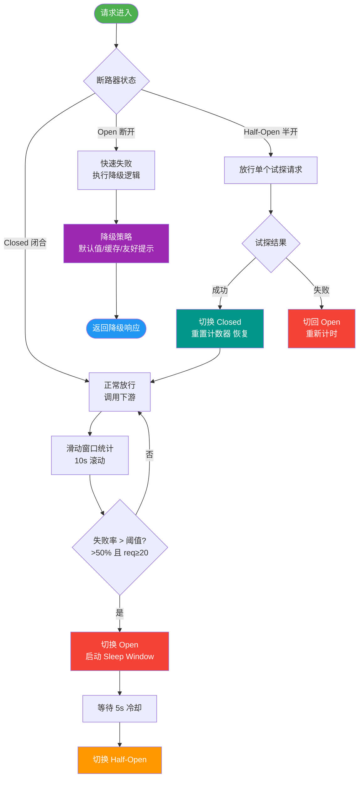

# 熔断器的三种状态是什么？

熔断器模式状态流转：

1. **CLOSED（关闭）**：
- **状态**：初始状态，熔断器闭合，请求正常通过调用下游服务。
- **逻辑**：统计请求的成功/失败/慢调用比例。当失败率或慢调用比例超过阈值（如默认50%）且最小请求数达标时，熔断器打开。

2. **OPEN（打开）**：
- **状态**：熔断状态，所有请求直接被拦截，快速失败，不发起实际远程调用，防止级联故障。
- **逻辑**：设置冷却时间。此时处于“拒接”阶段，保护下游恢复期不被压垮。

3. **HALF_OPEN（半开）**：
- **状态**：探测恢复状态。冷却时间结束（如5秒）后，熔断器进入半开。
- **逻辑**：允许**少量**请求（如1个）通过。如果成功，认为下游已恢复，状态变回CLOSED；如果失败，认为下游未恢复，重新变为OPEN，并重置冷却时间。

**熔断器状态流转图**：
```text
       失败率超阈值             冷却时间结束
      +--------------------------------------------------+
      |                                                  v
+------------+          成功          +------------+
|  CLOSED    | --------------------> | HALF_OPEN  |
|  (正常)    | <-------------------- |  (探测)    |
+------------+     探测成功/失败     +------------+
      ^                                  | 失败
      |                                  | 探测失败
      |                                  v
      |-----------------------------+-----------+
                                    |   OPEN    |
                                    | (熔断)    |
                                    +-----------+
```

**实战案例**：
某微服务系统依赖第三方支付网关，因网关波动导致大量线程阻塞在HTTP请求上，最终导致应用线程池耗尽拒绝业务请求。引入Resilience4j熔断器后，当失败率超阈值自动切断调用，Fallback返回默认余额页面，保住了核心业务。

**代码示例（Resilience4j 配置）**：
```java
CircuitBreakerConfig config = CircuitBreakerConfig.custom()
    .failureRateThreshold(50)                    // 失败率阈值50%
    .waitDurationInOpenState(Duration.ofSeconds(5)) // 熔断持续5秒
    .slidingWindowType(SlidingWindowType.TIME_BASED) // 时间窗口
    .slidingWindowSize(10)                       // 10秒窗口
    .minimumNumberOfCalls(10)                    // 至少10次调用才开始统计
    .build();
CircuitBreakerRegistry registry = CircuitBreakerRegistry.of(config);
CircuitBreaker cb = registry.circuitBreaker("paymentService");
```

**实现框架**：
- **Hystrix**：基于线程池/信号量隔离 + 熔断。已停止维护，进入维护模式。
- **Resilience4j**：轻量级，提供熔断、限流、舱壁隔离等功能，设计更现代化。
- **Sentinel**：阿里开源，基于滑动窗口统计实时数据，支持动态规则配置，控制台可视化强。
- **Spring Cloud Circuit Breaker**：统一抽象层，可以切换底层实现。

**熔断 vs 降级**：
- **熔断**：被动触发。下游服务不可用时，为了保护系统自动切断调用。
- **降级**：主动触发。当系统整体负载过高或核心功能受威胁时，主动抛弃非核心业务，保住核心链路。

## 常见考点
1. **Sentinel熔断策略**：支持三种策略：慢调用比例、异常比例、异常数。例如：响应时间超过500ms算慢调用，如果1秒内慢调用比例>50%则熔断。
2. **半开状态的请求量限制**：为了防止“恢复风暴”，半开状态通常只允许极少量请求（如1个）或极低的QPS通过，避免大量并发请求瞬间打死刚恢复的下游服务。
3. **熔断与重试的关系**：熔断打开期间，请求通常直接返回失败，一般不建议在熔断器拦截阶段进行自动重试（除非配置了特定的Fallback策略），以免加重恢复期的负载。


## 核心流程图



## 记忆要点

- 三态流转：Closed（正常） -> Open（熔断） -> Half_Open（探测）
- 因为失败率超阈值，所以进入Open拦截所有请求防雪崩
- 半开状态仅放行极少探测请求，成功则恢复，失败则继续熔断
- 框架对比：Hystrix已停更，Sentinel基于滑动窗口支持动态规则
- 核心区别：熔断是被动保护机制，而降级是主动兜底策略

## 结构化回答


**30 秒电梯演讲：** 家里的保险丝，检测到电流过载自动断路，修好试电后再合上。

**展开框架：**
1. **Closed** — Closed正常，Open熔断，HalfOpen探路
2. **防止故障蔓延** — 防止故障蔓延导致雪崩
3. **结合降级使** — 结合降级使用保核心

**收尾：** 这是我实战中的理解，您想深入哪一段？


## 视频脚本

> 预计时长：2 分钟 | 由浅入深

| 时间 | 画面/字幕 | 口播台词 | 讲解要点 |
|------|----------|----------|----------|
| 0:00 | 标题卡：熔断器的三种状态 | "熔断器的三种状态，一分钟讲透。" | 开场钩子 |
| 0:35 | 生活类比动画 | "打个比方——家里的保险丝，检测到电流过载自动断路，修好试电后再合上。" | 核心类比 |
| 1:10 | 概念定义动画 | "一句话：当下游服务故障时，自动切断请求以防止级联雪崩。" | 核心定义 |
| 1:50 | Closed正常 图解 | "Closed正常，Open熔断，HalfOpen探路。" | Closed正常 |

### 视频流程图


